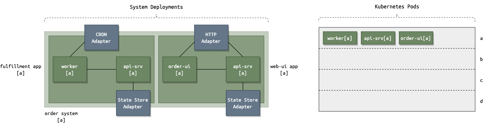
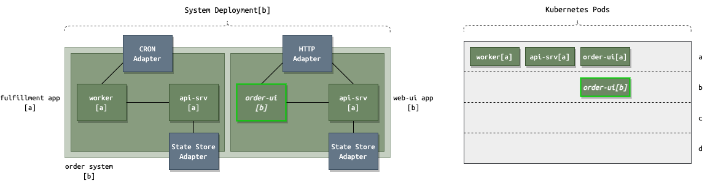
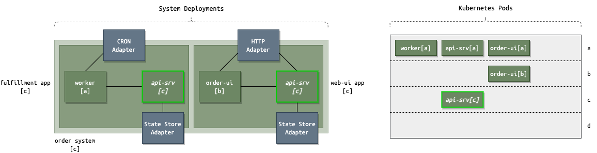
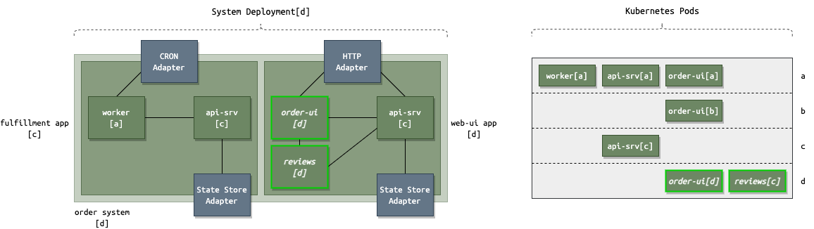

# CI/CD

## Deployments

For purposes of illustration, consider an Order System (in KubeFox, a **System** is a collection of applications).  

Note:  There are additional things happening during these deployment cycles which are discussed toward the bottom of the page.  For this part of the discussion, we're contemplating multiple deployments where only the most-recently deployed version of the System is running.

In our scenario, there is an Order System that comprises 2 applications:

- fulfillment app
- web-ui app

The fulfillment app is composed of 4 components, 2 of which are adapters:

1. CRON adapter
2. State Store adapter

**Adapters** are KubeFox-managed components.  

The user-written components are:

1. Worker
2. API server (api-srv) 

The web-ui app also composes 4 components, 2 of which being adapters:  

1. HTTP adapter
2. State Store adapter

and two of which user-written:

1. Order user interface (order-ui)
2. API server (api-srv)

Note that the fulfillment app and web-ui app both employ the api-srv components, i.e., these components are shared.

### Deployment a

When the Order System is initially deployed (we'll call this the 'a' deployment), it will look like this in KubeFox:

KubeFox will spool up 3 Pods, the Worker[a], api-srv[a] and the order-ui[a].  Because the api-srv component is shared by the fulfillment and web-ui apps, KubeFox will deploy it only once.

## Deployment b

Now things get interesting!

Let's say that the user needs to make a change to the order-ui component.  When the System b is deployed, it will look like this in KubeFox:

Note that in our deployment table, only the order-ui component was deployed.  KubeFox checks the state of the Order System and deploys only the components that have changed.

## Deployment c

For our next deployment [c], the user decides to make a change to the api-srv component. Again, KubeFox checks the state of the System and deploys only api-srv[c]:

## Deployment d

In our final deployment [d], the user does a couple of things:

- Creates a new component (reviews)
- Modifies the order-ui component

When the System is deployed, it looks like this:

Only the new (reviews) and modified component (order-ui) are deployed.

## Summary Notes

There are a few things of note here:

- Each of the deployments is a version in KubeFox.
- All of the deployments (a - d) are actually available via explicit URLs (unless they're deprecated).
- Only one copy of api-srv will be running at any given time *unless* there is a different version of api-srv deployed for one of the apps.  In that case, KubeFox will run the appropriate versions of api-srv to service requests for each individual application. 
