# Deployment Distillation

KubeFox automatically distills application deployments to only those components that
are new or which have changed.  You can think of this process as a diff between
what components are currently running in the cluster, and what components have
changed in the new deployment.  In so doing, KubeFox helps you control
provisioning.

<h3>Example</h3>

For purposes of illustration, consider an simple Order application ([App](./index.md#app)).

<figure markdown>
  
  <figcaption>Figure 1 - Version 1 of our Order App</figcaption>
</figure>

In our scenario, our Order App comprises 2 modules:

1. Fulfillment
2. Web-UI

The Fulfillment module is composed of 4 components, 2 of which are adapters:

1. CRON adapter
2. State Store adapter

[Adapters](./index.md#adapter) are Brokers for External Components, in this case
serving to proxy events, requests and responses to and from CRON and a State Store (like
a database).

The user-written components for the Fulfillment module are:

1. Order Worker
2. API Server

The Web UI module also consists of 4 components, 2 of which being adapters:

1. HTTP adapter
2. State Store adapter

and two of which user-written:

1. Order UI
2. API Server

Note that the Fulfillment and Web UI modules both employ the API Server component,
i.e., the API Server component is shared.

### Version 1 Deployment

When our App is initially deployed (we'll call this the Version 1
deployment), the cluster will look like this (Figure 2):

<figure markdown>
  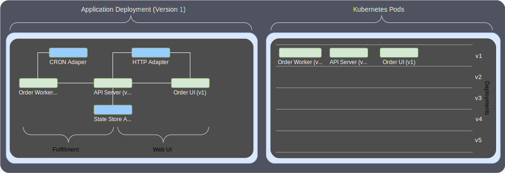
  <figcaption>Figure 2 - Initial Deployment - Version 1</figcaption>
</figure>

KubeFox will spool up 3 Pods, the Order Worker (v1), API Server (v1) and the
Order UI (v1).
Because the API Server component is shared by both modules,
KubeFox will deploy it only once.

### Version 2 Deployment

Now things get interesting!

Suppose we decide to make a change to the API Server component. To do so, we'll
deploy a new version of the Order App - Version 2.  KubeFox checks the state of our
repository and deploys only those components that are new or which have changed.
Because only the API Server component changed - it's now v2 - only one additional
Pod is created as shown in Figure 3:

<figure markdown>
  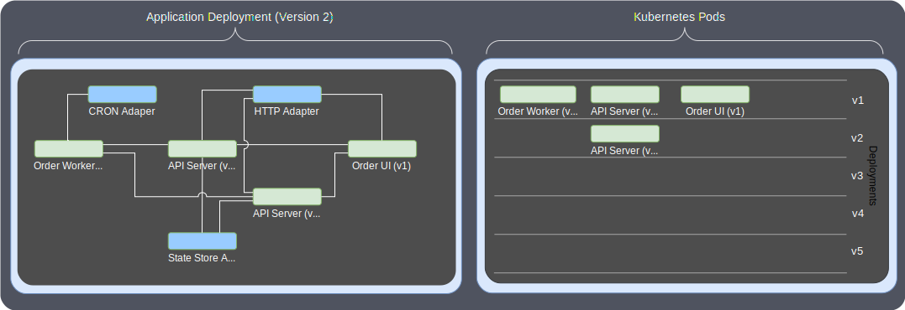
  <figcaption>Figure 3 - Deploying Version 2 to update the API Server to v2</figcaption>
</figure>

Remember when we said that now things get interesting?  Our cluster is now
capable of supporting both Version 1 and Version 2 traffic.  KubeFox looks at
the URL for the HTTP request, a [Genesis
Event](./index.md#genesis-event) in KubeFox, and employs matching to determine which
version of the App will service that event.  We can specify the
version via query parameters on the URL, as shown in Figure 4:

<figure markdown>
  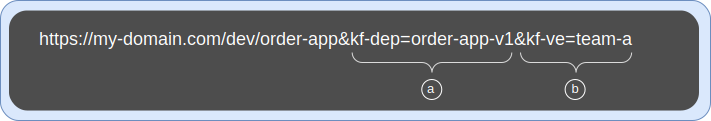
  <figcaption>Figure 4 - URL to access the v1 Deployment</figcaption>
</figure>

The kf-dep query parameter highlighted by **(a)** tells KubeFox that we want traffic
directed to the "order-app-v1" named deployment of the Order App (we can name
deployments when they're created).  The kf-ve query parameter highlighed by
**(b)** tells KubeFox that we want the order-app-v1 deployment in the "team-a"
Virtual Environment (VE).  In KubeFox, you can easily create Virtual Environments to
test prototypes or POCs, and different teams could create their own VEs to
support their activities. You can learn more about KubeFox's Virtual
Environments [here](virtual_environments.md). 

KubeFox dynamically routes traffic at runtime to
confine v1 traffic to only the components composing the v1 deployment of the Order
App.  When we work with Version 1, it appears as though Version 1 is the only version
present on the cluster (Figure 5):  

<figure markdown>
  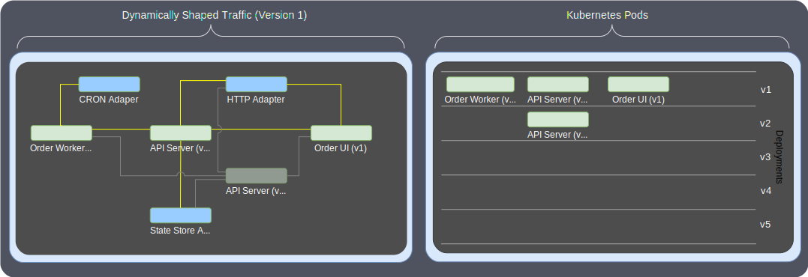
  <figcaption>Figure 5 - Version 1 traffic (with Version 2 present)</figcaption>
</figure>

You can learn more about KubeFox's Dynamic Routing and Guaranteed Delivery [here](./dynamic_routing.md).

Version 2 can be accessed in much the same way (Figure 6):

<figure markdown>
  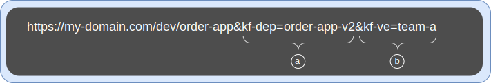
  <figcaption>Figure 6 - URL to access the v2 Deployment</figcaption>
</figure>

Again, the kf-dep **(a)** shapes traffic to the v2 deployment of the Order App.
We're still using the same VE **(b)**.  And we can easily access Version 2 with
this convention:

<figure markdown>
  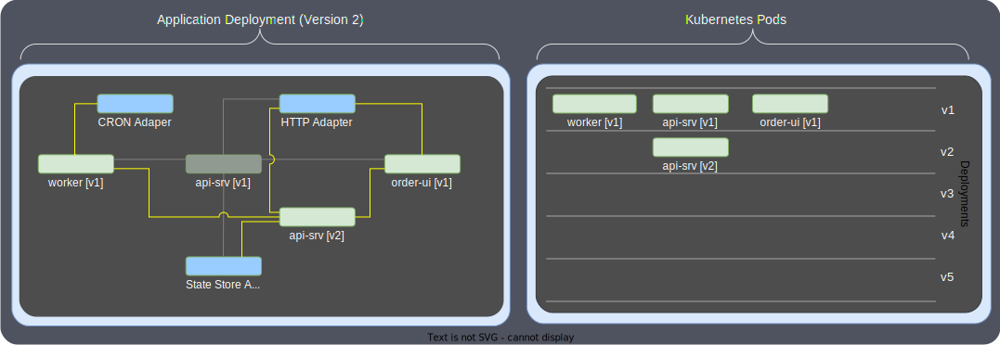
  <figcaption>Figure 7 - Version 2 traffic (with Version 1 present)</figcaption>
</figure>

Note that while both versions of the Order App can be exercised, there are only
4 user-written Pods running on the cluster.  KubeFox distilled the deployment to only
unique components and dynamically shapes traffic at runtime to the components composing a
particular deployment.

### Version 3 Deployment

Let's take things a little further.  Suppose we want to create a new version of
our Order App - Version 3 - to enhance the Order UI component and to
add a new component ("Review") to process order reviews.

When we deploy Version 3, the cluster will look as shown in Figure 8:

<figure markdown>
  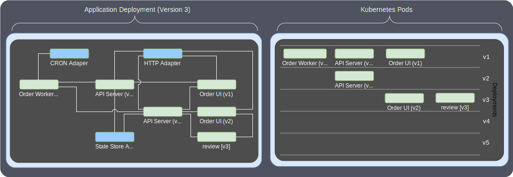
  <figcaption>Figure 8 - Deployment of Version 3</figcaption>
</figure>

As before, KubeFox deploys only the new and changed components.  And as before,
we now have access to 3 versions of our Order App.  

We can access our first version with the same URL as above (Figure 9):

<figure markdown>
  
  <figcaption>Figure 9 - URL to access Version 1 of the Order App</figcaption>
</figure>

and traffic will be dynamically routed to the v1 version of the Order App
(Figure 10):

<figure markdown>
  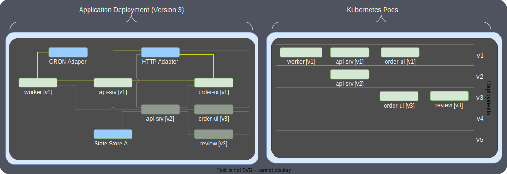
  <figcaption>Figure 10 - Version 1 traffic (with Versions 2 and 3 present)</figcaption>
</figure>

Version 2 is also still accessible via query parameters (Figure 11):

<figure markdown>
  
  <figcaption>Figure 11 - URL to access Version 2 of the Order App</figcaption>
</figure>

and traffic will be routed to v2 of our Order App (Figure 12):

<figure markdown>
  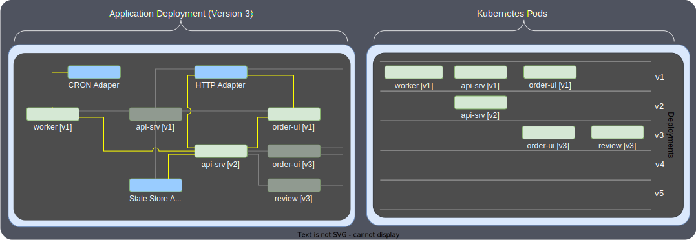
  <figcaption>Figure 12 - Version 2 traffic (with Versions 1 and 3 present)</figcaption>
</figure>

and similarly for Version 3 (Figures 13 and 14):

<figure markdown>
  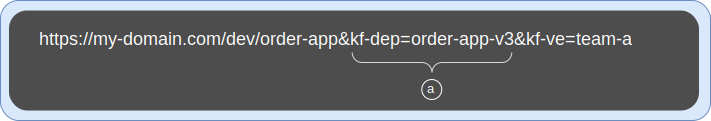
  <figcaption>Figure 13 - URL to access Version 3 of the Order App</figcaption>
</figure>

<figure markdown>
  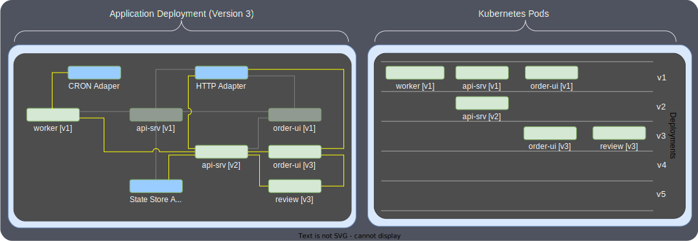
  <figcaption>Figure 14 - Version 3 traffic (with Versions 1 and 2 present)</figcaption>
</figure>

Different teams and even individual engineers can create and use their own VEs.

We've now deployed 3 versions of the Order App.  We have a total of 6
user-written components running.  Each version will generate its own telemetry,
even for shared components. For instance, telemetry for the  Order Worker will
be available separately for v1, v2 and v3 traffic, as though those versions of
the Order 
App were the only versions running.

We might decide that we want to provide access to a version of the Order App to
QA for smoke testing.  To make things simple for QA and avoid any changing URLs,
we can perform a Release.  When we release an App, KubeFox will default traffic
to it when there are no query parameters present.  For instance, if we release
version 2 of our Order App, 

    fox release v2 --virtual-env team-a

then plain URLs can be used to access it (Figure 15):

<figure markdown>
  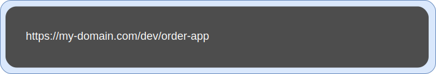
  <figcaption>Figure 15 - Plain URL to access released version of Order App</figcaption>
</figure>

## Summary

There are a number things of note here:

- To put a fine point on it, each of the deployments is a version in KubeFox.
- All of the deployments (Versions 1, 2 and 3) are actually available via
  explicit URLs.
- We didn't need to modify namespaces or configure routing to gain access the
  new versions of the App - we simply made our changes, deployed and the new
  versions were instantly accessible.
- Apps are built and deployed monolithically - which greatly simplifies workflow for
  developers. Under the covers KubeFox is doing a few things:
  - Distilling the component set to the minimum required to run the new
    deployment, thereby preserving resources and preventing over-provisioning
  - Shaping traffic dynamically at runtime to enable the use of shared, common
    components across deployments (same component version used in multiple deployments)
- Default traffic will be routed to the most recently released version. So if
  Version 1 is released, default traffic will be running through Version 1 even after
  Versions 2 and 3 are deployed. That provides development, QA and release teams with a
  great deal of power and flexibility.
