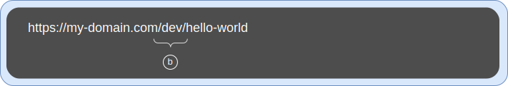
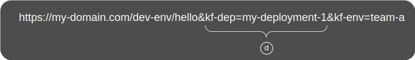
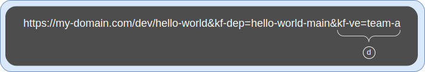
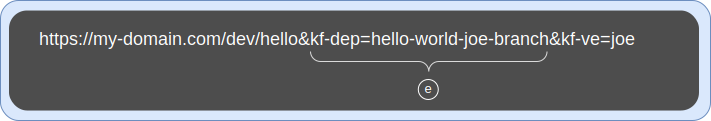
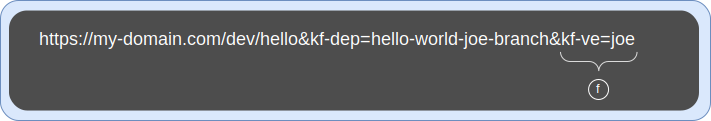
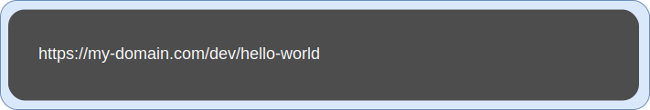
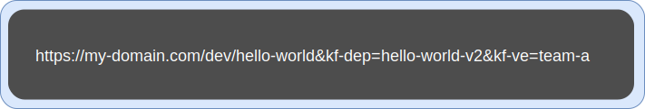
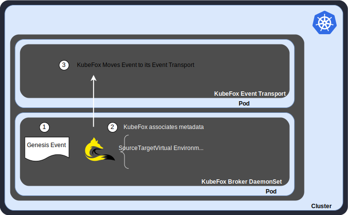
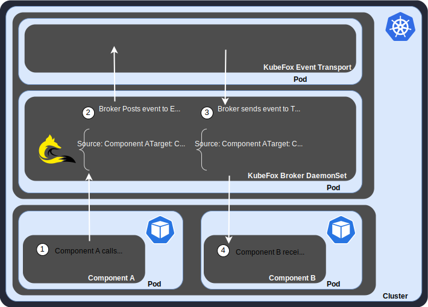
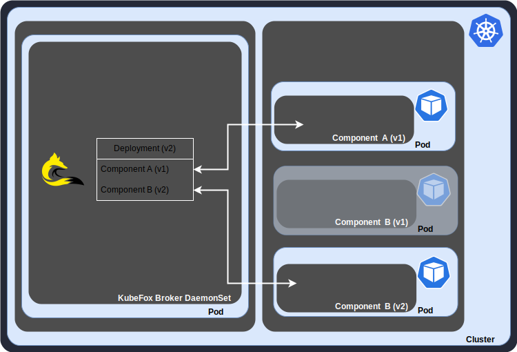

# Dynamic Routing and Guaranteed Delivery

Introduction

KubeFox routes dynamically at runtime.  As requests traverse an application in KubeFox, they are evaluated at each component-to-component transition.  That enables KubeFox to route requests to the correct component for a specific
version of the application - even if there are multiple versions of that same component running in the cluster.  In concert with KubeFox's [Virtual Environments](virtual_environments.md) and [Deployment Distillation](deployment_distillation.md), Dynamic
Routing is one of KubeFox’s greatest superpowers.

We'll start with some KubeFox fundamentals to build some context, but you can
jump straight to [Dynamic Routing](dynamic_routing.md#dynamic-routing) if you wish.

### Applications

As described in Concepts, an application ([App](index.md#app)) is exactly what
you think it is.  Abstractly, Apps are collections of components that work
together to perform tasks that serve to make that application useful, e.g., “get
me a list of these products”, “create this order”, “add these items to my
inventory” etc. (though it's likely that these individual capabilities would
themselves be broken into various components). Components in Kubernetes can be functions or
microservices.  A well-constructed App consists of components that have discrete
functions and lack dependencies, where dependencies are interactions between
components that (a) lack well-defined interfaces and/or (b) where a change in one
component can break another component.

When a developer modifies or enhances an App, they
work with one or more components.  Without KubeFox, they need to be concerned with
component-level considerations and CI/CD when they want to deploy and test their
changes. And they need to understand how their changes will be incorporated into
Kubernetes to ensure that their test scenario is viable and coordinated with
their teammates. 

With KubeFox, developers work at the App level.  Irrespective
of which components they modify, delete or add, KubeFox determines the
differences between the current and prior deployment.  You can think think of
this much like a component-level diff.  KubeFox then builds, containerizes and
distills deployments to only those components that have changed (see [Deployment
Distillation](deployment_distillation.md) for more information on this).  Best of all, developers can
spool up what appear to be individual sandboxes - without needless bureaucracy
and without their changes to a component affecting a teammate's use of that
component.

While KubeFox will deploy only changed components, it is aware of the
composition of the App and will route requests only to the versions of
components that composed that App at deployment time.  This is the guaranteed
delivery piece of KubeFox's Dynamic Routing.

Dynamic Routing starts with [Genesis Events](index.md#genesis-event).

### Genesis Events

When requests originate - [Genesis Events](index.md#genesis-event) in KubeFox – KubeFox employs matching
logic to determine how the request should be routed.  Once a Genesis Event is matched,
metadata is associated
with the request.  That metadata follows the request throughout its lifespan, and
informs KubeFox how the request should be routed as it moves from component to
component in the App.

Let's take a look at KubeFox Matching.

### KubeFox Matching

<figure markdown>
  
  <figcaption>Figure 1 - Standard Domain Prefix</figcaption>
</figure>

Of course, all HTTP requests start with the standard domain prefix **(a)**.  In Figure 1, traffic
is directed to the currently-released version of the hello-world App at my-domain.com/dev.

<figure markdown>
  
  <figcaption>Figure 2 - KubeFox Environment Subpath</figcaption>
</figure>

KubeFox employs straightforward conventions for matching. HTTP requests are identified by subpath.  When you define KubeFox
Environments, you specify the subpath that KubeFox
will use to identify the inbound requests that should map to that Environment.  In Figure
2 **(b)**, the subpath 'dev' tells KubeFox that it should use the Environment
that specifies the 'dev' subpath. Though optional, the KubeFox Environment typically maps to a traditional environment by
Kubernetes namespace, for instance, the 'dev' 
namespace in this case.

The YAML to define an Environment is extremely simple.  Below is YAML that
defines our 'dev' Environment.

    apiVersion: kubefox.xigxog.io/v1alpha1
    kind: Environment
    metadata:
      name: dev
    spec:
      releasePolicy:
        type: Testing
    data:
      vars:
        who: Universe
        subPath: dev

The subPath variable tells KubeFox that traffic inbound to http://my-domain.com/dev
will be managed by the 'dev' Environment.

In addition to identifying a request subpath, the Environment provides a set of values (e.g., Kubernetes
environment variables) that are common to the KubeFox VEs that map to that
Environment.  In the example above, we've defined a 'who' variable.  This is largely a convenience.  Environment variables can be
overridden in KubeFox VEs, but values that are shared can simply be inherited
from the Environment (part of the VE definition is the Environment from which
that VE is inheriting configuration).  If a value changes in the Environment, then the
KubeFox VEs pointing to that Environment inherit that change.

So far, what we've discussed may seem largely consistent with native Kubernetes.
Where things really get interesting is when KubeFox Virtual Environments (VEs)
enter the picture.  VEs enable teams or even individual engineers to create
sandboxes to provide for rapid prototyping, feature development, side-by-side testing,
versioning and a host of other capabilities.

There are two ways to access deployments in KubeFox VEs:

1. Perform a Release with the fox CLI; or
2. Reference a deployment using query parameters

Increasing flexibility usually comes at the expense of increased complexity;
however, KubeFox VEs increase flexibility while reducing complexity.  VEs
enable you to create
sandboxes, and can be
spooled up by teams or even by individual engineers - without DevOps and with
built-in controls to distill provisioning to the minimum.

<figure markdown>
  
  <figcaption>Figure 3 - KubeFox kf-dep Deployment Selector Query Parameter</figcaption>
</figure>

In Figure 3, we're selecting the 'hello-world-main' deployment **(c)** of the **hello-world** App.
This is just the **hello-world** App on the main branch in the repository.

<figure markdown>
  
  <figcaption>Figure 4 - KubeFox kf-ve Virtual Environment Selector Query Parameter</figcaption>
</figure>

We're also further qualifying (Figure 4) that we want traffic directed to the
**hello-world-main** deployment in the **team-a** VE **(d)**.

Individual engineers can spool up VEs and deploy applications on their own.
Suppose Joe has an enhancement to our hello-world App.  Joe can create his own
VE (we'll call the file "joe-ve.yaml"):

    apiVersion: kubefox.xigxog.io/v1alpha1
    kind: VirtualEnvironment
    metadata:
      name: joe
    spec:
      environment: dev

and load the VE into the cluster:

    kubectl apply -f joe-ve.yaml

Now Joe can test his version of the App.  He just references his deployment as
seen here in Figure 5 **(e)**:

<figure markdown>
  
  <figcaption>Figure 5 - Joe's deployment from his branch</figcaption>
</figure>

and his VE (Figure 6 **(f)** below):

<figure markdown>
  
  <figcaption>Figure 6 - Joe's VE</figcaption>
</figure>

You can repeatedly deploy other versions of an app to the same VE and
access them explicitly with query parameters.  Alternatively, you can iteratively
deploy and release, enabing you to test each new
version of the App without modifying HTTP requests.  Let's go just a bit deeper
on the KubeFox Release.

### KubeFox Release

You've seen how we can direct traffic to specific deployments and VEs with query
parameters.  You can also default traffic to a deployment by effecting a KubeFox
Release. A KubeFox Release
is made by using the fox CLI - e.g.: 

    fox publish --version v2 --virtual-env team-a
    fox release v2 --virtual-env team-a 

would release version v2 of the deployment on which we’re working to the **team-a**
Virtual Environment.  By ‘default traffic’, we mean traffic without employing query
parameters to explicitly
specify a deployment or Virtual Environment.  Remember
the URL in Figure 1 above?

<figure markdown>
  
  <figcaption>Figure 7 - Plain URL for the hello-world App</figcaption>
</figure>

This URL has no query parameters, so traffic will be routed to the currently-released
version of the hello-world App running in the **team-a** VE.  We can make successive changes
to the App, releasing each time:

    fox publish --version v3 --virtual-env team-a
    fox release v3 --virtual-env team-a 

By doing so, we can use the same plain URLs (sans query parameters) to access the updated releases.  

Prior releases are still available to us using query parameters.  For instance, after
releasing v3, we can access v2 with query parameters:

<figure markdown>
  
  <figcaption>Figure 8 - Accessing version v2 of the hello-world App</figcaption>
</figure>

### Dynamic Routing

How does KubeFox achieve this?

When requests originate, KubeFox evaluates them and attaches metadata that
informs it of a variety of things; key items include the Source and Target [Components](index.md#component), [App
Deployment](index.md#app-deployment), [Virtual
Environment](virtual_environments.md) and Manifest.  There are additional items
that help KubeFox manage the request (you can review the metadata in detail
here:  [Protocol Buffers](../reference/protobuf.md)).

<figure markdown>
  
  <figcaption>Figure 9 - Genesis Event Identification</figcaption>
</figure>

In Figure 9, a [Genesis
Event](index.md#genesis-event) has occurred (**1**), KubeFox has associated metadata
with it (**2**) and delivered it to its Event Transport (**3**).

<figure markdown>
  
  <figcaption>Figure 10 - Component-to-Component Routing</figcaption>
</figure>

In Figure 10, you see a simplified view of the component-to-component routing
workflow.

1. Component A is making a call to Component B
2. The KubeFox Broker knows that Component A is the source of the call, and it
   also knows what deployment this is, what the VE is, and the version of
   Component B to which it should route the request.  It also knows the versions
   of the two components.
3. The Broker validates that the request is legal (that this version of Component A is
   allowed to make the call to Component B, that the request is being routed to
   the correct version of Component B - meaning the version that is part of the same
   deployment, and that the
   version of Component B is present in the same VE) - and delivers the request
4. Component B receives the request

The checks described here are part of KubeFox's Guaranteed Delivery capability.

### Application Manifest

KubeFox has cognizance of the composition of the
application. That awareness enables KubeFox to do a few things:

1. Distill deployments (see
[Deployment Distillation](deployment_distillation.md)) to  unique components
only.
2. Understand which components and component versions are part of a deployment.
3. Guarantee delivery of requests to the correct versions of components -
   specifically, the collection of component versions that were part of the App
   for a particular deployment 

Let's take a vastly oversimplified look at what dynamic routing can do.

<figure markdown>
  
  <figcaption>Figure 11 - Dynamic Routing - v1 Deployment</figcaption>
</figure>

As shown in Figure 11, requests directed to the v1 deployment will be processed
by those components that were part of the application when it was deployed - in
this case, Component A (v1) and Component B (v1).  KubeFox makes it appear as if
the only components running in the cluster are these two components.

What happens if we want to make a modification to Component B, creating a new
version of Component B (v2) and we deploy again? 

<figure markdown>
  
  <figcaption>Figure 12 - Dynamic Routing - v2 Deployment</figcaption>
</figure>

In Figure 12, we have a new deployment (v2), composed of our original version of
Component A
(v1) and a new version of Component B (v2).  For requests directed to the v2 deployment, KubeFox will again make it appear as though 
deployment v2 is the only deployment present on the cluster.

Note that Component B (v1) is still present, and requests for the v1 deployment
will still be routed as shown in Figure 11.

