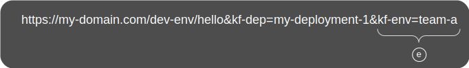

# Dynamic Routing and Guaranteed Delivery

Introduction

KubeFox routes dynamically at runtime.  As requests traverse an application in KubeFox, they are evaluated at each component-to-component transition.  That enables KubeFox to route requests to the correct component for a specific
version of the application - even if there are multiple versions of that same component running in the cluster.  In concert with KubeFox's [Virtual Environments](virtual_environments.md) and [Deployment Distillation](deployment_distillation.md), Dynamic
Routing is one of KubeFox’s greatest superpowers.

Let’s start with some KubeFox fundamentals.

### Applications

As described in Concepts, an application ([App](index.md#app)) is exactly what you think it is.  And what are Apps?  Abstractly, Apps are collections of components that work together to perform tasks that serve to make that application useful, e.g., “get me a list of these products”, “create this order”, “add these items to my inventory” etc.  Components in Kubernetes can be functions or microservices.  A well-constructed App consists of components that have discrete functions and lack dependencies.  Dependencies are interactions between components that (a) lack well-defined interfaces and (b) where a change in one component can break another component.

Developers build  and work with Apps, and KubeFox operates at an application level.  When a developer uses KubeFox, they publish at the App level.  Irrespective of which components they modify, delete or add, KubeFox will determine the differences between the current and prior deployment (you can think of this much like a component-level diff) of that App, and build, containerize and deploy only those components that have changed.

Once an App has been deployed, Dynamic Routing begins with [Genesis Events](index.md#genesis-event).

### Genesis Events

When requests originate - Genesis Events in KubeFox – KubeFox employs matching
logic to determine how the request should be routed.  Once a request is matched,
metadata is associated
with it.  That metadata follows the request throughout its lifespan, and
informs KubeFox how the requests should be routed. 

### KubeFox Matching

<figure markdown>
  
  <figcaption>Figure 1 - Standard Domain Prefix</figcaption>
</figure>

All HTTP requests start with the standard domain prefix.  In Figure 1, traffic
is directed to the currently-released version of the hello App at my-domain.com/dev/team-a.

<figure markdown>
  
  <figcaption>Figure 2 - KubeFox Environment Subpath</figcaption>
</figure>

HTTP requests are identified by subpath, where the parts of the subpath that
matter to KubeFox are the Environment and Virtual Environment (VE).  In Figure
2, the subpath 'dev-env' tells KubeFox that the dev-env Environment is selected.
The KubeFox Environment typically maps to a traditional environment by
Kubernetes namespace, for instance, the dev
namespace in this case.

In KubeFox, the Environment provides a set of values (e.g., Kubernetes
environment variables) that are common for the KubeFox VEs that map to that
Environment.  This is largely a convenience.  Environment variables can be
overridden in KubeFox VEs, but values that are shared can simply be inherited
from the Environment.  And if a value changes in the Environment, then the
KubeFox VEs inherit that change.

<figure markdown>
  
  <figcaption>Figure 3 - Kubefox Virtual Environment Subpath</figcaption>
</figure>

In Figure 3, the value 'team-a' in the subpath tells KubeFox that we're using
the team-a VE.  

In KubeFox, multiple versions of an app and multiple versions of components can
coexist side-by-side.  In Figure 3, default traffic is being directed to the
currently-released version of the hello App in the dev-env Environment and
team-a VE.

We can repeatedly deploy other versions of the same app to the same VE and
access them explicitly with query parameters.

<figure markdown>
  
  <figcaption>Figure 4 - KubeFox kf-dep Deployment Selector Query Parameter</figcaption>
</figure>

In Figure 4, we're selecting the 'my-deployment-1' deployment of the hello App.

<figure markdown>
  
  <figcaption>Figure 5 - KubeFox kf-env Virtual Environment Selector Query Parameter</figcaption>
</figure>

And we can also select the my-deployment-1 version of hello in the team-a VE.  

