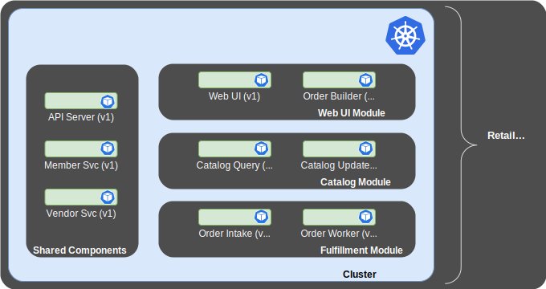
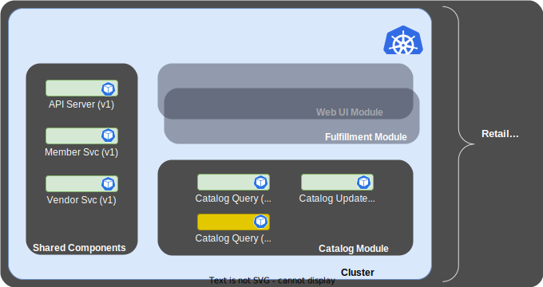
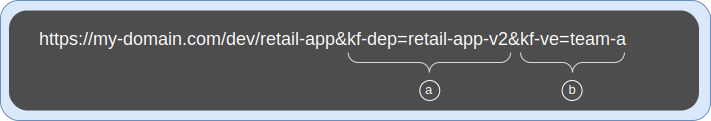
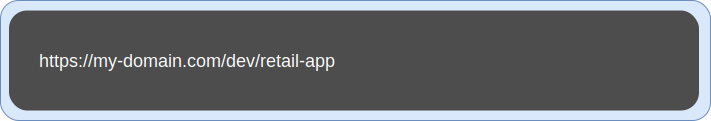
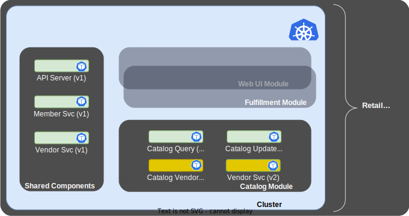
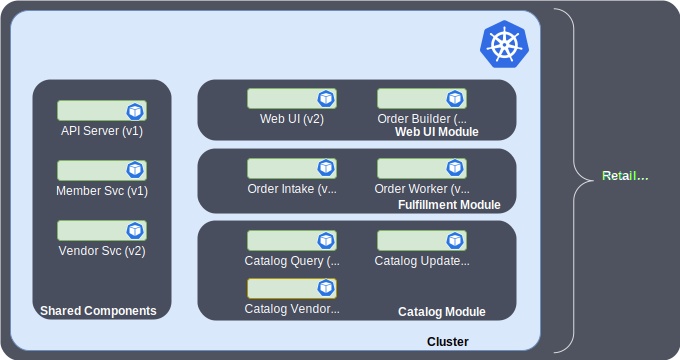

# Versioned Deployments

Deployments are fraught with a host of risks and their management absorbs
excessive resources.  Factors like version compatibility, roll-back,
availability, blue/green, A/B and canary complicate deployment.  KubeFox
simplifies the software lifecycle by providing for elegant versioned deployments
that serve to reduce risk and simplify engineering workflows.  But perhaps most
importantly, versioning reduces the application and microservice sprawl that is
endemic to many of today’s Kubernetes teams.

Let’s start with a Retail App composed of 3 modules, a Web UI module, a
Catalog module and a fulfillment module, as shown in Figure 1:

<figure markdown>
  
  <figcaption>Figure 1 - Composition of Version 1 of the Retail App</figcaption>
</figure>

As the diagram notes, this is the first version of our Retail App.  Note that
the modules share some Components - specifically, the API Server, Vendor
Service and Member Service components.  When the Retail App is deployed by
KubeFox, the cluster will look like the diagram in Figure 2.  

<figure markdown>
  
  <figcaption>Figure 2 - First Deployment of the Retail App</figcaption>
</figure>

Each of the components runs in its own Pod.  KubeFox handles the routing from
component to component, and provides telemetry both on a discrete basis - by
component and module - and on a global basis (across the cluster).  You can
visualize the behavior of the shared API Server both in the context of the
Catalog module, and in the context of the application.  Similarly, you can visualize
the behavior of each of the 3 modules; telemetry from shared components carries
with it the context of the calling modules.

Let's return to our Retail App. If update the Catalog Query component, thereby creating a
new version of the Retail App (version 2), we'll need the components shown in
Figure 3 to successfuly run the new version of the App.

<figure markdown>
  
  <figcaption>Figure 3 - Composition of Version 2 of the Retail App</figcaption>
</figure>

Any change to an App - whether a component modification, addition or deletion -
will yield a new version of the App when it is published.  

Everything seems pretty straightforward so far.  But at deployment time, KubeFox
flexes its muscles.
It evaluates the repository to determine what
components have changed, then builds, containerizes and deploys only the
changed components necessary to support the deployment. That
applies both to components themselves and unique versions of those components.   

It's important to note that developers don't need to interact
CI/CD-wise with individual components, or worry about how the components will be
wired together in the cluster. Developers publish
the App - not components.  KubeFox takes care of the rest.

Returning to our example, only the v2 Catalog Query component will be deployed.
At that point, the components
necessary to support v1 and v2 of the Retail App will be present on the
cluster, as shown in Figure 4.

<figure markdown>
  
  <figcaption>Figure 4 - Version 2 of the Retail App with the modified Catalog Query component</figcaption>
</figure>

Again, note that KubeFox is taking care of this, unburdening end users from the
drudgery of determining what changed, worrying about how things will be wired
together and managing namespaces.  The end user simply redeploys the Retail
App, and when KubeFox builds the deployment, it determines what changed and
distills the deployment to only those changed components (you can learn more
about Distilled Deployments [here](./deployment_distillation.md)).

### Accessing Versions

Once the deployment occurs, both versions of the Retail App will be available:
version 1 with the initial Catalog Query (v1) component, and version 2 with the
updated Catalog Query (v2) component.  KubeFox dynamically shapes traffic and
will route version 1 requests to the v1 version of the Catalog Query component,
and version 2 requests to the v2 component.  

Versions are accessed using
explicit URLs in the form of query parameters, enabling teams to validate functionality and stability with
minimal risk.  A sample URL to access v1 of the Retail App is shown in Figure 5:

<figure markdown>
  
  <figcaption>Figure 5 - URL with Query Parameters to Access v1 of the Retail App</figcaption>
</figure>

The deployment is referenced with the "kf-dep" query parameter **(a)**, and the
Virtual Environment with the "kf-ve" query parameter **(b)**.

All we need to do to select v2 instead is change kf-def to "retail-app-v2" as
shown in Figure 6, **(a)**.  We can use the same VE **(b)**.

<figure markdown>
  
  <figcaption>Figure 6 - URL with Query Parameters to Access v2 of the Retail App</figcaption>
</figure>

### Defaulting Traffic to a Version

We can default traffic to the v1 deployment by performing a Release with
the fox CLI:

    fox release v1 --virtual-env dev

Default traffic - meaning traffic sans query parameters (see Figure 7) 

<figure markdown>
  
  <figcaption>Figure 7 - Plain URL</figcaption>
</figure>

will be routed to version 1.  Version 2 is still accessible with query
parameters.  At some point, you may decide to default traffic to version 2 by
releasing version 2.  Version 2 would then handle default traffic.  Note that
you could still access version 1 with query parameters.

Let’s look at a different example to explore the power of KubeFox further.
Suppose we want to enhance the Catalog module further by adding a new component “Catalog
Vendor” and to support it, we need to update the shared component Vendor
Service.  To keep things a little tidier, let’s say that we’ve deprecated
version 1 of the Retail System, so we only need version 2 of the Catalog Query
component.  The component building blocks will be those shown in Figure 8.

<figure markdown>
  
  <figcaption>Figure 8 - Composition of Version 3 of the Retail App</figcaption>
</figure>

Note that the original v1 Vendor Service component – because it is still
shared by the Web UI and Fulfillment Modules – is still required.  The new v2
Vendor Service component is also required because it is needed by the new Catalog Vendor
component.  Once deployed, teh cluster will look as shown in Figure 9:  

<figure markdown>
  
  <figcaption>Figure 9 - Version 3 of the Retail App</figcaption>
</figure>

Note that we've shown the enhanced v2 Vendor Service Component as residing in the Catalog
Module - that's purely symbolic, as it is not shared yet by the Fulfillment and
Web UI modules (which both use the v1 version).

If we later create new versions of the
Web UI and Fulfillment modules that use the updated v2 Vendor Service
component (thereby creating Version 4 of the Retail App), we can choose to
deprecate the prior versions of the Retail App, and it will look as
shown in Figure 10.

<figure markdown>
  
  <figcaption>Figure 10 - Version 4 of the Retail App</figcaption>
</figure>

These examples illustrate just some of the power of KubeFox.  We can choose to run all
4 versions of the Retail App in parallel if we wish.  Doing so would not mean
that there would be 4 monolithic deployments of the Retail App, each
demanding and consuming their own resources.  Instead, KubeFox would only deploy
unique versions of needed components.  For instance, only one Pod for the Member
Service would be necessary, as the Member Service did not change for versions 2
through 4.  KubeFox would handle traffic shaping for each version, and telemetry
for version 2 would be specific to version 2, even for the Member Service.

<!-- The code below is experimental - dealing with color changes of SVGs
-->
<!-- <object
  id="color-change-svg"
  data="../diagrams/deployments/dark/test.svg"
  type="image/svg+xml"
  >
 </object> -->

<!-- 
Click the following button to see the function in action
  
<input type = "button" onclick = "changeSVGColor('#FFCD28')" value = "Display">   -->
