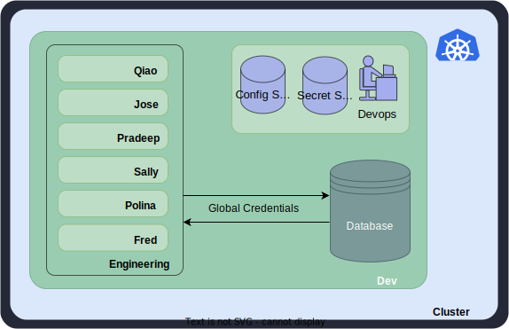
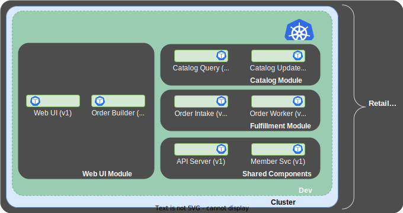
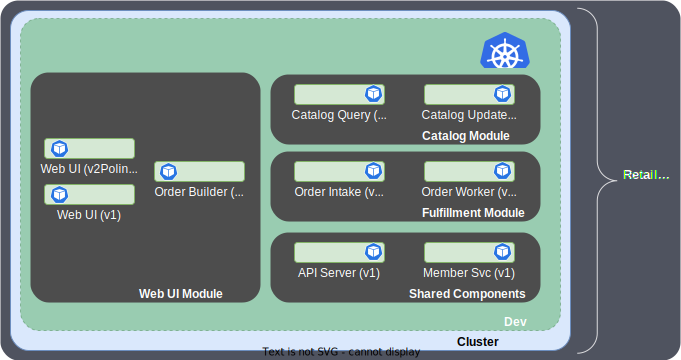
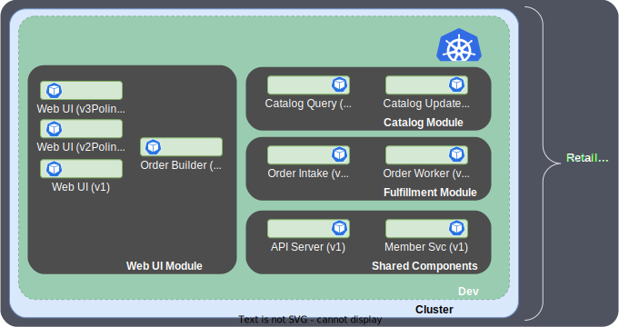
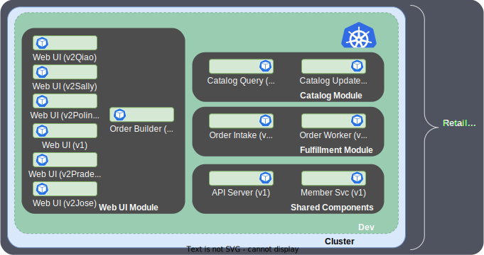
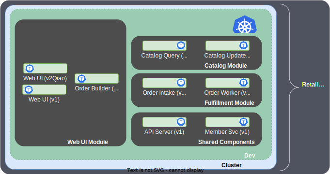

# Virtual Environments

When we think about environments today, we think about them as physical
constructs, because that is what they are. Environments familiar to all of us -
dev, QA, UAT, prod - exist for various reasons:

- In dev, we want to support the work of engineering teams to provide for rapid
  development of new capabilities;
- In QA, we’re collecting the works of various teams and testing them in various
  capacities (functional, performance, smoke, load, verification etc.);
- In UAT, we’re running pre-production code for the purpose of enabling users and
  customers to validate that the proposed release meets requirements;
- In prod, we’re running final code.

Each of these environments has a set of requirements, some of them unique.  For
instance, in dev and QA, we don’t want customer data, UAT should have only
limited or synthetic customer data, HA is unimportant in dev but can be mission
critical in prod etc.  Environments enable us to build policy controls
supporting these tenets. Figure 1 shows a typical dev environment.

<figure markdown>
  
  <figcaption>Figure 1 - A typical Dev environment</figcaption>
</figure>

To prevent things like adverse impacts to production customers from destructive
prototypes, we segregate the environments.  That segregation can take various
forms.  Whether the segregation occurs through different namespaces, different
environments or even different clusters, significant DevOps overhead is
incurred.  First, we need to determine the means by which segregation will
occur, then we need to build the constructs that will provide for segregation
\-e.g., manually building and configuring new namespaces, providing for connectivity,
determining and accounting for the blast radius of the new works etc.  This is
especially challenging in dev because dev has competing agendas:

1. We want developers to be able to innovate, test out new ideas, collaborate on
   changes, morph approaches - and do all of this freely and rapidly;
2. We want to prevent developers from stepping on each other; from a developer
   productivity standpoint, dedicated systems would be ideal;
3. We want to keep costs as low as possible, so we want to distill the
   supporting infrastructure (compute/storage resources, developer, QA and
   DevOps personnel etc.) to the smallest possible subset necessary - which, of
   course, is the opposite of (2).

In essence we have a dichotomy:  we want an independent, flexible dev workspace
that gracefully supports the innovative efforts of our teams *but* we want it at
the lowest cost possible.  And by the way, nothing can affect our production
systems.

Cost-reduction efforts today focus on reducing overall required resources by
actively analyzing different teams and developers within environments - for
instance, manually determining common factors across teams and developers,
building namespaces and infrastructure around those factors and continually
reassessing and reallocating -
resulting in a lot of overhead and expense.  These tasks are usually performed
by DevOps teams.  KubeFox usurps responsibility for the difficult aspects of
this process and drastically reduces DevOps overhead while simultaneously
increasing the speed at which accommodations can be made for new projects.

How?  KubeFox turns the concept of environment on its head.  Environments become lightweight, malleable, virtual constructs.  Custom configurations
(consisting of environment variables and secrets) can be created and deployed
easily  - either alongside a developer’s modifications or independently.  In
effect, it appears to the developer that their code is running inside a private
sandbox unique to them.  Behind the scenes, KubeFox takes care of
efficiencies by deploying only what is actually unique to that developer’s
efforts and sharing those components that have not changed.  The developer can
coexist with their colleagues - even if those colleagues are working on the same
component(s) for different reasons.  And DevOps overhead is drastically reduced.  

One can think about KubeFox environments as retaining the aspects of
environments that help accomplish useful things like segregating workloads,
providing sandboxes for POCs, developer experimentation, all the varieties of QA
testing and others.  However, the constraints one associates with environments
are gone.  

You can think of KubeFox Virtual Environments 
of them as overlays. Developers are empowered to rapidly spool up sandboxes to test their POCs and
ideas.  And they can do so without being constrained by environment
or namespace related logistics, and without the bureaucracy and overhead of
DevOps engagement.  

Polina can test her new code in Environment A, which is unique to her (Figure
2):

<figure markdown>
  
  <figcaption>Figure 2 - Polina testing in environment A</figcaption>
</figure>

and then shift instantly to Environment B (Figure 3), perhaps to compare her
changes with the prior version of software:

<figure markdown>
  
  <figcaption>Figure 3 - Polina testing in environment B</figcaption>
</figure>

KubeFox takes care of routing the requests correctly and injecting the
appropriate credentials - not just for the datastores, but for all components
composing Polina’s deployment.  And by the way, Polina can run both versions of
the Retail application simultaneously.

One way to think about it is that conventional developer environments are
spooled up.  But in actuality, KubeFox environments are overlays. Because KubeFox routes requests and events dynamically at runtime, the limitations of
environments melt away.  And KubeFox abstracts the
configuration from the deployment, empowering teams to easily and simply modify
and shift their
workloads - including for deployments that have already occurred.

KubeFox segregates the developer sandboxes while leveraging its capabilities to
distill the number of Pods running to only those that are unique and necessary
(this is discussed in greater depth both in [Versioned
Deployments](versioned_deployments.md) and [Deployment
Distillation](deployment_distillation.md).

In Figure 4, we have a complex Retail [App](index.md#app) comprising three modules: a Web UI
module, a Catalog module and a Fulfillment module.  Two components are shared
amongst those three modules. We've released version 1 of the Retail App just to make it
simple for developers to test with it.

<figure markdown>
  
  <figcaption>Figure 4 - Version 1 of the Retail App</figcaption>
</figure>

A KubeFox [Release](index.md#release)
results in all default traffic being directed to the released version of the App.  So
for instance, we might access the home page of the released App with a command like:

curl "http://localhost:8080/dev/index.html"

By the way, you can see some extra real estate in the Web UI
module - you'll see why in a moment.

Suppose we have a team of 5 engineers.  Each of them is working on the Web UI
module.  This presents some challenges with workspace segregation, specifically
around provisioning and co-development.  These types of challenges
that are often overcome with brute force provisioning - meaning running multiple
copies of the Retail App, each consuming its own resources. KubeFox eliminates
the need for active provisioning and empowers team members to develop and test
very rapidly - and without requiring DevOps involvement.

Let's start with Polina.  Polina makes some changes to the Web UI and then asks
KubeFox to deploy them (Figure 5).  When she does so - she doesn't need to tell KubeFox
what has changed and what to deploy.  She simply tells KubeFox to publish the
Retail App when she's ready.  KubeFox determines what has changed - in this
case, only the Web UI module - and it builds, containerizes and loads Polina's
new Web UI (we'll call it 'v2' or 'Version 2' for clarity's sake) into a Pod in the existing Dev namespace in the cluster:

<figure markdown>
  
  <figcaption>Figure 5 - Polina's Version 2 Deployment of the Web UI</figcaption>
</figure>

Note that KubeFox has distilled Polina's deployment of the Retail App to only
the v2Polina version of the Web UI component.  Polina can now test her version of
the Web UI component side-by-side with the production version (v1).  To access
her version, Polina simply adds some query parameters to the HTTP URL, e.g.:

curl "http://localhost:8080/polina/index.html?kf-dep=polinadepv2&kf-env=polina"

What we're doing here is asking for this request to be routed to the
"polinadepv2" deployment (shorthand for Polina's version 2 deployment) in the "polina"
Virtual Environment.  Polina can create another deployment (v3 in Figure 6) if she wishes and
test that alongside the base version of App and her v2 deployment:

<figure markdown>
  
  <figcaption>Figure 6 - Polina's v2 and v3 Deployments</figcaption>
</figure>

Again, all Polina has to do is to modify the Web UI and ask KubeFox to
publish her new version of the Retail App - Kubefox takes care of the rest.

Let's add our additional team members as shown in Figure 7:

<figure markdown>
  
  <figcaption>Figure 7 - Team Member v2 Deployments</figcaption>
</figure>

Each engineer perceives and interacts with their modifications as if they're
running in their own individual sandboxes.  So Qiao sees the system in the same
way as Polina did when she deployed her v2 version of the Web UI (Figure 8):

<figure markdown>
  
  <figcaption>Figure 8 - Qiao's v2 Deployment</figcaption>
</figure>

These developer-specific ‘environments’ are made possible by KubeFox.  KubeFox
dynamically routes traffic at runtime based upon configuration, enabling very
rapid traffic shaping without redeploying code, without DevOps involvement and
without provisioning management.
