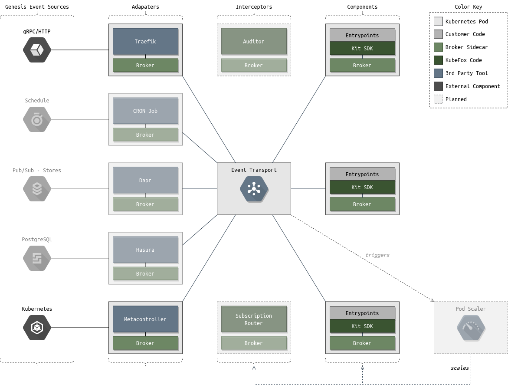
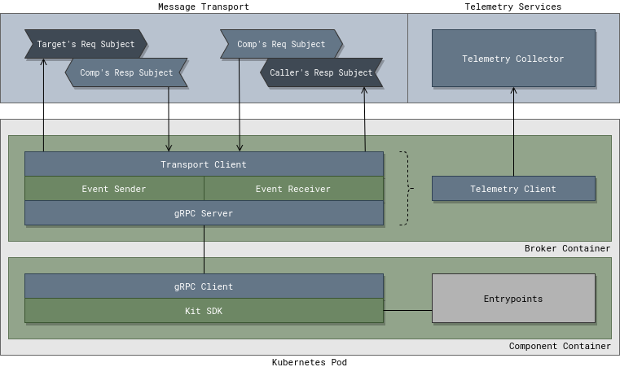

# Design

KubeFox is an event driven architecture. All requests and responses, even
synchronous calls, are modeled as events and are exchanged as messages via
Brokers and the Event Transport.

## Platform

The KubeFox Platform is driven by three core components; API Server, Runtime
Server, and Operator.

## API Server

The API Server implements the KubeFox API, a resource-based (RESTful)
programmatic interface provided via HTTP. Several types of primary resources are
defined by the API. Additional subresources are defined for each primary
resource type.

Most KubeFox API resource types are objects: they represent a concrete instance
of a concept, like a Config or a System. A smaller number of API resource types
are virtual in that they represent operations on objects, rather than objects
themselves, such as a Deployment or Release.

Every primary resource includes a metadata subresource. The metadata subresource
contains attributes that apply to all instances (objects) of that resource.

## Ref Subresources

Resources of type config, environment, and system include a special set of
subresources known as refs which allow retrieval of a specific resource instance
(object). Three types of ref subresources exist: id, tag, and branch. The branch
subresource is only available for the system resource. Performing a get on a ref
subresource will return the specific resource instance (object) it references.

An id subresource is automatically created when a resource of type config,
environment, or system is created. The URI of the subresource is generated by
the server and is guaranteed to be unique to that instance of the resource.

A tag subresource can be created by sending the id of the resource instance it
should reference. Tag subresources can be created or deleted, but not updated.
If a tag subresource is being utilized by a deployment or release it cannot be
deleted.

For system resources a branch subresource can be created by sending the id of
the resource instance it should reference. Branch subresources can be updated to
reference a different id at any time.

## Runtime Server

The Runtime Server is responsible for providing Brokers with everything they
need to process an event. This includes the System Object, Environment, and
Configuration specific to that event. Additionally, the Runtime Server provides
the Brokers with all credentials and secrets needed for it to securely connect
to the event transport server on startup.

## Operator

The Operator is responsible for reflecting the state of the KubeFox Platform
onto Kubernetes. State changes may occur after requests are processed by the API
Server or from events that occur within the KubeFox Platform. The operator
constantly monitors the health of all components of the Platform and can
automatically resolves issues causing any degradation.

## Broker

The Broker is a sidecar service that proxies all events to and from the
component it is serving and the KubeFox event transport. For security, it is the
only service allowed to connect to the event transport. As events pass through
the Broker it injects context information specific to that event. For example,
an incoming event to a component might have environment variables injected into
it before passing it to the component's entry point. Additionally, the Broker
enforces access control and security policies to ensure events can only be
accessed by the appropriate components. Lastly the Broker collects telemetry
data and ensures the needed trace context information follows related events.

