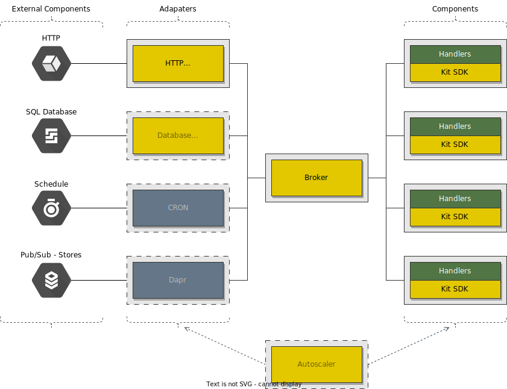
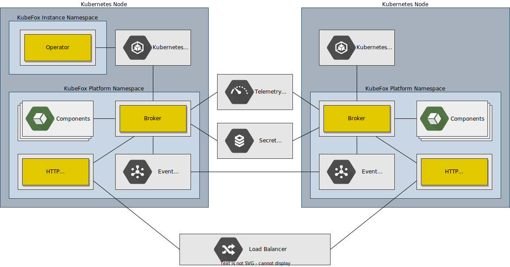

# Design

KubeFox is an event driven architecture. All requests and responses, even
synchronous calls, are modeled as events and are exchanged as messages via
Brokers and the Event Transport.

## Platform

The KubeFox Platform is driven by three core components; API Server, Runtime
Server, and Operator.

## Operator

The Operator is responsible for reflecting the state of the KubeFox Platform
onto Kubernetes. State changes may occur after requests are processed by the API
Server or from events that occur within the KubeFox Platform. The operator
constantly monitors the health of all components of the Platform and can
automatically resolves issues causing any degradation.
