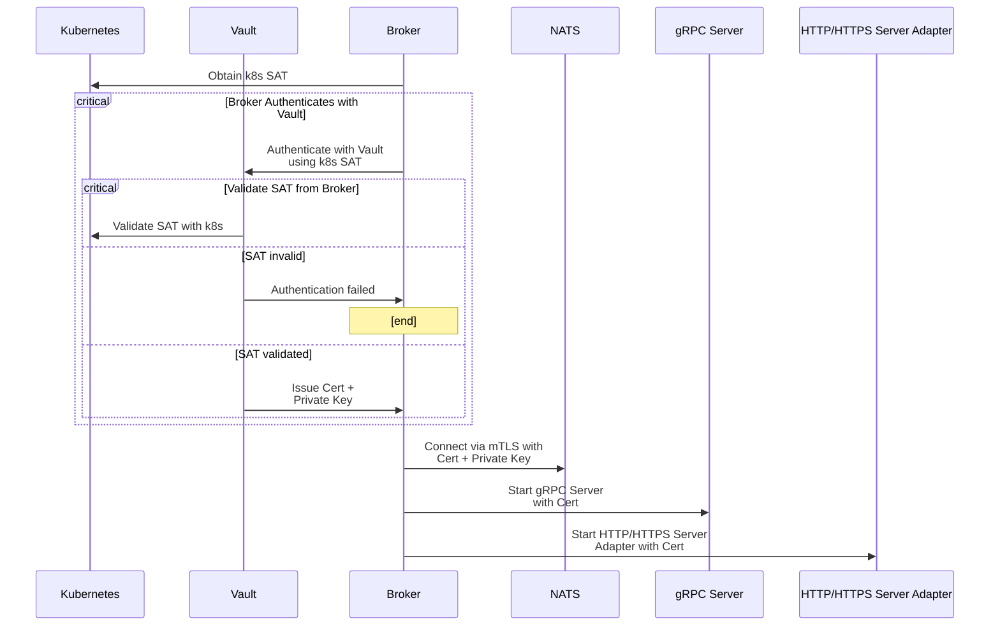

# Broker Startup

- On start up K8s service account token (SAT) is used to authenticate with Vault.
- Vault verifies SAT with K8s API and issues certificate and private key.
- Broker connects to NATS using mTLS with provided certificate and key.
- Start gRPC server used by components using certificate.
- Starts HTTP/HTTPS servers adapters.

    