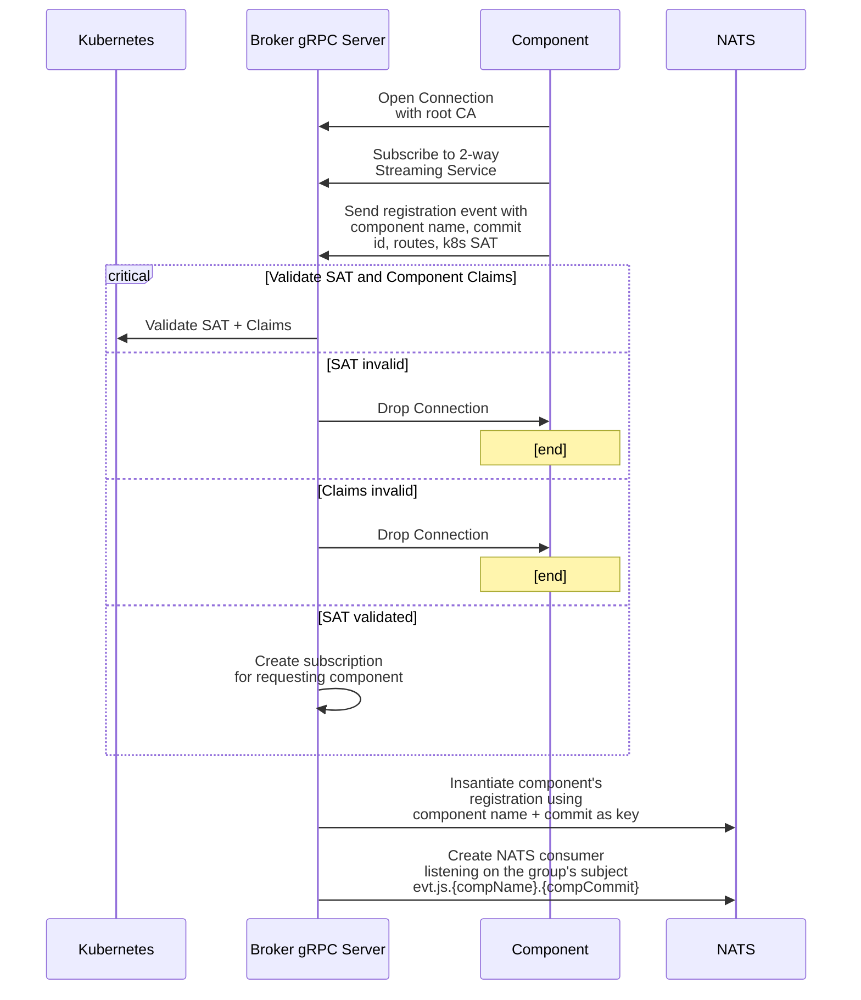

# Component Connects

1. Component opens connections to broker's gRPC server using root CA to verify certificate.
2. Component calls subscribe service (2-way streaming) and sends a registration event, which contains component name, commit, id, routes, and K8s SAT.
3. Broker authorizes by verifying SAT with K8s API and ensures claims match attributes provided by component.
4. The broker starts a subscription for the component that is used to pass events.
5. Broker puts component's registration into NATS k/v store using the component name + commit as key (not id).
6. Broker creates NATS consumer which listens for new messages on the component
   group's subject (evt.js.{compName}.{compCommit}).

