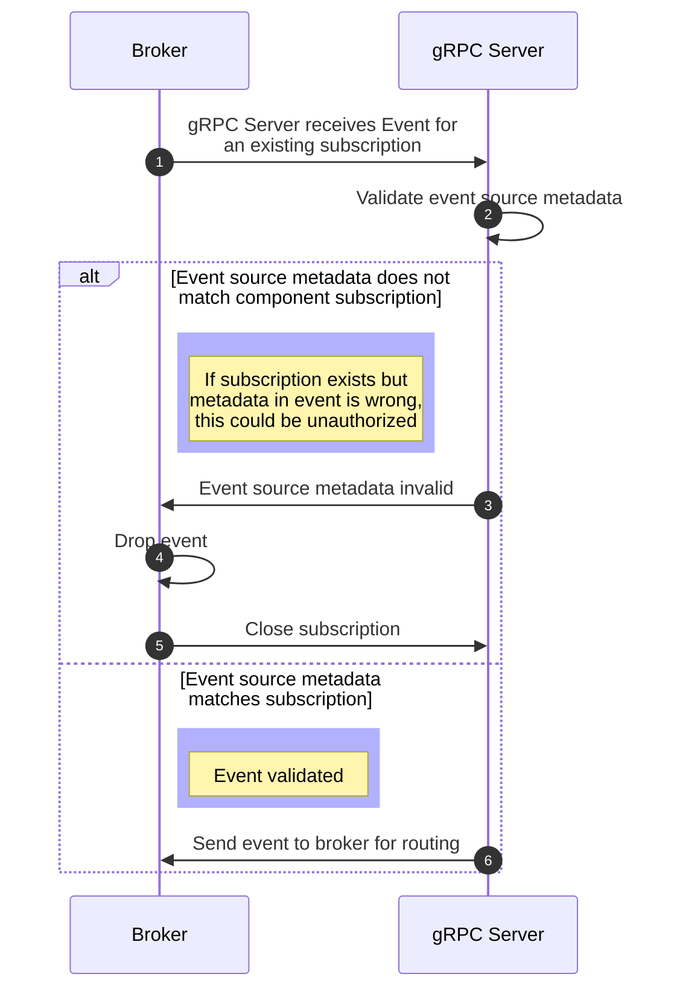

# Process Component Event

The diagrams below show [Component Event](../../concepts/index.md#event)
processing for [gRPC](process_component_event.md#grpc-server) requests, and for the
[KubeFox Broker](process_component_event.md#broker).

### gRPC Server

<!-- 1. Event is received by grpc server for an existing subscription.
2. grpc server verifies the event source matches the subscribed component, if it does not the broker drops the event and closes the subscription.
3. The grpc server passes the event to the broker for routing. -->

### Broker

<!-- 1. The event should already have context set as it is not a genesis event, if it doesn't it is rejected and dropped.
2. The event source should be complete with component name, commit, and id
3. The event target should either contain only the component's name or be complete.
4. Either is not true event is dropped
5. If only target name is set then event is matched based on context and target commit and route id are added
6. If event is not matched it is dropped (currently there is no response sent to component)
7. the deployment or release are then pulled and broker verifies both the source and target components are part of the deployment spec.
8. if they are not event is dropped.
9. broker checks if a matching component is subscribed locally via grpc and if so sends the event to that component.
10. otherwise the event is publish onto the component's NATS subject so that another broker with a subscription for that component can process it.
11. ttl is updated before sending
 -->

```mermaid
  sequenceDiagram
    autonumber

    participant broker as Broker
    participant grpcs as gRPC Server
    participant nats as NATS
    participant component as Matched Component

    grpcs->>broker: Inbound event from component

    rect rgba(100, 100, 255, .5)
        Note right of broker: Validate context set - must have either: <br/> - known release, or<br/> - known deployment
    end

    broker->>broker: Validate Context Set
    alt Context not set
        broker->>broker: reject and drop event
    else
        note right of broker: Context set
    end

    rect rgba(100, 100, 255, .5)
        Note right of broker: Validate event source metadata:<br/> 1. source component name,<br/>2. commit, and<br/>3. id
    end
    broker->>broker: Validate event source metadata
    alt Metadata invalid
        broker->>broker: reject and drop event
    else
        note right of broker: Event source metadata validated
    end

    rect rgba(100, 100, 255, .5)
        Note right of broker: Validate event target - must contain:<br/> 1. target component name only, OR<br/>2. complete target component metadata
    end
    
    broker->>broker: Validate event target metadata
    alt Target metadata invalid
        broker->>broker: reject and drop event
    else
        note right of broker: Event target metadata validated
    end

    rect rgba(100, 100, 255, .5)
        Note right of broker: Match event target
    end

    alt Event target specified by name only
        broker->>nats: Match event target (target name + context)
        alt Match not found
            nats->>broker: Target component not found
            broker->>broker: Drop event
        else Match found
            nats->>broker: Target component found
            rect rgba(100, 100, 255, .5)
                Note right of broker: Add target metadata:<br/> 1. target commit, and<br/>2. route id
            end
        end
    else Event target metadata complete
        broker->>nats: Match event target (metadata complete)
        alt Match not found
            nats->>broker: Target component not found
            broker->>broker: Drop event
        else Match found
            nats->>broker: Target component found
        end
    end

    broker->>nats: Retrieve deployment or release
    rect rgba(100, 100, 255, .5)
        Note right of broker: Source and target components <br/> must be part of the deployment spec
    end
    broker->>broker: Validate source and target 
    alt Source and target are not <br/> present in the deployment
        broker->>broker: Drop event
    else
        rect rgba(100, 100, 255, .5)
            Note right of broker: Source and target are <br/>present in the deployment
        end
    end

    broker->>grpcs: Determine whether matched target<br/>component is locally subscribed
    alt Matched target component locally subscribed
        grpcs-->component: Local subscription
        grpcs->>broker: Component subscription found
        rect rgba(100, 100, 255, .5)
            Note left of grpcs: Update ttl and send event <br/> to locally-subscribed component
        end
        broker->>broker: Update ttl
        broker->>grpcs: Send event to component via gRPC
    else Matched target component not locally subscribed
        grpcs->>broker: Component subscription not found
        rect rgba(100, 100, 255, .5)
            Note left of nats: Update ttl and publish to target<br/>component group's NATS subject
        end
        broker->>broker: Update ttl
        broker->>nats: Publish event to NATS
    end

```

