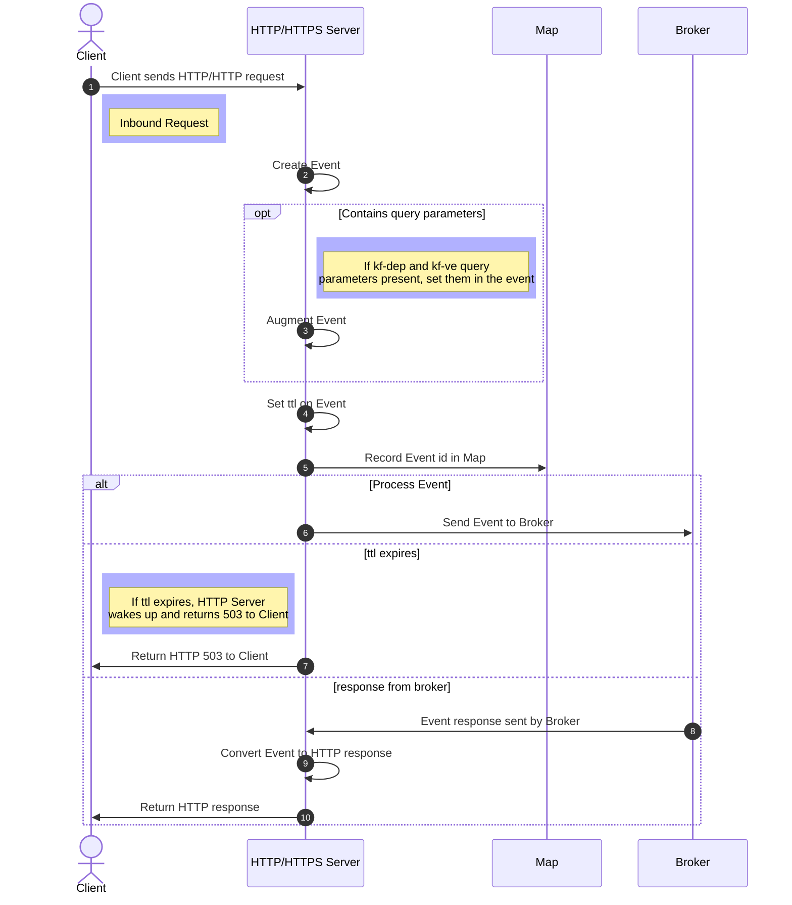
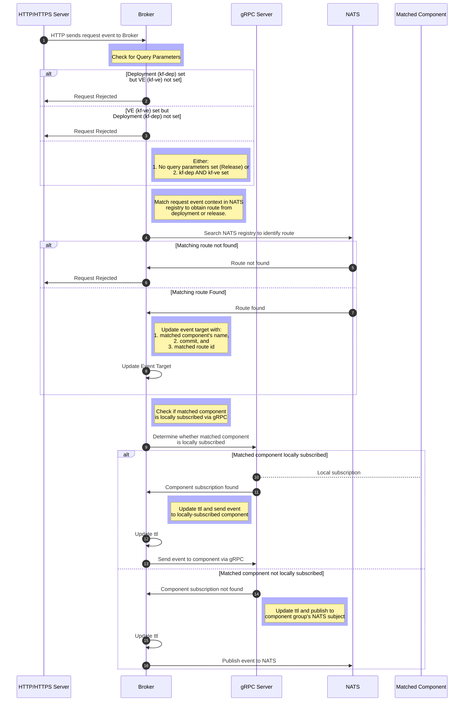

# Process Genesis Event

The diagrams below show [Genesis Event](../../concepts/index.md#genesis-event)
processing for [HTTP and HTTPS
Server](process_genesis_event_http.md#http-server) requests, and for the
[KubeFox Broker](process_genesis_event_http.md#broker).

### HTTP Server

<!-- 1. HTTP request comes in to http server and is converted to event.
2. If request contains deployment and environment headers/query params they are set on the event.
3. The default TTL, which can be set as a flag on broker, is set on event.
4. http server records request event id in map.
5. sends event to broker for routing
6. http server then blocks and waits either for ttl to expire or response to come from broker
8. if ttl expires 503 is returned to client
9. if response comes back it is converted to http response and sent back to
   client. -->

### Broker

<!-- 1. Broker receives http request event from http server.
2. Event will either have no context which indicates it should match a release or have the deployment and environment set.
3. If environment or deployment is set without the other the request is rejected.
4. Based on the context a matcher for the specified deployment or for all released components is used. These are built by inspecting the deployed and released components and looking up their routes in the registration stored in the NATS.
5. If request does not match any routes a not found error is returned.
6. If matched the event target is updated with the matched component's name, commit, and matched route id.
7. broker checks if a matching component is subscribed locally via grpc and if so sends the event to that component.
8. otherwise the event is publish onto the component group's NATS subject so that another broker with a subscription for that component can process it.
9. ttl is updated before sending
 -->

