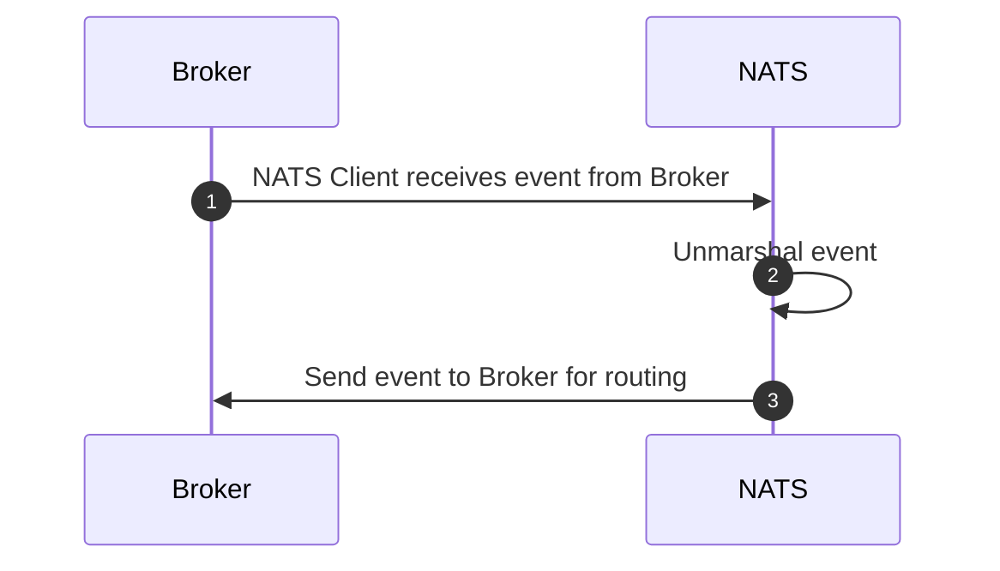

# Process NATS Event

The diagrams below show NATS Event
processing for the [NATS Client](process_nats_event.md#nats-client) requests, and for the
[KubeFox Broker](process_nats_event.md#broker).

### NATS Client

<!-- 1. Receives and unmarshals event, ttl is updated based on when msg was created.
2. Sends event to broker for routing. -->

### Broker

<!-- 1. Workflow is same as for grpc but target should have both name and commit set.
2. If there is matching component it means that the component got unsubscribed while process the event, otherwise the broker would not have been listening on the subject. Is this case the event is republished onto the same subject. -->

```mermaid
  sequenceDiagram
    autonumber

    participant broker as Broker
    participant grpcs as gRPC Server
    participant nats as NATS
    participant component as Matched Component

    nats->>broker: Inbound event from component

    rect rgba(100, 100, 255, .5)
        Note right of broker: Validate context set - must have either: <br/> - known release, or<br/> - known deployment
    end

    broker->>broker: Validate Context Set
    alt Context not set
        broker->>broker: reject and drop event
    else
        note right of broker: Context set
    end

    rect rgba(100, 100, 255, .5)
        Note right of broker: Validate event source metadata:<br/> 1. source component name,<br/>2. commit, and<br/>3. id
    end
    broker->>broker: Validate event source metadata
    alt Metadata invalid
        broker->>broker: reject and drop event
    else
        note right of broker: Event source metadata validated
    end

    rect rgba(100, 100, 255, .5)
        Note right of broker: Validate event target - must contain:<br/> 1. target component name, AND<br/>2. commit id
    end
    
    broker->>broker: Validate event target metadata
    alt Target metadata invalid
        broker->>broker: reject and drop event
    else
        note right of broker: Event target metadata validated
    end

    rect rgba(100, 100, 255, .5)
        Note right of broker: Match event target
    end

    alt Event target specified by name and id only
        broker->>nats: Match event target (target name, id + context)
        alt Match not found
            nats->>broker: Target component not found
            broker->>broker: Drop event
        else Match found
            nats->>broker: Target component found
            rect rgba(100, 100, 255, .5)
                Note right of broker: Add target route id
            end
        end
    else Event target metadata complete
        broker->>nats: Match event target (metadata complete)
        alt Match not found
            nats->>broker: Target component not found
            broker->>broker: Drop event
        else Match found
            nats->>broker: Target component found
        end
    end

    broker->>nats: Retrieve deployment or release
    rect rgba(100, 100, 255, .5)
        Note right of broker: Source and target components <br/> must be part of the deployment spec
    end
    broker->>broker: Validate source and target 
    alt Source and target are not <br/> present in the deployment
        broker->>broker: Drop event
    else
        rect rgba(100, 100, 255, .5)
            Note right of broker: Source and target are <br/>present in the deployment
        end
    end

    broker->>grpcs: Determine whether matched target<br/>component is locally subscribed
    alt Matched target component locally subscribed
        grpcs-->component: Local subscription
        rect rgba(100, 100, 255, .5)
            Note left of grpcs: Component must have been<br/>unsubscribed while processing the event
        end
        rect rgba(100, 100, 255, .5)
            Note left of nats: Update ttl and publish to target<br/>component group's NATS subject
        end
        broker->>broker: Update ttl
        broker->>nats: Publish event to NATS
    else Matched target component not locally subscribed
        grpcs->>broker: Component subscription not found
        rect rgba(100, 100, 255, .5)
            Note left of nats: Update ttl and publish to target<br/>component group's NATS subject
        end
        broker->>broker: Update ttl
        broker->>nats: Publish event to NATS
    end

```

