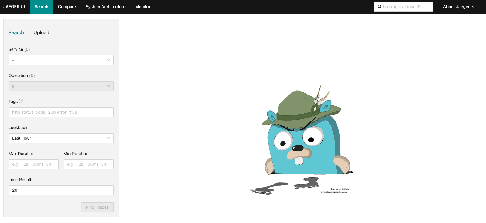
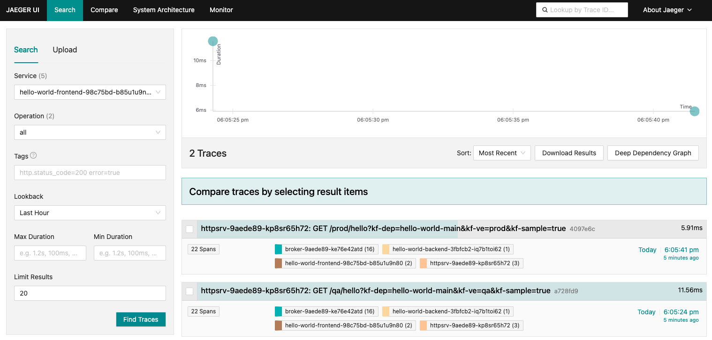
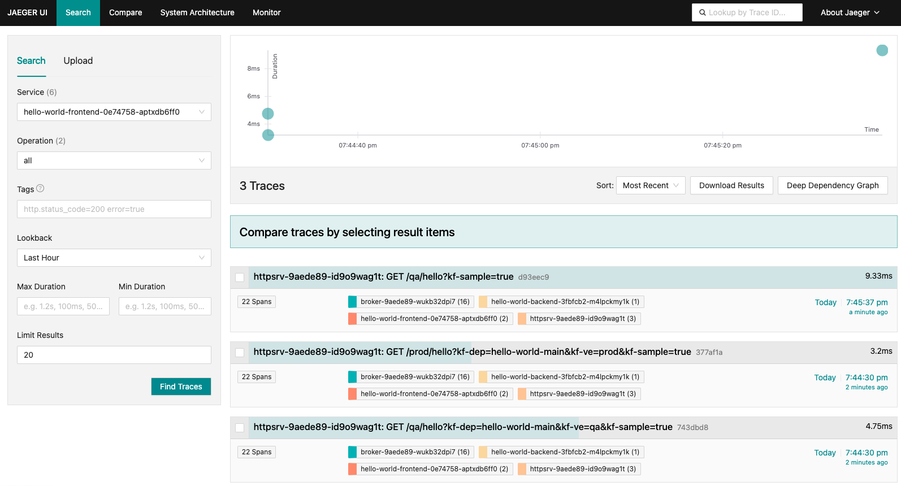
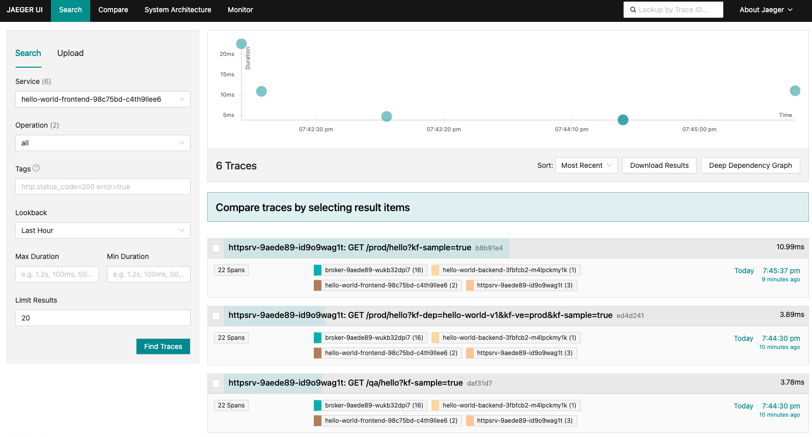
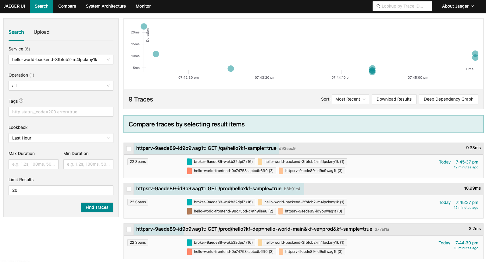

# Quickstart

Welcome to the world of KubeFox! This technical guide will walk you through the
process of setting up a Kubernetes cluster using either kind or Azure and
deploying your inaugural KubeFox app. From crafting environments and deploying
apps to testing and version control, we'll cover it all. Whether you're a
seasoned developer or just getting started, this guide will help you navigate
the fundamentals of a comprehensive software development lifecycle leveraging
KubeFox. Let's dive in!

## Prerequisites

--8<-- "./docs/getting_started/common_content/prereqs.md"

## Tracing

You can choose to run the Quickstart with tracing active, or without tracing.
With tracing active, a couple of additional Pods are created:  

1. A Pod for OpenTelemetry which collects and exports trace data to Jaeger
2. A Pod for Jaeger providing a visual interface for trace data

Tracing enables you to trace the workflow of your application - which components
call which components, how much time was spent in each component etc.

If this is the first time you've worked with Kubernetes or KubeFox, perhaps skip
tracing for now just to keep things simple.  But if you're feeling adventurous
or curious, feel free to proceed with Tracing Active.

=== "Tracing Active"

===+ "No Tracing"

By the way, once you select **Tracing Active** or **No Tracing**, or whether
you're going to use **Local(kind)** or **Azure** (below), it remains selected throughout the document so you can select-and-forget. 

## Setup Kubernetes

Let's kick things off by setting up a Kubernetes cluster. Use the following
commands depending on which Kubernetes provider you would like to use. If you
already have a Kubernetes Cluster provisioned, you can skip this step.

=== "Local (kind)"

    --8<-- "./docs/getting_started/common_content/kind_config.md"

=== "Azure (AKS)"

    --8<-- "./docs/getting_started/common_content/azure_config.md"

## Setup KubeFox

In this step you will install the KubeFox Helm Chart to initiate the KubeFox
Operator on your Kubernetes cluster. The operator manages KubeFox Platforms and
Apps.

=== "Local (kind)"

    --8<-- "./docs/getting_started/common_content/install_kubefox_local_tracing_option.md"

=== "Azure (AKS)"

    --8<-- "./docs/getting_started/common_content/install_kubefox_azure_tracing_option.md"

## Deploy

Awesome! You're all set to start the KubeFox Platform on the your newly created
cluster and deploy your first KubeFox App. To begin, create a new directory and 
use Fox to initialize the `hello-world` App. Run all subsequent commands from
this directory. The environment variable `FOX_INFO` tells Fox to to provide
additional output about what is going on. Employ the `--quickstart` flag to use
defaults and create a KubeFox Platform named `demo` in the `kubefox-demo`
Namespace.

```{ .shell .copy }
mkdir kubefox-quickstart && \
  cd kubefox-quickstart && \
  export FOX_INFO=true && \
  fox init --quickstart
```

??? example "Output"

    ```text
    info    Configuration successfully written to '/home/xadhatter/.config/kubefox/config.yaml'.

    info    Waiting for KubeFox Platform 'demo' to be ready...
    info    KubeFox initialized for the quickstart guide!
    ```

Notice the newly created directories and files. The `hello-world` App comprises
two Components, `frontend` and `backend`. There are also two example
Environments and Virtual Environments in the `hack/environments` directory.
Finally, Fox initialized a new Git repo for you. Take a look around!

Now, let's create some Environments and Virtual Environments. A Virtual
Environments inherits all specifications and data from its parent Environment,
but values can be overridden or added in the Virtual Environments. In the
provided examples the `subPath` variable is used to ensure unique routes between
Virtual Environments.

Run the following command to examine the Environments and Virtual Environments
and apply them to Kubernetes using `kubectl`. Note the differences between the
two Environments' variables on the highlighted lines.

```{ .shell .copy }
cat hack/environments/* && \
  kubectl apply --namespace kubefox-demo --filename hack/environments/
```

??? example "Output"

    ```text hl_lines="11 12 30 31"
    ---
    apiVersion: kubefox.xigxog.io/v1alpha1
    kind: Environment
    metadata:
      name: prod
    spec:
      releasePolicy:
        type: Stable
    data:
      vars:
        who: Universe
        subPath: prod
    ---
    apiVersion: kubefox.xigxog.io/v1alpha1
    kind: VirtualEnvironment
    metadata:
      name: prod
    spec:
      environment: prod
    ---
    apiVersion: kubefox.xigxog.io/v1alpha1
    kind: Environment
    metadata:
      name: qa
    spec:
      releasePolicy:
        type: Testing
    data:
      vars:
        who: World
        subPath: qa
    ---
    apiVersion: kubefox.xigxog.io/v1alpha1
    kind: VirtualEnvironment
    metadata:
      name: qa
    spec:
      environment: qa
    environment.kubefox.xigxog.io/prod created
    virtualenvironment.kubefox.xigxog.io/prod created
    environment.kubefox.xigxog.io/qa created
    virtualenvironment.kubefox.xigxog.io/qa created
    ```

We have two Virtual Environments:

1. prod - which inherits an environment variable 'who' set to “Universe” and a
   subpath of “prod” from its parent Environment.
2. qa - which inherits an environment variable 'who' set to "World" and a
   subpath of “qa” from its parent Environment.

Next deploy the `hello-world` App. Simply use the `publish` command, which not
only builds the OCI images for the Components but also pushes them to the
container registry and finally deploys the App to the KubeFox Platform. You have
the flexibility to specify the name and version of the AppDeployment you're
creating. We'll delve into AppDeployment version later in this tutorial, so
there's no need to worry about it right now. If you don't provide a name,
KubeFox defaults it to `<APP NAME>-<GIT REF>`. In our case, it becomes
`hello-world-main`. The initial run might take a bit of time as it downloads
dependencies, but subsequent runs will be faster. If you want more detailed
feedback, consider adding the `--verbose` flag.

```{ .shell .copy }
fox publish --wait 5m
```

??? example "Output"

    ```text
    info    Building Component image 'localhost/kubefox/hello-world/backend:3fbfcb274c2116d4d82271da41074135'.
    info    Loading Component image 'localhost/kubefox/hello-world/backend:3fbfcb274c2116d4d82271da41074135' into kind cluster 'kind'.

    info    Building Component image 'localhost/kubefox/hello-world/frontend:98c75bd20b210d15b456ec92faab2abd'.
    info    Loading Component image 'localhost/kubefox/hello-world/frontend:98c75bd20b210d15b456ec92faab2abd' into kind cluster 'kind'.

    info    Waiting for KubeFox Platform 'demo' to be ready.
    info    Waiting for Component 'backend' to be ready.
    info    Waiting for Component 'frontend' to be ready.

    apiVersion: kubefox.xigxog.io/v1alpha1
    kind: AppDeployment
    metadata:
      creationTimestamp: "1970-01-01T00:00:00Z"
      finalizers:
      - kubefox.xigxog.io/release-protection
      generation: 1
      labels:
        app.kubernetes.io/name: hello-world
        kubefox.xigxog.io/app-branch: main
        kubefox.xigxog.io/app-commit: 8bdd108ba636353020b95b75764b5edb18d5f914
        kubefox.xigxog.io/app-commit-short: 8bdd108
      name: hello-world-main
      namespace: kubefox-demo
      resourceVersion: "13326"
      uid: 5ad9a257-01c0-43e0-b6be-92757a47ba7c
    details:
      description: A simple App demonstrating the use of KubeFox.
      title: Hello World
    spec:
      appName: hello-world
      branch: main
      commit: 8bdd108ba636353020b95b75764b5edb18d5f914
      commitTime: "1970-01-01T00:00:00Z"
      components:
        backend:
          defaultHandler: true
          envVarSchema:
            who:
              required: true
          hash: 3fbfcb274c2116d4d82271da41074135
          type: KubeFox
        frontend:
          dependencies:
            backend:
              type: KubeFox
          hash: 98c75bd20b210d15b456ec92faab2abd
          routes:
          - envVarSchema:
              subPath:
                required: true
            id: 0
            rule: Path(`/{{.Vars.subPath}}/hello`)
          type: KubeFox
      containerRegistry: localhost/kubefox
    status:
      conditions:
      - lastTransitionTime: "1970-01-01T00:00:00Z"
        message: Component Deployments have minimum required Pods available.
        observedGeneration: 1
        reason: ComponentsAvailable
        status: "True"
        type: Available
      - lastTransitionTime: "1970-01-01T00:00:00Z"
        message: Component Deployments completed successfully.
        observedGeneration: 1
        reason: ComponentsDeployed
        status: "False"
        type: Progressing
    ```

Inspect what's running on Kubernetes.

```{ .shell .copy }
kubectl get pods --namespace kubefox-demo
```

??? example "Output"

    ```text
    NAME                                           READY   STATUS    RESTARTS   AGE
    demo-broker-grkcn                              1/1     Running   0          12s
    demo-httpsrv-7d8d946c57-rlt55                  1/1     Running   0          10s
    demo-nats-0                                    1/1     Running   0          18s
    hello-world-backend-3fbfcb2-577868c97b-29q2k   1/1     Running   0          2s
    hello-world-frontend-98c75bd-65fb98f59d-ll4sf  1/1     Running   0          2s
    ```

The Pods for two Components you deployed were created, `backend` and `frontend`.
The `broker`, `httpsrv`, and `nats` Pods are part of the KubeFox Platform
initiated by the Operator during Platform creation.

Typically, connections to KubeFox Apps are made through a public-facing load
balancer. To keep things simple for purposes of this tutorial, we'll use the Fox CLI to create a local proxy instead. Note that we're going to leave the proxy running, so it's important to start it in a new terminal window.

In the new terminal window run the following command:

```{ .shell .copy }
fox proxy 8080
```

??? info "macOS Network Warning"

    <figure markdown>
      
    </figure>

    If you are using macOS you might notice this dialog popup when you start the
    proxy. This is expected as Fox starts a local HTTP server. The server is
    bound to the `localhost` interface and is only accessible from your
    workstation. Please press `Allow` to continue.

??? example "Output"

    ```text
    HTTP proxy started on http://127.0.0.1:8080
    ```

=== "Tracing Active"

    KubeFox has the ability to generate trace data automatically.  To see the
    traces, we need to do a couple of simple things.  First, we need to set up port
    forwarding to enable a browser window to access the trace data we'll generate.
    As with the proxy, this will be a command we will leave running so we need
    another (a third) terminal window.

    In the new terminal window, enter the following command: 

    ```{ .shell .copy }
    kubectl port-forward -n kubefox-system service/jaeger-query 16686:16686
    ```
    ??? example "Output"

        ```text
        Forwarding from 127.0.0.1:16686 -> 16686
        Forwarding from [::1]:16686 -> 16686
        ```
    With the port forward active, we can take a quick look at the Jaeger UI.  Jaeger
    provides us the ability to visualize the traces generated by KubeFox. Click on
    the link and you should see a screen similar to that in Figure 1.

    [http://localhost:16686/](http://localhost:16686/){:target="_blank"} 

    <figure markdown>
      
      <figcaption>Figure 1 - Inital Jaeger Screen</figcaption>
    </figure>

    Note that we don't have any traces at this point because we haven't yet
    exercised our application.  We'll jump back over to Jaeger in a moment.

    Leave the port forward and the proxy running, and return to the original
    terminal.  Back in the original terminal, let's test the AppDeployment. KubeFox won't route
    requests to the App until it's released, but you can still test AppDeployments
    by manually providing context. KubeFox needs two pieces of information to route
    an event, the AppDeployment to use and the Virtual Environments to inject. These
    can be passed as headers or query parameters for HTTP requests.

    The query parameters are:

    - kf-dep - specifies the deployment we want to target
    - kv-ve - specifies a Virtual Environment in which the target deployment is available
    - kf-sample=true - tells KubeFox that we want to generate trace data for a request

    Let's run our first curl request!

    ```{ .shell .copy }
    curl "http://localhost:8080/qa/hello?kf-dep=hello-world-main&kf-ve=qa&kf-sample=true"
    ```
=== "No Tracing"

    Leave the proxy running, and return to the original terminal. Back in the
    original terminal, let's test the AppDeployment. KubeFox won't route requests to
    the App until it's released, but you can still test AppDeployments
    by manually providing context. KubeFox needs two pieces of information to route
    an event, the AppDeployment to use and the Virtual Environments to inject. These
    can be passed as headers or query parameters for HTTP requests.

    The query parameters are:

    - kf-dep - specifies the deployment we want to target
    - kv-ve - specifies a Virtual Environment in which the target deployment is available

    Let's run our first curl request!

    ```{ .shell .copy }
    curl "http://localhost:8080/qa/hello?kf-dep=hello-world-main&kf-ve=qa"
    ```

??? example "Output"

    ```text
    👋 Hello World!
    ```

Try switching to the `prod` Virtual Environment — this can be done seamlessly
with KubeFox without creating another AppDeployment. This is possible because
KubeFox injects context at request time instead of at deployment. Adding Virtual
Environments has nearly zero overhead! We need to change the URL path from
`/qa/hello` to `/prod/hello` to match the `subPath` variable we specified in the
Environment.

=== "Tracing Active"

    ```{ .shell .copy }
    curl "http://localhost:8080/prod/hello?kf-dep=hello-world-main&kf-ve=prod&kf-sample=true"
    ```

    ??? example "Output"

        ```text
        👋 Hello Universe!
        ```

    Let's take a look at Jaeger at this point.  Go to the tab you opened above and
    do the following:

    1. Refresh the page
    2. Select the "hello-world-frontend..." in the "Service" dropdown.
    3. Click the "Find Traces" button at the bottom.

    You should see something similar to what is shown in Figure 2 below.

    <figure markdown>
      
      <figcaption>Figure 2 - Jaeger Screen showing traces for the frontend</figcaption>
    </figure>

    Pretty cool, right?  With no time invested in the configuration of telemetry,
    you're seeing trace data for the `hello-world` App, simply by virtue of building
    the App with KubeFox.

    Feel free to play around with Jaeger and get acquainted with the interface.
    Some pointers: 

    - Trace data will be available to Jaeger a few seconds after running a command.
    - It is the 'kf-sample=true' query parameter that generates the trace data for a
      particular commmand.
    - The simplest way to see data is to go through steps above (Refresh the Jaeger
      page, select the Service for which you want to see trace data, and click the
      "Find Traces" button). 

=== "No Tracing"

    ```{ .shell .copy }
    curl "http://localhost:8080/prod/hello?kf-dep=hello-world-main&kf-ve=prod"
    ```

    ??? example "Output"

        ```text
        👋 Hello Universe!
        ```

## Release

To have KubeFox automatically route requests without manually specifying context
you need to create a Release. Once a AppDeployment is released, KubeFox will
match requests to Components' routes and automatically inject context. Before
creating a Release it is recommended to publish a versioned AppDeployment and
tag the Git repo. Unlike normal AppDeployments, which can be updated freely,
versioned AppDeployments are immutable. They provide a stable deployment that
can be promoted to higher Virtual Environments.

Tag the Git repo, publish the versioned AppDeployment, and release it to the
`qa` Environment with this command.

```{ .shell .copy }
fox publish --version v1 --create-tag && \
  fox release v1 --virtual-env qa
```

??? example "Output"

    ```text
    info    Component image 'localhost/kubefox/hello-world/backend:3fbfcb274c2116d4d82271da41074135' exists, skipping build.
    info    Loading Component image 'localhost/kubefox/hello-world/backend:3fbfcb274c2116d4d82271da41074135' into kind cluster 'kind'.

    info    Component image 'localhost/kubefox/hello-world/frontend:98c75bd20b210d15b456ec92faab2abd' exists, skipping build.
    info    Loading Component image 'localhost/kubefox/hello-world/frontend:98c75bd20b210d15b456ec92faab2abd' into kind cluster 'kind'.

    info    Creating tag 'v1'.

    apiVersion: kubefox.xigxog.io/v1alpha1
    kind: AppDeployment
    metadata:
      creationTimestamp: "1970-01-01T00:00:00Z"
      finalizers:
      - kubefox.xigxog.io/release-protection
      generation: 1
      labels:
        app.kubernetes.io/name: hello-world
        kubefox.xigxog.io/app-branch: main
        kubefox.xigxog.io/app-commit: 8bdd108ba636353020b95b75764b5edb18d5f914
        kubefox.xigxog.io/app-commit-short: 8bdd108
        kubefox.xigxog.io/app-tag: v1
        kubefox.xigxog.io/app-version: v1
      name: hello-world-v1
      namespace: kubefox-demo
      resourceVersion: "2257050"
      uid: 782a0938-7f9d-4bae-a6b5-900499fca6f7
    details:
      description: A simple App demonstrating the use of KubeFox.
      title: Hello World
    spec:
      appName: hello-world
      branch: main
      commit: 8bdd108ba636353020b95b75764b5edb18d5f914
      commitTime: "1970-01-01T00:00:00Z"
      components:
        backend:
          defaultHandler: true
          envVarSchema:
            who:
              required: true
          hash: 3fbfcb274c2116d4d82271da41074135
          type: KubeFox
        frontend:
          dependencies:
            backend:
              type: KubeFox
          hash: 98c75bd20b210d15b456ec92faab2abd
          routes:
          - envVarSchema:
              subPath:
                required: true
            id: 0
            rule: Path(`/{{.Vars.subPath}}/hello`)
          type: KubeFox
      containerRegistry: localhost/kubefox
      tag: v1
      version: v1
    status:
      conditions:
      - lastTransitionTime: "1970-01-01T00:00:00Z"
        message: Component Deployments have minimum required Pods available.
        observedGeneration: 1
        reason: ComponentsAvailable
        status: "True"
        type: Available
      - lastTransitionTime: "1970-01-01T00:00:00Z"
        message: Component Deployments completed successfully.
        observedGeneration: 1
        reason: ComponentsDeployed
        status: "False"
        type: Progressing

    apiVersion: kubefox.xigxog.io/v1alpha1
    kind: VirtualEnvironment
    metadata:
      creationTimestamp: "1970-01-01T00:00:00Z"
      finalizers:
      - kubefox.xigxog.io/environment-protection
      generation: 2
      labels:
        kubefox.xigxog.io/environment: qa
      name: qa
      namespace: kubefox-demo
      resourceVersion: "5643"
      uid: f7d7a42f-bc3f-46f3-8ec4-c557e1a84fe3
    spec:
      environment: qa
      release:
        apps:
          hello-world:
            appDeployment: hello-world-v1
            version: v1
    status:
      activeRelease:
        activationTime: "1970-01-01T00:00:00Z"
        apps:
          hello-world:
            appDeployment: hello-world-v1
            version: v1
        id: 011aa5fd-0ed3-4920-8564-bb793435e97c
        requestTime: "1970-01-01T00:00:00Z"
      conditions:
      - lastTransitionTime: "1970-01-01T00:00:00Z"
        message: Release AppDeployments are available, Routes and Adapters are valid and
          compatible with the VirtualEnv.
        observedGeneration: 2
        reason: ContextAvailable
        status: "True"
        type: ActiveReleaseAvailable
      - lastTransitionTime: "1970-01-01T00:00:00Z"
        message: Release was activated.
        observedGeneration: 2
        reason: ReleaseActivated
        status: "False"
        type: ReleasePending
    ```

When a `Fox Release` is performed to a Virtual Environment, KubeFox will default
traffic to that subPath to the current release.  In our case, traffic to
localhost:8080/qa/hello will be routed to the currently released version of the
`hello-world` App.

Test the same request as before, but this time without specifying context. Since
the App has been released, the request is matched by the Component's route, and
context information is automatically applied.

=== "Tracing Active"

    ```{ .shell .copy }
    curl "http://localhost:8080/qa/hello?kf-sample=true"
    ```

    Note:  We do need to add the 'kf-sample=true' query parameter to capture trace data.

=== "No Tracing"

    ```{ .shell .copy }
    curl "http://localhost:8080/qa/hello"
    ```

??? example "Output"

    ```text
    👋 Hello World!
    ```

Inspect the Pods running on Kubernetes now that you created another
AppDeployment and Release.

```{ .shell .copy }
kubectl get pods --namespace kubefox-demo
```

??? example "Output"

    ```text
    NAME                                           READY   STATUS    RESTARTS   AGE
    demo-broker-grkcn                              1/1     Running   0          6m11s
    demo-httpsrv-7d8d946c57-rlt55                  1/1     Running   0          6m9s
    demo-nats-0                                    1/1     Running   0          6m17s
    hello-world-backend-3fbfcb2-577868c97b-29q2k   1/1     Running   0          6m1s
    hello-world-frontend-98c75bd-65fb98f59d-ll4sf  1/1     Running   0          6m1s
    ```

Surprisingly, nothing has changed in the Pods running on Kubernetes. KubeFox
dynamically injects context per request, just like when you changed Virtual
Environments earlier with the query parameters.

AppDeployments are KubeFox custom resources, so you can get information on
AppDeployments with Kubectl. 

```{ .shell .copy }
kubectl get appdeployments --namespace kubefox-demo
```

??? example "Output"

    ```text
    NAME               APP           VERSION   AVAILABLE   REASON                PROGRESSING
    hello-world-main   hello-world             True        ComponentsAvailable   False
    hello-world-v1     hello-world   v1        True        ComponentsAvailable   False
    ```

## Update

Next, let's make a modification to the `frontend` Component, commit the changes, and
deploy. Open up `components/frontend/main.go` in your favorite editor and update
line `28` in the `sayHello` function to say something new.

```go linenums="22" hl_lines="7"
func sayHello(k kit.Kontext) error {
    r, err := k.Req(backend).Send()
    if err != nil {
        return err
    }

    msg := fmt.Sprintf("👋 Hello %s!", r.Str()) //(1)
    json := map[string]any{"msg": msg}
    html := fmt.Sprintf(htmlTmpl, msg)
    k.Log().Debug(msg)

    return k.Resp().SendAccepts(json, html, msg)
}
```

Update the sayHello function to say `Hey` instead of `Hello`, and save your changes.  It should look
like this:

```go linenums="22" hl_lines="7"
func sayHello(k kit.Kontext) error {
    r, err := k.Req(backend).Send()
    if err != nil {
        return err
    }

    msg := fmt.Sprintf("👋 Hey %s!", r.Str()) //(1)
    json := map[string]any{"msg": msg}
    html := fmt.Sprintf(htmlTmpl, msg)
    k.Log().Debug(msg)

    return k.Resp().SendAccepts(json, html, msg)
}
```

Fox operates against the current commit of the Git repo when deploying
Components. That means before deploying you need to commit the changes to record
them. You can then re-deploy the `hello-world-main` AppDeployment and test.

```{ .shell .copy }
git add . && \
  git commit -m "updated frontend to say Hey" && \
  fox publish --wait 5m
```

??? example "Output"

    ```text
    [main 6dcc993] updated frontend to say Hey
    1 file changed, 1 insertion(+)

    info    Component image 'localhost/kubefox/hello-world/backend:3fbfcb274c2116d4d82271da41074135' exists, skipping build.
    info    Loading Component image 'localhost/kubefox/hello-world/backend:3fbfcb274c2116d4d82271da41074135' into kind cluster 'kind'.

    info    Building Component image 'localhost/kubefox/hello-world/frontend:0e74758f06c3d275746689c161eb21e1'.
    info    Loading Component image 'localhost/kubefox/hello-world/frontend:0e74758f06c3d275746689c161eb21e1' into kind cluster 'kind'.

    info    Waiting for KubeFox Platform 'demo' to be ready...
    info    Waiting for Component 'backend' to be ready...
    info    Waiting for Component 'frontend' to be ready...

    apiVersion: kubefox.xigxog.io/v1alpha1
    kind: AppDeployment
    metadata:
      creationTimestamp: "1970-01-01T00:00:00Z"
      generation: 2
      labels:
        app.kubernetes.io/name: hello-world
        kubefox.xigxog.io/app-branch: main
        kubefox.xigxog.io/app-commit: 6dcc9937126fccaf119acae8785e3ab90808a998
        kubefox.xigxog.io/app-commit-short: 6dcc993
      name: hello-world-main
      namespace: kubefox-demo
      resourceVersion: "2258944"
      uid: 5ad9a257-01c0-43e0-b6be-92757a47ba7c
    details:
      description: A simple App demonstrating the use of KubeFox.
      title: Hello World
    spec:
      appName: hello-world
      branch: main
      commit: 6dcc9937126fccaf119acae8785e3ab90808a998
      commitTime: "1970-01-01T00:00:00Z"
      components:
        backend:
          defaultHandler: true
          envVarSchema:
            who:
              required: true
          hash: 3fbfcb274c2116d4d82271da41074135
          type: KubeFox
        frontend:
          dependencies:
            backend:
              type: KubeFox
          hash: 0e74758f06c3d275746689c161eb21e1
          routes:
          - envVarSchema:
              subPath:
                required: true
            id: 0
            rule: Path(`/{{.Vars.subPath}}/hello`)
          type: KubeFox
      containerRegistry: localhost/kubefox
    status:
      conditions:
      - lastTransitionTime: "1970-01-01T00:00:00Z"
        message: Component Deployments have minimum required Pods available.
        observedGeneration: 2
        reason: ComponentsAvailable
        status: "True"
        type: Available
      - lastTransitionTime: "1970-01-01T00:00:00Z"
        message: Component Deployments completed successfully.
        observedGeneration: 2
        reason: ComponentsDeployed
        status: "False"
        type: Progressing
    ```

Fox didn't rebuild the `backend` Component as no changes were made. Try testing
out the current `v1` Release and latest `hello-world-main` AppDeployment.

=== "Tracing Active"

    ```{ .shell .copy }
    echo -ne "VERSION\tVIRTENV\tOUTPUT" && \
      echo -ne "\nv1\tqa\t"; curl "http://localhost:8080/qa/hello?kf-sample=true" && \
      echo -ne "\nv1\tprod\t"; curl "http://localhost:8080/prod/hello?kf-dep=hello-world-v1&kf-ve=prod&kf-sample=true" && \
      echo -ne "\nmain\tqa\t"; curl "http://localhost:8080/qa/hello?kf-dep=hello-world-main&kf-ve=qa&kf-sample=true" && \
      echo -ne "\nmain\tprod\t"; curl "http://localhost:8080/prod/hello?kf-dep=hello-world-main&kf-ve=prod&kf-sample=true"
    ```

=== "No Tracing"

    ```{ .shell .copy }
    echo -ne "VERSION\tVIRTENV\tOUTPUT" && \
      echo -ne "\nv1\tqa\t"; curl "http://localhost:8080/qa/hello" && \
      echo -ne "\nv1\tprod\t"; curl "http://localhost:8080/prod/hello?kf-dep=hello-world-v1&kf-ve=prod" && \
      echo -ne "\nmain\tqa\t"; curl "http://localhost:8080/qa/hello?kf-dep=hello-world-main&kf-ve=qa" && \
      echo -ne "\nmain\tprod\t"; curl "http://localhost:8080/prod/hello?kf-dep=hello-world-main&kf-ve=prod"
    ```

??? example "Output"

    ```text
    VERSION VIRTENV OUTPUT
    v1      qa      👋 Hello World!
    v1      prod    👋 Hello Universe!
    main    qa      👋 Hey World!
    main    prod    👋 Hey Universe!
    ```

What is happening here?

1. The first request is going to the `qa` subpath and no deployment or Virtual
   Environment is specified.  KubeFox will route the request to the
   currently-released version of the `hello-world` App in the qa Virtual
   Environment, which is the hello-world-v1 deployment (AppDeployment to be specific) - our original version.
2. The second request is routed to the 'prod' subpath and the `hello-world-v1`
   deployment and `prod` Virtual Environment are specified - so we'll again be
   accessing v1, our original version. 
3. The third request is routed to the `hello-world-main` deployment in the `qa`
   Virtual Environment.  When we did the `Fox Publish` above, we replaced the
   `hello-world-main` deployment with the one we just modified (where we say
   "Hey" instead of "Hello").
4. The last request is the same - it's routed to the (new) `hello-world-main` deployment in the `prod`
   Virtual Environment.  

Now that you've created a new AppDeployment, take another look at the Pods
running on Kubernetes.

```{ .shell .copy }
kubectl get pods --namespace kubefox-demo
```

??? example "Output"

    ```text
    NAME                                           READY   STATUS    RESTARTS   AGE
    demo-broker-grkcn                              1/1     Running   0          6m11s
    demo-httpsrv-7d8d946c57-rlt55                  1/1     Running   0          6m9s
    demo-nats-0                                    1/1     Running   0          6m17s
    hello-world-backend-3fbfcb2-577868c97b-29q2k   1/1     Running   0          6m1s
    hello-world-frontend-0e74758-7c9895669d-mj6vc  1/1     Running   0          18s
    hello-world-frontend-98c75bd-65fb98f59d-ll4sf  1/1     Running   0          6m1s
    ```

You might be surprised to find only three Component Pods running to support the
two AppDeployments and Release. Remember that KubeFox skipped the build of the
`backend` component?  Because it did not change, the two AppDeployments are able
to share the same `backend` Pod. This is just one of the ways that KubeFox helps
control provisioning.  

KubeFox can achieve this because it dynamically shapes traffic at runtime and will route traffic to the correct
version of the App depending on context.  Requests to the `v1` deployment - our
original version of the App, will use the initial version of the frontend
component.  Requests to the `main` deployment will use the newly-created version
of the frontend. 

## Promote

Finally, let's publish the new version of the App, release it to the `qa` Virtual
Environment, and then promote version `v1` to the `prod` Virtual Environment.
Stricter policies of the `prod` Virtual Environments require the Release to be
stable. To achieve this, the Operator creates a ReleaseManifest when it
activates the Release. A ReleaseManifest is an immutable snapshot of all
constituents of the Release; the Environment, Virtual Environments, Adapters,
and AppDeployments. This ensures any changes made to these resources after the
Release is activated do not affect the Release.

Release the new version - we'll call it `v2` - to `qa`, and promote the `v1`
version to `prod`.

```{ .shell .copy }
fox publish --version v2 --create-tag && \
  fox release v2 --virtual-env qa && \
  fox release v1 --virtual-env prod
```

??? example "Output"

    ```text
    info    Component image 'localhost/kubefox/hello-world/backend:3fbfcb274c2116d4d82271da41074135' exists.
    info    Loading Component image 'localhost/kubefox/hello-world/backend:3fbfcb274c2116d4d82271da41074135' into kind cluster 'kind'.

    info    Component image 'localhost/kubefox/hello-world/frontend:0e74758f06c3d275746689c161eb21e1' exists.
    info    Loading Component image 'localhost/kubefox/hello-world/frontend:0e74758f06c3d275746689c161eb21e1' into kind cluster 'kind'.

    info    Creating tag 'v2'.

    apiVersion: kubefox.xigxog.io/v1alpha1
    kind: AppDeployment
    metadata:
      creationTimestamp: "1970-01-01T00:00:00Z"
      finalizers:
      - kubefox.xigxog.io/release-protection
      generation: 1
      labels:
        app.kubernetes.io/name: hello-world
        kubefox.xigxog.io/app-branch: main
        kubefox.xigxog.io/app-commit: 6dcc9937126fccaf119acae8785e3ab90808a998
        kubefox.xigxog.io/app-commit-short: 6dcc993
        kubefox.xigxog.io/app-tag: v2
        kubefox.xigxog.io/app-version: v2
      name: hello-world-v2
      namespace: kubefox-demo
      resourceVersion: "2259758"
      uid: 7d3e6c48-71bd-428f-bd3a-245f73344538
    details:
      description: A simple App demonstrating the use of KubeFox.
      title: Hello World
    spec:
      appName: hello-world
      branch: main
      commit: 6dcc9937126fccaf119acae8785e3ab90808a998
      commitTime: "1970-01-01T00:00:00Z"
      components:
        backend:
          defaultHandler: true
          envVarSchema:
            who:
              required: true
          hash: 3fbfcb274c2116d4d82271da41074135
          type: KubeFox
        frontend:
          dependencies:
            backend:
              type: KubeFox
          hash: 0e74758f06c3d275746689c161eb21e1
          routes:
          - envVarSchema:
              subPath:
                required: true
            id: 0
            rule: Path(`/{{.Vars.subPath}}/hello`)
          type: KubeFox
      containerRegistry: localhost/kubefox
      tag: v2
      version: v2
    status:
      conditions:
      - lastTransitionTime: "1970-01-01T00:00:00Z"
        message: Component Deployments have minimum required Pods available.
        observedGeneration: 1
        reason: ComponentsAvailable
        status: "True"
        type: Available
      - lastTransitionTime: "1970-01-01T00:00:00Z"
        message: Component Deployments completed successfully.
        observedGeneration: 1
        reason: ComponentsDeployed
        status: "False"
        type: Progressing

    apiVersion: kubefox.xigxog.io/v1alpha1
    kind: VirtualEnvironment
    metadata:
      creationTimestamp: "1970-01-01T00:00:00Z"
      finalizers:
      - kubefox.xigxog.io/environment-protection
      generation: 3
      labels:
        kubefox.xigxog.io/environment: qa
      name: qa
      namespace: kubefox-demo
      resourceVersion: "5643"
      uid: f7d7a42f-bc3f-46f3-8ec4-c557e1a84fe3
    spec:
      environment: qa
      release:
        apps:
          hello-world:
            appDeployment: hello-world-v2
            version: v2
    status:
      activeRelease:
        activationTime: "1970-01-01T00:00:00Z"
        apps:
          hello-world:
            appDeployment: hello-world-v2
            version: v2
        id: 41d473dc-ccff-4878-9daa-abaf2db8d104
        requestTime: "1970-01-01T00:00:00Z"
      conditions:
      - lastTransitionTime: "1970-01-01T00:00:00Z"
        message: Release AppDeployments are available, Routes and Adapters are valid and
          compatible with the VirtualEnv.
        observedGeneration: 3
        reason: ContextAvailable
        status: "True"
        type: ActiveReleaseAvailable
      - lastTransitionTime: "1970-01-01T00:00:00Z"
        message: Release was activated.
        observedGeneration: 3
        reason: ReleaseActivated
        status: "False"
        type: ReleasePending
      releaseHistory:
      - activationTime: "1970-01-01T00:00:00Z"
        apps:
          hello-world:
            appDeployment: hello-world-v1
            version: v1
        archiveReason: Superseded
        archiveTime: "1970-01-01T00:00:00Z"
        id: 011aa5fd-0ed3-4920-8564-bb793435e97c
        requestTime: "1970-01-01T00:00:00Z"

    apiVersion: kubefox.xigxog.io/v1alpha1
    kind: VirtualEnvironment
    metadata:
      creationTimestamp: "1970-01-01T00:00:00Z"
      finalizers:
      - kubefox.xigxog.io/environment-protection
      generation: 2
      labels:
        kubefox.xigxog.io/environment: prod
      name: prod
      namespace: kubefox-demo
      resourceVersion: "5750"
      uid: 4980c5d9-208d-420b-9133-9ff3468eb7e6
    spec:
      environment: prod
      release:
        apps:
          hello-world:
            appDeployment: hello-world-v1
            version: v1
    status:
      activeRelease:
        activationTime: "1970-01-01T00:00:00Z"
        apps:
          hello-world:
            appDeployment: hello-world-v1
            version: v1
        id: 18875dc4-d347-45be-8221-c0dbc0c1b2e5
        releaseManifest: prod-5747-20240201-162421
        requestTime: "1970-01-01T00:00:00Z"
      conditions:
      - lastTransitionTime: "1970-01-01T00:00:00Z"
        message: Release AppDeployments are available, Routes and Adapters are valid and
          compatible with the VirtualEnv.
        observedGeneration: 2
        reason: ContextAvailable
        status: "True"
        type: ActiveReleaseAvailable
      - lastTransitionTime: "1970-01-01T00:00:00Z"
        message: Release was activated.
        observedGeneration: 2
        reason: ReleaseActivated
        status: "False"
        type: ReleasePending
    ```

Note that Fox recognized that the versions of the components composing these
releases were already present on the cluster, so they didn't need to be built or
deployed.  We didn't make any
modifications; we're just publishing the new version - `v2` - which has our
"Hey" change and releasing it to the `qa` Virtual Environment, and we're
releasing our `v1` (original) version to the `prod` Virtual
Environment.  This mirrors what we'd do in real life - the latest changes
released to QA for additional testing and the stable version to Prod.

Give the new Releases a spin! Notice the new output from the updated `frontend`
Component in `qa`, while `prod` still displays the original output from `v1`.
With Releases in both Virtual Environments there's no need to manually specify
the context (with the `kf-dep` and `kf-ve` query parameters).  

=== "Tracing Active"

    ```{ .shell .copy }
    echo -ne "VERSION\tVIRTENV\tOUTPUT" && \
      echo -ne "\nv1\tprod\t"; curl "http://localhost:8080/prod/hello?kf-sample=true" && \
      echo -ne "\nv2\tqa\t"; curl "http://localhost:8080/qa/hello?kf-sample=true"
    ```

    ??? example "Output"

        ```text
        VERSION VIRTENV OUTPUT
        v1      prod    👋 Hello Universe!
        v2      qa      👋 Hey World!
        ```

    Let's jump over to Jaeger again (remember to refresh the page, select the component and click the 'Find Traces' button).  Take a look at the most recent frontend Pod
    and you'll see 3 traces similar to Figure 3 below:

    <figure markdown>
      
      <figcaption>Figure 3 - Jaeger Screen showing traces for the updated ("Hey") frontend component</figcaption>
    </figure>

    If you look at the other version of the frontend - the original "Hello" version,
    you'll see that it has 6 traces (Figure 4):

    <figure markdown>
      
      <figcaption>Figure 4 - Jaeger Screen showing traces for the original ("Hello") frontend component</figcaption>
    </figure>

    And finally, if you look at the traces for the backend component, you'll see
    that it has 9 traces (Figure 5):

    <figure markdown>
      
      <figcaption>Figure 5 - Jaeger Screen showing traces for the backend component</figcaption>
    </figure>

    That's because the backend component is handling traffic for both versions of
    the frontend.  

=== "No Tracing"

    ```{ .shell .copy }
    echo -ne "VERSION\tVIRTENV\tOUTPUT" && \
      echo -ne "\nv1\tprod\t"; curl "http://localhost:8080/prod/hello" && \
      echo -ne "\nv2\tqa\t"; curl "http://localhost:8080/qa/hello"
    ```

    ??? example "Output"

        ```text
        VERSION VIRTENV OUTPUT
        v1      prod    👋 Hello Universe!
        v2      qa      👋 Hey World!
        ```

Just for fun take one final look at all that you've created.

```{ .shell .copy}
kubectl api-resources --output name | \
  grep -e kubefox -e pods | \
  xargs -I % sh -c 'echo; kubectl get --show-kind --ignore-not-found --namespace kubefox-demo %'
```

??? example "Output"

    ```text
    NAME                                               READY   STATUS    RESTARTS   AGE
    pod/demo-broker-grkcn                              1/1     Running   0          6m21s
    pod/demo-httpsrv-7d8d946c57-rlt55                  1/1     Running   0          6m19s
    pod/demo-nats-0                                    1/1     Running   0          6m27s
    pod/hello-world-backend-3fbfcb2-577868c97b-29q2k   1/1     Running   0          6m11s
    pod/hello-world-frontend-0e74758-7c9895669d-mj6vc  1/1     Running   0          28s
    pod/hello-world-frontend-98c75bd-65fb98f59d-ll4sf  1/1     Running   0          6m11s

    NAME                                                 APP           VERSION   AVAILABLE   REASON                PROGRESSING
    appdeployment.kubefox.xigxog.io/hello-world-main     hello-world             True        ComponentsAvailable   False
    appdeployment.kubefox.xigxog.io/hello-world-v1       hello-world   v1        True        ComponentsAvailable   False
    appdeployment.kubefox.xigxog.io/hello-world-v2       hello-world   v2        True        ComponentsAvailable   False

    NAME                                 AGE
    environment.kubefox.xigxog.io/prod   54m
    environment.kubefox.xigxog.io/qa     54m

    NAME                              AVAILABLE   EVENT TIMEOUT   EVENT MAX   LOG LEVEL
    platform.kubefox.xigxog.io/demo   True        30              5242880     info

    NAME                                                          ID                                     ENVIRONMENT   VIRTUALENVIRONMENT
    releasemanifest.kubefox.xigxog.io/prod-5747-20240201-162421   18875dc4-d347-45be-8221-c0dbc0c1b2e5   prod          prod

    NAME                                        ENVIRONMENT   MANIFEST                    AVAILABLE   REASON             PENDING   PENDING REASON
    virtualenvironment.kubefox.xigxog.io/prod   prod          prod-5747-20240201-162421   True        ContextAvailable   False     ReleaseActivated
    virtualenvironment.kubefox.xigxog.io/qa     qa                                        True        ContextAvailable   False     ReleaseActivated
    ```

## Cleanup

Once you are done with the quickstart, you can delete the Kubernetes cluster and
related resources created during the setup.

=== "Local (kind)"

    ```{ .shell .copy }
    kind delete cluster
    ```

=== "Azure (AKS)"

    ```{ .shell .copy }
    az group delete --resource-group $AZ_RESOURCE_GROUP
    ```

Explore the rest of the documentation for more details. If you encounter any
problems please let us know on [GitHub
Issues](https://github.com/xigxog/kubefox/issues).
