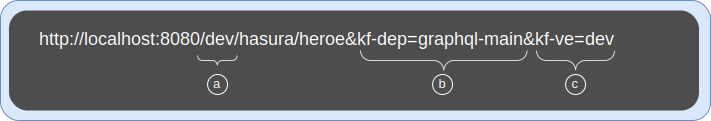

# KubeFox with Hasura Tutorial

Welcome to the world of KubeFox! This tutorial will walk you through the process
of setting up a Kubernetes cluster using kind ("kind" is **K**ubernetes **in**
**D**ocker), loading KubeFox and Hasura, and working with the technologies.

The tutorial is a hands-on, code-along-with-us introduction to KubeFox Virtual Environments (VEs) with GoLang and Hasura.  In under an hour, you’ll work with a test application in Kubernetes that has multiple backends, see how KubeFox enables developers to rapidly prototype, test different versions of code, and visualize application behavior - without extensive configuration or DevOps overhead.  

You’ll see how KubeFox’s Virtual Environments empower developers as you spin up what appear to be independent sandboxes.  Behind the scenes, you’ll learn how KubeFox’s Deployment Distillation and Dynamic Routing work in concert to prevent over-provisioning.  And we’ll finish with some simple modifications to the Virtual Environments themselves, enabling you switch the backend data store you’re using without deploying anything.

This overview is approachable - even for those relatively new to Kubernetes.

Some quick notes:

1. We'll add instructions for Azure soon - it's really not that different but we
   want to vet it first.
2. This tutorial maps to a [CNCF
   Livestream](https://www.youtube.com/watch?v=Gc6XJFgjocM) we did on March
   13th, 2024. You can follow along with that Livestream if you wish.

## Prerequisites

Ensure that the following tools are installed for this tutorial:

- [Docker](https://docs.docker.com/engine/install/) - A container toolset and
  runtime used to build KubeFox Components' OCI images and run a local
  Kubernetes Cluster via kind.
- [Fox](https://github.com/xigxog/kubefox-cli/releases/) - A CLI for
  communicating with the KubeFox Platform. Installation instructions are below.
- [Git](https://github.com/git-guides/install-git) - A distributed version
  control system.
- [Helm](https://helm.sh/docs/intro/install/) - Package manager for Kubernetes
  used to install the KubeFox Operator on Kubernetes.
- [Kind](https://kind.sigs.k8s.io/docs/user/quick-start/) - **K**uberentes
  **in** **D**ocker. A tool for running local Kubernetes Clusters using Docker
  container "nodes".
- [Kubectl](https://kubernetes.io/docs/tasks/tools/) - CLI for communicating
  with a Kubernetes Cluster's control plane, using the Kubernetes API.
- [k9s](https://k9scli.io/topics/install/) - A terminal based UI to interact
  with your Kubernetes clusters. You can use native kubectl commands to
  accomplish the same things, but k9s is a nice convenience and we use it here.
  By the way, the k9s [homepage](https://k9scli.io/) is probably the cleverest of any
  company in the k8s space, succeeding in that endeavor at many levels.

Here are a few optional but recommended tools:

- [Go](https://go.dev/doc/install) - A programming language. The `hello-world`
  example App is written in Go, but Fox is able to compile it even without Go
  installed.
- [VS Code](https://code.visualstudio.com/download) - A lightweight but powerful
  source code editor. Helpful if you want to explore the `hello-world` app.
- [Azure CLI](https://learn.microsoft.com/en-us/cli/azure/install-azure-cli) -
  CLI for communicating with the Azure control plane.

## Setup Kubernetes

_Note: If you went through the KubeFox Quickstart using kind, we recommend that you
first delete the cluster you created to ensure that you're starting with a clean
slate._

Let's kick things off by setting up a Kubernetes cluster. If you
already have a Kubernetes Cluster provisioned, you can skip this step.

=== "Local (kind)"

    Setup a Kubernetes cluster on your workstation using kind and Docker. Kind
    is an excellent tool specifically designed for quickly establishing a
    cluster for testing purposes.

    ```{ .shell .copy }
    kind create cluster --wait 5m
    ```

    ??? example "Output"

        ```text
        Creating cluster "kind" ...
        ✓ Ensuring node image (kindest/node:v1.27.3) 🖼
        ✓ Preparing nodes 📦
        ✓ Writing configuration 📜
        ✓ Starting control-plane 🕹️
        ✓ Installing CNI 🔌
        ✓ Installing StorageClass 💾
        ✓ Waiting ≤ 5m0s for control-plane = Ready ⏳
        • Ready after 15s 💚
        Set kubectl context to "kind-kind"
        You can now use your cluster with:

        kubectl cluster-info --context kind-kind

        Have a nice day! 👋
        ```

## Setup KubeFox

In this step you will install the KubeFox Helm Chart to initiate the KubeFox
Operator on your Kubernetes cluster. The operator manages KubeFox Platforms and
Apps.

```{ .shell .copy }
helm upgrade kubefox kubefox \
  --repo https://xigxog.github.io/helm-charts \
  --create-namespace --namespace kubefox-system \
  --install --wait
```

??? example "Output"

    ```text
    Release "kubefox" does not exist. Installing it now.
    NAME: kubefox
    LAST DEPLOYED: Thu Jan  1 00:00:00 1970
    NAMESPACE: kubefox-system
    STATUS: deployed
    REVISION: 1
    TEST SUITE: None
    ```

---

## Get the Fox CLI

Now install Fox, a CLI tool used to interact with KubeFox and prepare your Apps
for deployment and release.

=== "Install using Go"

    ```{ .shell .copy }
    go install github.com/xigxog/fox@latest
    ```

=== "Install using Bash"

    ```{ .shell .copy }
    curl -sL "https://github.com/xigxog/fox/releases/latest/download/fox-$(uname -s | tr 'A-Z' 'a-z')-amd64.tar.gz" | \
      tar xvz - -C /tmp && \
      sudo mv /tmp/fox /usr/local/bin/fox
    ```

=== "Install Manually"

    Download the [latest Fox release](https://github.com/xigxog/fox/releases/latest){:target="_blank"} for your OS and extract the `fox` binary to a directory on your path.

Awesome! You're all set to start the KubeFox Platform on the your newly created
cluster and deploy your first KubeFox Hasura GraphQL App. To begin, create a new
directory and use Fox to initialize the `graphql` App. Run all subsequent
commands from this directory. The environment variable `FOX_INFO` tells Fox to
to provide additional output about what is going on. Employ the `--graphql` flag
to simplify setting things up for this tutorial.

```{ .shell .copy }
mkdir kubefox-graphql && \
  cd kubefox-graphql && \
  export FOX_INFO=true && \
  fox init --graphql
```

??? example "Output"

    ```text
    info    Configuration successfully written to '/home/xadhatter/.config/kubefox/config.yaml'.

    info    Waiting for KubeFox Platform 'demo' to be ready...
    info    KubeFox initialized for the GraphQL tutorial!
    ```

---

## Load Hasura

Now we want to load Hasura into the cluster.

```{ .shell .copy }
kubectl apply -f hack/hasura.yaml --namespace kubefox-demo
```
??? example "Output"

    ```text
    pod/hasura-prod created
    service/hasura-prod created
    pod/hasura-dev created
    service/hasura-dev created
    pod/hasura-john created
    service/hasura-john created
    ```
Note that it can take some time for the pods to spin up.  You may also see the
Pods in not-quite-ready state, but give them some time and they'll come up.
Check on them and ensure that they're ready before proceeding.

```{ .shell .copy }
kubectl get pods -A
```
??? example "Output"
    ```text

    You might see something like this initially:

    NAMESPACE            NAME                                         READY   STATUS              RESTARTS   AGE
    kube-system          coredns-5d78c9869d-6bv9d                     1/1     Running             0          23m
    kube-system          coredns-5d78c9869d-gv2v9                     1/1     Running             0          23m
    kube-system          etcd-kind-control-plane                      1/1     Running             0          24m
    kube-system          kindnet-qfzbd                                1/1     Running             0          23m
    kube-system          kube-apiserver-kind-control-plane            1/1     Running             0          24m
    kube-system          kube-controller-manager-kind-control-plane   1/1     Running             0          24m
    kube-system          kube-proxy-dxwgc                             1/1     Running             0          23m
    kube-system          kube-scheduler-kind-control-plane            1/1     Running             0          24m
    kubefox-demo         demo-broker-xpgt4                            1/1     Running             0          44s
    kubefox-demo         demo-httpsrv-6774cb9d65-gwcrv                1/1     Running             0          38s
    kubefox-demo         demo-nats-0                                  1/1     Running             0          56s
    kubefox-demo         hasura-dev                                   0/2     ContainerCreating   0          18s
    kubefox-demo         hasura-john                                  0/2     ContainerCreating   0          18s
    kubefox-demo         hasura-prod                                  0/2     ContainerCreating   0          18s
    kubefox-system       kubefox-operator-68b6f4ddb9-8jfdw            1/1     Running             0          23m
    kubefox-system       kubefox-vault-0                              1/1     Running             0          23m
    local-path-storage   local-path-provisioner-6bc4bddd6b-d8sjw      1/1     Running             0          23m

    or even errors:

    NAMESPACE            NAME                                         READY   STATUS             RESTARTS      AGE
    kube-system          coredns-5d78c9869d-6bv9d                     1/1     Running            0             24m
    kube-system          coredns-5d78c9869d-gv2v9                     1/1     Running            0             24m
    kube-system          etcd-kind-control-plane                      1/1     Running            0             24m
    kube-system          kindnet-qfzbd                                1/1     Running            0             24m
    kube-system          kube-apiserver-kind-control-plane            1/1     Running            0             24m
    kube-system          kube-controller-manager-kind-control-plane   1/1     Running            0             24m
    kube-system          kube-proxy-dxwgc                             1/1     Running            0             24m
    kube-system          kube-scheduler-kind-control-plane            1/1     Running            0             24m
    kubefox-demo         demo-broker-xpgt4                            1/1     Running            0             52s
    kubefox-demo         demo-httpsrv-6774cb9d65-gwcrv                1/1     Running            0             46s
    kubefox-demo         demo-nats-0                                  1/1     Running            0             64s
    kubefox-demo         hasura-dev                                   1/2     Error              1 (15s ago)   26s
    kubefox-demo         hasura-john                                  1/2     CrashLoopBackOff   1 (2s ago)    26s
    kubefox-demo         hasura-prod                                  2/2     Running            1 (17s ago)   26s
    kubefox-system       kubefox-operator-68b6f4ddb9-8jfdw            1/1     Running            0             23m
    kubefox-system       kubefox-vault-0                              1/1     Running            0             23m
    local-path-storage   local-path-provisioner-6bc4bddd6b-d8sjw      1/1     Running            0             24m

    But give the Pods a few minutes until you see this:

    NAMESPACE            NAME                                         READY   STATUS    RESTARTS      AGE
    kube-system          coredns-5d78c9869d-249l2                     1/1     Running   1 (17h ago)   18h
    kube-system          coredns-5d78c9869d-94ghx                     1/1     Running   1 (17h ago)   18h
    kube-system          etcd-kind-control-plane                      1/1     Running   1 (17h ago)   18h
    kube-system          kindnet-jj8dl                                1/1     Running   1 (17h ago)   18h
    kube-system          kube-apiserver-kind-control-plane            1/1     Running   1 (17h ago)   18h
    kube-system          kube-controller-manager-kind-control-plane   1/1     Running   2 (17h ago)   18h
    kube-system          kube-proxy-z9xdg                             1/1     Running   1 (17h ago)   18h
    kube-system          kube-scheduler-kind-control-plane            1/1     Running   1 (17h ago)   18h
    kubefox-demo         demo-broker-594zx                            1/1     Running   2 (17h ago)   17h
    kubefox-demo         demo-httpsrv-6989f9595-vgvjs                 1/1     Running   1 (17h ago)   17h
    kubefox-demo         demo-nats-0                                  1/1     Running   1 (17h ago)   17h
    kubefox-demo         hasura-dev                                   2/2     Running   5 (17h ago)   17h
    kubefox-demo         hasura-john                                  2/2     Running   4 (17h ago)   17h
    kubefox-demo         hasura-prod                                  2/2     Running   5 (17h ago)   17h
    kubefox-system       kubefox-operator-68b6f4ddb9-9ttzh            1/1     Running   2 (17h ago)   18h
    kubefox-system       kubefox-vault-0                              1/1     Running   2 (16m ago)   18h
    local-path-storage   local-path-provisioner-6bc4bddd6b-xl5hp      1/1     Running   1 (17h ago)   18h
    ```

Once the Pods are up, we can start working with KubeFox and Hasura in earnest!

---

## Define Environments and Virtual Environments (VEs)

We're first going to establish some KubeFox Environments and Virtual
Environments. Let's take a quick look at the environment YAML.  Open "dev.yaml"
in VS Code.  It's in the hack/environments folder in kubefox-graphql:

```text
---
apiVersion: kubefox.xigxog.io/v1alpha1
kind: Environment
metadata:
  name: dev
spec:
  releasePolicy:
    type: Testing
data:
  vars:
    db: dev
    #subPath: dev
---
apiVersion: kubefox.xigxog.io/v1alpha1
kind: VirtualEnvironment
metadata:
  name: dev
spec:
  environment: dev
---
apiVersion: kubefox.xigxog.io/v1alpha1
kind: VirtualEnvironment
metadata:
  name: dev-john
spec:
  environment: dev
data:
  vars:
    db: john
    subPath: john
```

Let's review some parts of these resources.

Think of the Environment as a parent of Virtual Environments (we'll call Virtual
Environments VEs for short).  Environment variables defined in the Environment
resource will be inherited by VEs, but can also be overridden in VEs.  The
Environment is largely a convenience, relieving you from defining the same
values repeatedly in the VEs (e.g., DB connection strings).  

VEs map to Environments using the spec: environment: value - in this case "dev".
Each of these VEs - "dev" and "dev-john" - inherit the values from the dev
Environment.  The dev-john VE overrides the value of the "db" environment value
to "john".  We'll discuss the "subPath" value in a momment.

As you can see, multiple VEs can be defined within an Environment. You'll see
later how - when coupled with KubeFox's Dynamic Routing - VEs are one of
KubeFox's superpowers.

Let's load the environment resources (we have two of them - "dev" and "prod") into our cluster:

```{ .shell .copy }
kubectl apply -f hack/environments/ --namespace kubefox-demo
```

??? example "Output"

    ```text
    environment.kubefox.xigxog.io/dev created
    virtualenvironment.kubefox.xigxog.io/dev created
    virtualenvironment.kubefox.xigxog.io/dev-john created
    environment.kubefox.xigxog.io/prod created
    virtualenvironment.kubefox.xigxog.io/prod created
    ```

Great!  So we've created two Environments, "dev" and "prod".  In prod, we have
one VE: "prod".  And in dev, we have two VEs: "dev" and "dev-john".  Let's chat
about the subPath value referenced above.

Open our App component - "main.go".  It's in the components/server subdirectory of
kubefox-graphql. Scroll to line 40 and you'll see the following:

```text
	k.Static("/{{.Vars.subPath}}/hasura/static", "static", EFS)
	k.Route("Path(`/{{.Vars.subPath}}/hasura/heroes`)", listHeroes)
	k.Route("PathPrefix(`/{{.Vars.subPath}}/hasura`)", forwardHasura)
```
KubeFox has the ability to inject routing information at runtime.  It will pull
the subPath value from the VE (which may be inherited from the Environment) and
inject it where you see "{{.Vars.subPath}}".  You'll see this in action in a
moment, but to send a request to a deployment in the "dev" VE, we'd use an URL
with a subpath of "dev" as that is what is defined in the dev VE above:

<figure markdown>
  
  <figcaption>Figure 1. Sample URL with subPath, deployment and VE</figcaption>
</figure>

These are the features of the URL shown in Figure 1 above:<br/>
(a) - The 'dev' subPath is specified, which should match the subPath in the
dev VE<br/>
(b) - The 'graphql-main' deployment is specified<br/>
(c) - The 'de' VE is specified<br/>

It's worthwhile to note here that in KubeFox, there can be multiple versions of
an App with multiple versions of components running in the same cluster.
KubeFox has strict rules for determining what the target deployment is.  Once a
request has been identified at origin (a Genesis Event in KubeFox), KubeFox will
ensure that the request is interacting only with App components that were part
of the specific version of the deployment being referenced.

Scroll up a bit to line 38, and you'll see the following:

```text
	graphqlAdapter = k.HTTPAdapter("graphql")
	hasuraAdapter = k.HTTPAdapter("hasura")
``` 

These two lines define dependencies for components that must be present for us
to successfully run our App.

---

## Initial Deployment

It's time to do our first deployment!  When you deploy in KubeFox, you don't
spend time trying to identify the components that changed and work through CI/CD
nuances.  You simply tell KubeFox to deploy, and KubeFox determines what needs
to be deployed.

```{ .shell .copy }
export FOX_INFO=True && \
fox publish --wait 5m 
```
??? example "Output"

    ```text

    info	Component image 'localhost/kubefox/graphql/server:a6fee36f3aed5bef8e4b482821fc4098' exists, skipping build.
    info	Loading component image 'localhost/kubefox/graphql/server:a6fee36f3aed5bef8e4b482821fc4098' into kind cluster 'kind'.

    info	Waiting for KubeFox Platform 'demo' to be ready...
    info	Waiting for component 'server' to be ready...

    apiVersion: kubefox.xigxog.io/v1alpha1
    details:
      description: A simple App demonstrating the use of KubeFox with Hasura GraphQL Engine.
      title: KubeFox GraphQL Demo
    kind: AppDeployment
    metadata:
      creationTimestamp: "2024-03-23T21:56:51Z"
      finalizers:
      - kubefox.xigxog.io/release-protection
      generation: 1
      labels:
        app.kubernetes.io/name: graphql
        kubefox.xigxog.io/app-branch: main
        kubefox.xigxog.io/app-commit: 5137cd594639b21ed2aca569800bac0340a89ebe
        kubefox.xigxog.io/app-commit-short: 5137cd5
      name: graphql-main
      namespace: kubefox-demo
      resourceVersion: "22300"
      uid: f2dd3c45-a553-43c5-aa0f-bffb53c9bf59
    spec:
      appName: graphql
      branch: main
      commit: 5137cd594639b21ed2aca569800bac0340a89ebe
      commitTime: "2024-03-23T02:13:21Z"
      components:
        server:
          dependencies:
            graphql:
              type: HTTPAdapter
            hasura:
              type: HTTPAdapter
          hash: a6fee36f3aed5bef8e4b482821fc4098
          routes:
          - envVarSchema:
              subPath:
                required: true
            id: 0
            rule: PathPrefix(`/{{.Vars.subPath}}/hasura/static`)
          - envVarSchema:
              subPath:
                required: true
            id: 1
            rule: Path(`/{{.Vars.subPath}}/hasura/heroes`)
          - envVarSchema:
              subPath:
                required: true
            id: 2
            rule: PathPrefix(`/{{.Vars.subPath}}/hasura`)
          type: KubeFox
      containerRegistry: localhost/kubefox
      tag: .
    status:
      conditions:
      - lastTransitionTime: "2024-03-23T21:56:51Z"
        message: One or more problems found, see `status.problems` for details.
        observedGeneration: 1
        reason: ProblemsFound
        status: "False"
        type: Available
      - lastTransitionTime: "2024-03-23T21:56:51Z"
        message: One or more problems found, see `status.problems` for details.
        observedGeneration: 1
        reason: ProblemsFound
        status: "False"
        type: Progressing
      problems:
      - causes:
        - kind: AppDeployment
          name: graphql-main
          observedGeneration: 1
          path: $.spec.components.server.dependencies.graphql
        message: Component "server" dependency "graphql" of type "HTTPAdapter" not found.
        type: DependencyNotFound
      - causes:
        - kind: AppDeployment
          name: graphql-main
          observedGeneration: 1
          path: $.spec.components.server.dependencies.hasura
        message: Component "server" dependency "hasura" of type "HTTPAdapter" not found.
        type: DependencyNotFound
    ```
What KubeFox did here was to inspect the repository, determine what changed,
build container(s) for those components that are new or which changed, push
those containers to a container registry (e.g., GHCR, ACR, a local registry etc.) and
build an AppDeployment based upon that process.  The AppDeployment is a custom
resource that the KubeFox Operator leverages to bring the AppDeployment online.

In the Output, you can also see the routes we defined in our App (in the
"routes:" section), and the Adapter dependencies we specified (in the
"dependencies:" section).

Let's jump over to k9s for the rest our evaluation of the cluster.  If you don't
see the Pods section as shown in Figure 2 below, then type 
```text
:pods
```
 or 
```text
:pods -n = kubefox-demo
```
into k9s.

<figure markdown>
  
  <figcaption>Figure 2 - Pods display after fox publish</figcaption>
</figure>

Typically, connections to KubeFox Apps are made through a public-facing load
balancer. For the simplicity of this guide use Fox to create a local proxy
instead. Note that we're going to leave the proxy running, so it's important to
start  in a new terminal window.  

In a new terminal window run the following command:

```{ .shell .copy }
fox proxy 8080
```

??? info "macOS Network Warning"

    <figure markdown>
      
    </figure>

    If you are using macOS you might notice this dialog popup when you start the
    proxy. This is expected as Fox starts a local HTTP server. The server is
    bound to the `localhost` interface and is only accessible from your
    workstation. Please press `Allow` to continue.

??? example "Output"

    ```text
    HTTP proxy started on http://127.0.0.1:8080
    ```

---

## Diagnosing a 400 Response

Now, switch back to the original terminal window and run the following curl
command:

```{ .shell .copy }
curl -v "http://localhost:8080/dev/hasura/heroes?kf-dep=graphql-main&kf-ve=dev"
```

??? example "Output"
    ```text

    *   Trying [::1]:8080...
    * connect to ::1 port 8080 failed: Connection refused
    *   Trying 127.0.0.1:8080...
    * Connected to localhost (127.0.0.1) port 8080
    > GET /dev/hasura/heroes?kf-dep=graphql-main&kf-ve=dev HTTP/1.1
    > Host: localhost:8080
    > User-Agent: curl/8.4.0
    > Accept: */*
    > 
    < HTTP/1.1 400 Bad Request
    < Content-Length: 1156
    < Content-Type: text/plain; charset=utf-8
    < Date: Mon, 25 Mar 2024 20:40:05 GMT
    < Kubefox-Adapter: httpsrv-3baaaee-fsgolhxhgu
    < Kubefox-App-Deployment: graphql-main
    < Kubefox-Event-Id: b9cb40af-0bdc-4cb3-a607-f383bce3facf
    < Kubefox-Platform: demo
    < Kubefox-Virtual-Environment: dev
    < 
    invalid: event context is invalid
    - causes:
      - kind: AppDeployment
        name: graphql-main
        observedGeneration: 1
        path: $.spec.components.server.routes[0].subPath
      message: Var "subPath" not found but is required.
      type: VarNotFound
    - causes:
      - kind: AppDeployment
        name: graphql-main
        observedGeneration: 1
        path: $.spec.components.server.routes[1].subPath
      message: Var "subPath" not found but is required.
      type: VarNotFound
    - causes:
      - kind: AppDeployment
        name: graphql-main
        observedGeneration: 1
        path: $.spec.components.server.routes[2].subPath
      message: Var "subPath" not found but is required.
      type: VarNotFound
    - causes:
      - kind: AppDeployment
        name: graphql-main
        observedGeneration: 1
        path: $.spec.components.server.dependencies.graphql
      message: Component "server" dependency "graphql" of type "HTTPAdapter" not found.
      type: DependencyNotFound
    - causes:
      - kind: AppDeployment
        name: graphql-main
        observedGeneration: 1
        path: $.spec.components.server.dependencies.hasura
      message: Component "server" dependency "hasura" of type "HTTPAdapter" not found.
      type: DependencyNotFound
    * Connection #0 to host localhost left intact

    ```

Huh.  We received an HTTP 400 - Bad Request.  Why?

KubeFox is telling us that it cannot fulfill the request because the event
context is invalid:

```text
    invalid: event context is invalid
```

A little further down, we can see the reasons.  The first error is

```text
    message: Var "subPath" not found but is required.
```

So KubeFox saw that the request specified a subPath of 'dev', as illustrated in
Figure 1 above, but that subPath is not defined in the "dev" VE.

The second thing is that our Adapters have not been defined:

```text
    message: Component "server" dependency "graphql" of type "HTTPAdapter" not found.
    message: Component "server" dependency "hasura" of type "HTTPAdapter" not found.
```

The HTTP Adapters are translating back and forth between KubeFox events and some
external protocol - in this case, HTTP. KubeFox performs this translation at
runtime, which enables it to route dynamically at runtime.  You'll see this in
action in a moment, when we dynamically select GraphQL endpoints without
modifying any code..

Let's fix our problems, starting with the HTTP adapters.

```{ .shell .copy }
kubectl apply -f hack/http-adapter.yaml --namespace kubefox-demo
```

??? example "Output"
    ```text
    httpadapter.kubefox.xigxog.io/graphql created
    httpadapter.kubefox.xigxog.io/hasura created
    ```
We cheated a bit here for purposes of illustration.  If you review the original
deployment, reprinted here (under Output below), KubeFox told us that problems were
present when we tried to publish.  KubeFox could not resolve the dependencies
for the Adapters, and told us so.

??? example "Output"

    ```text

    info	Component image 'localhost/kubefox/graphql/server:a6fee36f3aed5bef8e4b482821fc4098' exists, skipping build.
    info	Loading component image 'localhost/kubefox/graphql/server:a6fee36f3aed5bef8e4b482821fc4098' into kind cluster 'kind'.

    info	Waiting for KubeFox Platform 'demo' to be ready...
    info	Waiting for component 'server' to be ready...

    apiVersion: kubefox.xigxog.io/v1alpha1
    details:
      description: A simple App demonstrating the use of KubeFox with Hasura GraphQL Engine.
      title: KubeFox GraphQL Demo
    kind: AppDeployment
    metadata:
      creationTimestamp: "2024-03-23T21:56:51Z"
      finalizers:
      - kubefox.xigxog.io/release-protection
      generation: 1
      labels:
        app.kubernetes.io/name: graphql
        kubefox.xigxog.io/app-branch: main
        kubefox.xigxog.io/app-commit: 5137cd594639b21ed2aca569800bac0340a89ebe
        kubefox.xigxog.io/app-commit-short: 5137cd5
      name: graphql-main
      namespace: kubefox-demo
      resourceVersion: "22300"
      uid: f2dd3c45-a553-43c5-aa0f-bffb53c9bf59
    spec:
      appName: graphql
      branch: main
      commit: 5137cd594639b21ed2aca569800bac0340a89ebe
      commitTime: "2024-03-23T02:13:21Z"
      components:
        server:
          dependencies:
            graphql:
              type: HTTPAdapter
            hasura:
              type: HTTPAdapter
          hash: a6fee36f3aed5bef8e4b482821fc4098
          routes:
          - envVarSchema:
              subPath:
                required: true
            id: 0
            rule: PathPrefix(`/{{.Vars.subPath}}/hasura/static`)
          - envVarSchema:
              subPath:
                required: true
            id: 1
            rule: Path(`/{{.Vars.subPath}}/hasura/heroes`)
          - envVarSchema:
              subPath:
                required: true
            id: 2
            rule: PathPrefix(`/{{.Vars.subPath}}/hasura`)
          type: KubeFox
      containerRegistry: localhost/kubefox
      tag: .
    status:
      conditions:
      - lastTransitionTime: "2024-03-23T21:56:51Z"
        message: One or more problems found, see `status.problems` for details.
        observedGeneration: 1
        reason: ProblemsFound
        status: "False"
        type: Available
      - lastTransitionTime: "2024-03-23T21:56:51Z"
        message: One or more problems found, see `status.problems` for details.
        observedGeneration: 1
        reason: ProblemsFound
        status: "False"
        type: Progressing
      problems:
      - causes:
        - kind: AppDeployment
          name: graphql-main
          observedGeneration: 1
          path: $.spec.components.server.dependencies.graphql
        message: Component "server" dependency "graphql" of type "HTTPAdapter" not found.
        type: DependencyNotFound
      - causes:
        - kind: AppDeployment
          name: graphql-main
          observedGeneration: 1
          path: $.spec.components.server.dependencies.hasura
        message: Component "server" dependency "hasura" of type "HTTPAdapter" not found.
        type: DependencyNotFound
    ```

Now let's fix the subPath problem. Open dev.yaml (located in hack/environments).
Do see the problem?

```text
  ---
  apiVersion: kubefox.xigxog.io/v1alpha1
  kind: Environment
  metadata:
    name: dev
  spec:
    releasePolicy:
      type: Testing
  data:
    vars:
      db: dev
      #subPath: dev
  ---
  apiVersion: kubefox.xigxog.io/v1alpha1
  kind: VirtualEnvironment
  metadata:
    name: dev
  spec:
    environment: dev
  ---
```

Neither the Environment nor the VE specify subPath (the subPath in the
Environment is commented out). Uncomment it, save the file, and reapply the
environment YAML: 

```{ .shell .copy }
kubectl apply -f hack/environments/ --namespace kubefox-demo
```

??? example "Output"

    ```text
    environment.kubefox.xigxog.io/dev created
    virtualenvironment.kubefox.xigxog.io/dev created
    virtualenvironment.kubefox.xigxog.io/dev-john created
    environment.kubefox.xigxog.io/prod created
    virtualenvironment.kubefox.xigxog.io/prod created
    ```

---

## Accessing Deployment with Query Parameters

Okay - let's retry our curl command:

```{ .shell .copy }
curl -v "http://localhost:8080/dev/hasura/heroes?kf-dep=graphql-main&kf-ve=dev"
```

And voila!  Success! A very long HTML page. 

??? example "Output"

    ```text

    *   Trying [::1]:8080...
    * connect to ::1 port 8080 failed: Connection refused
    *   Trying 127.0.0.1:8080...
    * Connected to localhost (127.0.0.1) port 8080
    > GET /dev/hasura/heroes?kf-dep=graphql-main&kf-ve=dev HTTP/1.1
    > Host: localhost:8080
    > User-Agent: curl/8.4.0
    > Accept: */*
    > 
    < HTTP/1.1 200 OK
    < Content-Length: 81129
    < Content-Type: text/html; charset=utf-8
    < Date: Tue, 26 Mar 2024 00:37:21 GMT
    < Kubefox-Adapter: httpsrv-3baaaee-fsgolhxhgu
    < Kubefox-App-Deployment: graphql-main
    < Kubefox-Event-Id: 41fa0e8c-c2bf-4d57-89c5-ba69c54fa0fe
    < Kubefox-Platform: demo
    < Kubefox-Virtual-Environment: dev
    < 
    <!DOCTYPE html>


    <html lang="en">
      <head>
        <meta charset="UTF-8" />
        <meta name="viewport" content="width=device-width, initial-scale=1.0" />
        <meta http-equiv="X-UA-Compatible" content="ie=edge" />

        <title>KubeFox Hasura Demo</title>

        <link rel="stylesheet" href="./static/style.css" />
        <link rel="icon" href="./static/favicon.ico" type="image/x-icon" />
      </head>

    <body>
        <h1>🦸 Superheroes</h1>

        <table class="styled-table">
          <tr>
            <th>Name</th>
            <th>Real Name</th>
            <th>Alignment</th>
          </tr>
          
          <tr>
            <td>3-D Man</td>
            <td>Charles Chandler</td>
            <td>Good</td>
          </tr>

     ...     
    (and a bunch more output)
     ...

      </table>
      </body>
    </html>
    * Connection #0 to host localhost left intact

    ```

This will look a lot better if we view it in a browser, so copy the URL and
paste it into your browser:

```{ .shell .copy }
  http://localhost:8080/dev/hasura/heroes?kf-dep=graphql-main&kf-ve=dev
```
<figure markdown>
  
  <figcaption>Figure 3 - The Superheroes HTML Page in FireFox</figcaption>
</figure>

If we look under the covers, we see that while the content is correct and the
initial request was fine, subsequent requests made by the browser lacked the
KubeFox context for the deployment and VE (to see this view, right click and
click inspect, select "Network", refresh the page, and click on the 404 message):

<figure markdown>
  
  <figcaption>Figure 4 - The Superheroes HTML Page with 404 Detail</figcaption>
</figure>

We can fix this in one of two ways:
That
1. We can launch the fox proxy with context.   Go to the terminal where you
   launched the fox proxy, do a CTRL-C, then restart it with context:

```{ .shell .copy }
fox proxy --virtual-env dev --app-deployment graphql-main 8080
```

When we specify the deployment and VE in the fox proxy, it will take care of the
injection of the deployment and VE for us.  So we can use an undecorated URL (without
query parameters):

```{ .shell .copy }
  http://localhost:8080/dev/hasura/heroes
```

Try it and you should see this:

<figure markdown>
  
  <figcaption>Figure 5 - The Superheroes HTML Page with fox proxy context</figcaption>
</figure>

2. A simpler way to do this though is to make a release.  First, we can change the fox
   proxy back to the generic flavor (CTRL-C the fox proxy with context, then
   restart it as follows):

```{ .shell .copy }
  fox proxy 8080
```

---

## Creating a Release

Now we create a release:

```{ .shell .copy }
fox release graphql-main --virtual-env dev
```

??? example "Output"

    ```text

    apiVersion: kubefox.xigxog.io/v1alpha1
    data: {}
    details: {}
    kind: VirtualEnvironment
    metadata:
      creationTimestamp: "2024-03-25T19:07:18Z"
      finalizers:
      - kubefox.xigxog.io/environment-protection
      generation: 2
      labels:
        kubefox.xigxog.io/environment: dev
      name: dev
      namespace: kubefox-demo
      resourceVersion: "42792"
      uid: 32f05b08-a832-4700-9a95-6e9757295ff8
    spec:
      environment: dev
      release:
        apps:
          graphql:
            appDeployment: graphql-main
    status:
      activeRelease:
        activationTime: "2024-03-26T01:31:05Z"
        apps:
          graphql:
            appDeployment: graphql-main
        id: 6e211510-388e-4514-ac50-970795d749c4
        requestTime: "2024-03-26T01:31:05Z"
      conditions:
      - lastTransitionTime: "2024-03-26T01:31:05Z"
        message: Release AppDeployments are available, Routes and Adapters are valid and
          compatible with the VirtualEnv.
        observedGeneration: 2
        reason: ContextAvailable
        status: "True"
        type: ActiveReleaseAvailable
      - lastTransitionTime: "2024-03-25T19:07:18Z"
        message: Release was activated.
        observedGeneration: 2
        reason: ReleaseActivated
        status: "False"
        type: ReleasePending
        
    ```

When we release, KubeFox defaults all traffic to that subPath to the
currently-released version of the App. And we should see the same results in our browser:

<figure markdown>
  
  <figcaption>Figure 6 - The Superheroes HTML Page after release</figcaption>
</figure>

We can have one release per VE.

Using Release is actually recommended.  It's more convenient for developers and
QA staff, and the URLs don't need to be decorated with query parameters, so the
same test suites can be run iteratively for rapid prototyping etc.

---

## Dynamic Routing in Action

Remember that we started with three VEs:  "dev" and "dev-john" in the dev
environment, and "prod" in the prod environment.  To illustrate the power of
KubeFox's Dynamic Routing, we're going to create a release for each of our VEs.

First we'll release to the dev-john VE:

```{ .shell .copy }
fox release graphql-main --virtual-env dev-john
```

??? example "Output"

    ```text

    apiVersion: kubefox.xigxog.io/v1alpha1
    data:
      vars:
        db: john
        subPath: john
    details: {}
    kind: VirtualEnvironment
    metadata:
      creationTimestamp: "2024-03-25T19:07:18Z"
      finalizers:
      - kubefox.xigxog.io/environment-protection
      generation: 2
      labels:
        kubefox.xigxog.io/environment: dev
      name: dev-john
      namespace: kubefox-demo
      resourceVersion: "45775"
      uid: dbbdb3ef-4599-45a1-80eb-682c2233edca
    spec:
      environment: dev
      release:
        apps:
          graphql:
            appDeployment: graphql-main
    status:
      activeRelease:
        activationTime: "2024-03-26T01:58:44Z"
        apps:
          graphql:
            appDeployment: graphql-main
        id: 200e8d65-193a-48d4-b23c-908bcd531682
        requestTime: "2024-03-26T01:58:44Z"
      conditions:
      - lastTransitionTime: "2024-03-26T01:58:44Z"
        message: Release AppDeployments are available, Routes and Adapters are valid and
          compatible with the VirtualEnv.
        observedGeneration: 2
        reason: ContextAvailable
        status: "True"
        type: ActiveReleaseAvailable
      - lastTransitionTime: "2024-03-25T19:07:18Z"
        message: Release was activated.
        observedGeneration: 2
        reason: ReleaseActivated
        status: "False"
        type: ReleasePending

    ```

---

## Releasing to prod

Now we're going to release to prod, but there is a fundamental difference
between the prod environment and dev environment.  If we look back at the dev
environment (open "dev.yaml" in VS Code.  It's in the hack/environments folder
in kubefox-graphql).  You'll see a releasePolicy defined as type: Testing.

```text
---
apiVersion: kubefox.xigxog.io/v1alpha1
kind: Environment
metadata:
  name: dev
spec:
  releasePolicy:
    type: Testing
data:
  vars:
    db: dev
    subPath: dev
---
```

A Texting release policy enables release without requiring any formality,
thereby reducing overhead.  In prod however, we want formality.  We want
releases to be versioned and immutable.  It is good practice to ensure that
prod releases can be reproduced at any point in the future - and that is
actually required for compliance purposes for things like medical devices.

When we look at prod.yaml, we see a releasePolicy defined as type: Stable.  That
compels us to add some steps to release.

```text
---
apiVersion: kubefox.xigxog.io/v1alpha1
kind: Environment
metadata:
  name: prod
spec:
  releasePolicy:
    type: Stable
data:
  vars:
    db: prod
    subPath: prod
---
```

Just for grins, let's try to do a release to prod  in the same manner as we did
for dev:

```{ .shell .copy }
fox release graphql-main --virtual-env prod
```

Take a look at the response:

??? example "Output"

    ```text

    apiVersion: kubefox.xigxog.io/v1alpha1
    data: {}
    details: {}
    kind: VirtualEnvironment
    metadata:
      creationTimestamp: "2024-03-25T19:07:18Z"
      finalizers:
      - kubefox.xigxog.io/environment-protection
      generation: 2
      labels:
        kubefox.xigxog.io/environment: prod
      name: prod
      namespace: kubefox-demo
      resourceVersion: "47747"
      uid: a4460926-872c-4146-9873-1b364991200a
    spec:
      environment: prod
      release:
        apps:
          graphql:
            appDeployment: graphql-main
    status:
      activeRelease: null
      conditions:
      - lastTransitionTime: "2024-03-25T19:07:18Z"
        message: No active Release, Release is pending activation.
        observedGeneration: 2
        reason: ReleasePending
        status: "False"
        type: ActiveReleaseAvailable
      - lastTransitionTime: "2024-03-26T02:17:02Z"
        message: One or more problems found with Release preventing it from being activated,
          see `status.pendingRelease` for details.
        observedGeneration: 2
        reason: ProblemsFound
        status: "True"
        type: ReleasePending
      pendingRelease:
        apps:
          graphql:
            appDeployment: graphql-main
        id: 6e30c6b8-077e-4b14-888b-589813989f4d
        problems:
        - causes:
          - kind: VirtualEnvironment
            name: prod
            observedGeneration: 2
            path: $.spec.releasePolicy.versionRequired
            value: Stable
          - kind: VirtualEnvironment
            name: prod
            observedGeneration: 2
            path: $.spec.release.apps.graphql.version
            value: ""
          message: Version is required but not set for App "graphql".
          observedTime: "2024-03-26T02:17:02Z"
          type: PolicyViolation
        requestTime: "2024-03-26T02:17:02Z"

    ```

KubeFox cannot release the App because the version is not set:

```text
   message: Version is required but not set for App "graphql".
```

Okay, so let's tag the repository and publish a versioned copy of the
App based upon that tag:

```{ .shell .copy }
fox publish --version v1 --create-tag
```

We receive an immediate error:

```text
error	😖 Error finding commit hash: uncommitted changes present
```

Remember that KubeFox works from the repository outward.  We discussed the fact
that it inspects the repository, detects changes, and publishes only those
changes that it finds.  It also ensures that when we try to publish to a
VE that has a Stable release policy, that we're publishing what we
intend to publish. 

Remember that we made a change earlier to uncomment subPath in dev.yaml.  We
need to deal with that before we can publish.  In our case, let's simply commit
the changes and republish:

```{ .shell .copy }
git add . && \
  git commit -m "fixed VE" && \
  fox publish --version v1 --create-tag
```

??? example "Output"

    ```text
    [main 77600ae] fixed VE
    1 file changed, 1 insertion(+), 1 deletion(-)
    info	Component image 'localhost/kubefox/graphql/server:a6fee36f3aed5bef8e4b482821fc4098' exists, skipping build.
    info	Loading component image 'localhost/kubefox/graphql/server:a6fee36f3aed5bef8e4b482821fc4098' into kind cluster 'kind'.

    info	Creating tag 'v1'.

    apiVersion: kubefox.xigxog.io/v1alpha1
    details:
      description: A simple App demonstrating the use of KubeFox with Hasura GraphQL Engine.
      title: KubeFox GraphQL Demo
    kind: AppDeployment
    metadata:
      creationTimestamp: "2024-03-26T02:39:39Z"
      finalizers:
      - kubefox.xigxog.io/release-protection
      generation: 1
      labels:
        app.kubernetes.io/name: graphql
        kubefox.xigxog.io/app-branch: main
        kubefox.xigxog.io/app-commit: 77600ae042dd5601f28ea63e3845922419ab3ae2
        kubefox.xigxog.io/app-commit-short: 77600ae
        kubefox.xigxog.io/app-tag: v1
        kubefox.xigxog.io/app-version: v1
      name: graphql-v1
      namespace: kubefox-demo
      resourceVersion: "50193"
      uid: fcf765ef-93f0-4da8-af55-f04dd48303e5
    spec:
      appName: graphql
      branch: main
      commit: 77600ae042dd5601f28ea63e3845922419ab3ae2
      commitTime: "2024-03-26T02:39:37Z"
      components:
        server:
          dependencies:
            graphql:
              type: HTTPAdapter
            hasura:
              type: HTTPAdapter
          hash: a6fee36f3aed5bef8e4b482821fc4098
          routes:
          - envVarSchema:
              subPath:
                required: true
            id: 0
            rule: PathPrefix(`/{{.Vars.subPath}}/hasura/static`)
          - envVarSchema:
              subPath:
                required: true
            id: 1
            rule: Path(`/{{.Vars.subPath}}/hasura/heroes`)
          - envVarSchema:
              subPath:
                required: true
            id: 2
            rule: PathPrefix(`/{{.Vars.subPath}}/hasura`)
          type: KubeFox
      containerRegistry: localhost/kubefox
      tag: v1
      version: v1
    status:
      conditions:
      - lastTransitionTime: "2024-03-26T02:39:39Z"
        message: Component Deployments have minimum required Pods available.
        observedGeneration: 1
        reason: ComponentsAvailable
        status: "True"
        type: Available
      - lastTransitionTime: "2024-03-26T02:39:39Z"
        message: Component Deployments completed successfully.
        observedGeneration: 1
        reason: ComponentsDeployed
        status: "False"
        type: Progressing
    ```

We've now complied with our release policy and successfully released.

---

## Deployment Distillation

It's worthwhile to take a closer look at the top of the deployment, where you
can see this message:

```text
    info	Component image 'localhost/kubefox/graphql/server:a6fee36f3aed5bef8e4b482821fc4098' exists, skipping build.
```

Remember that KubeFox works from the repository outward.  It inspected the
component, determined it had not changed and continued with the deployment.
This is a common occurrence when working with a KubeFox App.  It is not
incumbent on the developer, QA or build staff to determine what has changed and
modify CI/CD accordingly.  Instead, staff simply publishes, and KubeFox handles
the rest. Besides being an enormous timesaver, this approach lends itself to far
greater accuracy during development cycles.

KubeFox did create a new AppDeployment, with the name "graphql-v1":

```text
    kind: AppDeployment
    metadata:
      creationTimestamp: "2024-03-26T02:39:39Z"
      finalizers:
      - kubefox.xigxog.io/release-protection
      generation: 1
      labels:
        app.kubernetes.io/name: graphql
        kubefox.xigxog.io/app-branch: main
        kubefox.xigxog.io/app-commit: 77600ae042dd5601f28ea63e3845922419ab3ae2
        kubefox.xigxog.io/app-commit-short: 77600ae
        kubefox.xigxog.io/app-tag: v1
        kubefox.xigxog.io/app-version: v1
      name: graphql-v1
      namespace: kubefox-demo
      resourceVersion: "50193"
      uid: fcf765ef-93f0-4da8-af55-f04dd48303e5
    ...
```

Let's jump over to k9s and see what we have.

<figure markdown>
  
  <figcaption>Figure 7 - View of Pods after Publish to prod</figcaption>
</figure>

We've released to dev, dev-john and prod - but we still have only one
graphql-server-... application Pod. KubeFox can satisfy all requests for each of
these deployments with a single Pod due to its dynamic routing.

Let's take a look at our AppDeployments.  On k9s, type ":appdeployments"
(without he quotes).

<figure markdown>
  
  <figcaption>Figure 7 - View of AppDeployments after publish to prod</figcaption>
</figure>

We have two AppDeployments.
1. graphql-main - our development version of our App
2. graphql-v1 - our production version of our App

Let's take a look at the browser.  First, let's try the dev VE.

```{ .shell .copy }
  http://localhost:8080/dev/hasura/heroes
```

<figure markdown>
  
  <figcaption>Figure 8 - Browser view of the dev VE after release</figcaption>
</figure>

Okay, let's try dev-john (remember the subPath is "john").

```{ .shell .copy }
  http://localhost:8080/john/hasura/heroes
```

<figure markdown>
  
  <figcaption>Figure 9 - Browser view of the dev-john VE after release</figcaption>
</figure>

Finally, let's try prod.

```{ .shell .copy }
  http://localhost:8080/prod/hasura/heroes
```

<figure markdown>
  
  <figcaption>Figure 10 - Browser view of the prod VE pre release</figcaption>
</figure>

Huh.  We get "route not found".  That means that KubeFox could not route the
request. We did not supply query parameters in the URL, so that must mean that
we neglected to perform a release.  If that's true, then we should be able to
access the version in prod by specifying context with query parameters.  Let's try that:

```{ .shell .copy }
  http://localhost:8080/prod/hasura/heroes?kf-dep=graphql-v1&kf-ve=prod
```

<figure markdown>
  
  <figcaption>Figure 11 - Browser view of the prod VE pre release with query parameters</figcaption>
</figure>

Okay - that works.  We just forgot to release.  Let's do that now:

```{ .shell .copy }
fox release v1 --virtual-env prod
```

??? example "Output"

    ```text

    apiVersion: kubefox.xigxog.io/v1alpha1
    data: {}
    details: {}
    kind: VirtualEnvironment
    metadata:
      creationTimestamp: "2024-03-25T19:07:18Z"
      finalizers:
      - kubefox.xigxog.io/environment-protection
      generation: 4
      labels:
        kubefox.xigxog.io/environment: prod
      name: prod
      namespace: kubefox-demo
      resourceVersion: "59612"
      uid: a4460926-872c-4146-9873-1b364991200a
    spec:
      environment: prod
      release:
        apps:
          graphql:
            appDeployment: graphql-v1
            version: v1
    status:
      activeRelease:
        activationTime: "2024-03-26T19:07:45Z"
        apps:
          graphql:
            appDeployment: graphql-v1
            version: v1
        id: 260697ca-af1b-4c0d-a2d6-343967dab2a4
        releaseManifest: prod-59609-20240326-190745
        requestTime: "2024-03-26T19:07:45Z"
      conditions:
      - lastTransitionTime: "2024-03-26T19:07:45Z"
        message: Release AppDeployments are available, Routes and Adapters are valid and
          compatible with the VirtualEnv.
        observedGeneration: 4
        reason: ContextAvailable
        status: "True"
        type: ActiveReleaseAvailable
      - lastTransitionTime: "2024-03-26T02:22:02Z"
        message: Release was activated.
        observedGeneration: 4
        reason: ReleaseActivated
        status: "False"
        type: ReleasePending
    ```

and try our undecorated query in prod again.

```{ .shell .copy }
  http://localhost:8080/prod/hasura/heroes
```

<figure markdown>
  
  <figcaption>Figure 12 - Browser view of the prod VE post release</figcaption>
</figure>

That's better.

The release process performs a compilation of the routes, and when undecorated
URLs are processed, KubeFox determines the context and automatically injects the
variables for the released version of the App for that VE.

Okay!  Things are about to get really cool.  

You've seen how simple application development can be in KubeFox, how it distills
deployments to only those components that are new or which have changed, and how
it can dynamically route requests at runtime.  Starting from where we're at in
the tutorial - a single component and three VEs, what if - without deploying any
code and without affecting prod - we could shift the data sources? Can you
imagine the implications for testing and for things like intelligent canary
deployments?

Well, we're about to go there.

Let's jump into the Hasura console in the dev-john VE. 

```{ .shell .copy }
  http://localhost:8080/john/hasura/
```

You should see this:

<figure markdown>
  
  <figcaption>Figure 13 - Hasura console in the dev-john VE</figcaption>
</figure>

There is some simple logic in our main.go component that routes requests to
Hasura. On line 43, you see this code:

```text
	k.Route("PathPrefix(`/{{.Vars.subPath}}/hasura`)", forwardHasura)
```

which tells us that anything that is not 'static' or 'heroes' will be forward to
Hasura, and there is a simple proxy function starting on line 69 to achieve this:

```text
  func forwardHasura(k kit.Kontext) error {
    req := k.Forward(hasuraAdapter)
    req.RewritePath(k.PathSuffix())

    resp, err := req.Send()
    if err != nil {
      return err
    }

    return k.Resp().Forward(resp)
  }
```

---

## Hasura Console Basics

Getting back to Hasura, one of its many value adds is that it inspects the
database and builds a GraphQL interface to it for you.

For purposes of this tutorial, we're going to focus on the basics to enable you
to see what KubeFox can do, but we encourage you to play around with Hasura. It
is a very powerful product. 

In the center panel - labeled Query Variables - there is a query ready for us to
execute. Just to get acquainted, click the play button you see next to
"GraphiQL" at the top of that panel.

<figure markdown>
  
  <figcaption>Figure 14 - Results from our first query</figcaption>
</figure>

Right now, it's returning "alignment_id", which is not really very helpful
Alignment, in our superhero world, is whether the superhero is 'good' or
'bad'. What we'd really like to know is exactly that.  So change the query to
look like it does in Figure 15.  Hasura's autocomplete will help you but some
tips:

1. Delete from "alignment_id" to "weight_kg"
2. Type "alignment {" on the line after superhero name (Hasura will add the
   right brace), and hit <Enter>
3. Start typing "alignment" and Hasura will autocomplete for you

<figure markdown>
  
  <figcaption>Figure 15 - Hasura query with alignment edit</figcaption>
</figure>

Run the query again (hit the play button), and you should see this:

<figure markdown>
  
  <figcaption>Figure 16 - Hasura query results after alignment edit</figcaption>
</figure>

Now we're going to go into the database and modify the superhero table.  To do
so:

1. Click the "DATA" menu button at the top of the Hasura console
2. Expand the "> public" folder under the "Superheroes" database on the left
   panel
3. Click the "superhero" table

Your screen should look like this:

<figure markdown>
  
  <figcaption>Figure 17 - Browsing the 'superhero' table in Hasura</figcaption>
</figure>

Click the edit button for "3-D Man":

<figure markdown>
  
  <figcaption>Figure 18 - Editing 3-D Man in Hasura</figcaption>
</figure>

Type in your own name in the "full_name" field for 3-D Man (Congratulations!
You're a superhero!):

<figure markdown>
  
  <figcaption>Figure 19 - You become 3-D Man</figcaption>
</figure>

and save your changes.  Try the URL again.

```{ .shell .copy }
  http://localhost:8080/john/hasura/heroes
```

You should see that you've become 3-D Man.

<figure markdown>
  
  <figcaption>Figure 20 - 3-D Man in the dev-john VE</figcaption>
</figure>

Let's check and see what the dev VE looks like.

```{ .shell .copy }
  http://localhost:8080/dev/hasura/heroes
```
<figure markdown>
  
  <figcaption>Figure 21 - 3-D Man in the dev VE</figcaption>
</figure>

3-D Man is unchanged.  Why?  The change we made was in the 'dev-john' VE, the
'dev' VE is unaffected.  Even though there is only one Pod running for both
releases, KubeFox is dynamically routing requests at runtime.  Developers using
the dev VE can use the original data source, and developers using the 'dev-john'
VE can work with the new content and queries. To each group, their VEs provide
them wiht what appear to be independent sandboxes.  All the while, KubeFox is controlling
provisioning by deploying only changed (or new) components - so we're achieving
this with a single instance of our graphql-server component.

---

## Modifying our App

Let's take this even further.  We'll add gender to the database query using
Hasura, then we'll modify our App to support the additional column.

Start by going back to Hasura.

```{ .shell .copy }
  http://localhost:8080/john/hasura/
```

You should be here:

<figure markdown>
  
  <figcaption>Figure 22 - Hasura console before adding gender</figcaption>
</figure>

Let's add gender to our query.  To do so:

1. Copy the 'alignment' block
2. Change 'alignment' to 'gender'

The console should look like this:

<figure markdown>
  
  <figcaption>Figure 23 - Hasura console after adding gender</figcaption>
</figure>

Hit the play button. The console should show these results:

<figure markdown>
  
  <figcaption>Figure 24 - Hasura console showing query results with gender</figcaption>
</figure>

You can see that we've made gender available in our query.  Now we want to
modify our component to obtain and show the update.

Before we make our changes, let's create a feature branch.

```{ .shell .copy }
  git checkout -b feature
```
??? example "Output"

    ```text
    Switched to a new branch 'feature'
    ```

Open main.go in VS Code.  It's in the components/server directory.  On line 48,
you'll see the listHeroes function.

```text
  func listHeroes(k kit.Kontext) error {
    client := graphql.New(k, graphqlAdapter)

    // For additional documentation check out
    // https://github.com/hasura/go-graphql-client.
    var query struct {
      Superhero []struct {
        Name      string `graphql:"superhero_name"`
        RealName  string `graphql:"full_name"`
        Alignment struct {
          Value string `graphql:"alignment"`
        }
      } `graphql:"superhero(order_by: {superhero_name: asc})"`
    }
    if err := client.Query(&query, nil); err != nil {
      return err
    }

    return k.Resp().SendHTMLTemplate(tpl, "index.html", query)
  }
```

We want to add gender to our GraphQL query.  To do so, we'll do something very
similar to what we did in the Hasura console:

1. Copy the Alignment struct & paste it right beneath itself
2. In the copy, change 'Alignment' to 'Gender'
3. Change 'Value string: 'graphql:"alignment"' to 'Value string: 'graphql:"gender"'

It should look like this:

```text
  func listHeroes(k kit.Kontext) error {
    client := graphql.New(k, graphqlAdapter)

    // For additional documentation check out
    // https://github.com/hasura/go-graphql-client.
    var query struct {
      Superhero []struct {
        Name      string `graphql:"superhero_name"`
        RealName  string `graphql:"full_name"`
        Alignment struct {
          Value string `graphql:"alignment"`
        }
        Gender struct {
          Value string `graphql:"gender"`
        }
      } `graphql:"superhero(order_by: {superhero_name: asc})"`
    }
    if err := client.Query(&query, nil); err != nil {
      return err
    }

    return k.Resp().SendHTMLTemplate(tpl, "index.html", query)
  }
```

This extends our Go GraphQL query to include gender.  To display it, we need to modify
the HTML page.

The last line in the listHeroes function:

```text
    return k.Resp().SendHTMLTemplate(tpl, "index.html", query)
```

This is a helper function from the KubeFox SDK (kit), which generates HTML based
upon Go templates.

In VS Code, open the index.html template, located in
components/server/templates.  In it, you'll see this table:

```text
    <table class="styled-table">
      <tr>
        <th>Name</th>
        <th>Real Name</th>
        <th>Alignment</th>
      </tr>
      {{ range .Superhero }}
      <tr>
        <td>{{.Name}}</td>
        <td>{{.RealName}}</td>
        <td>{{.Alignment.Value}}</td>
      </tr>
      {{ end}}
    </table>
```

We just need to add gender.  Modify the table so it looks like this:

```text
    <table class="styled-table">
      <tr>
        <th>Name</th>
        <th>Real Name</th>
        <th>Alignment</th>
        <th>Gender</th>
      </tr>
      {{ range .Superhero }}
      <tr>
        <td>{{.Name}}</td>
        <td>{{.RealName}}</td>
        <td>{{.Alignment.Value}}</td>
        <td>{{.Gender.Value}}</td>
      </tr>
      {{ end}}
    </table>
```
Finished!  Let's commit our changes:

```{ .shell .copy }
  git add . && \
  git commit -m "Added gender"
```

Now we can do a fox publish.  We're publishing from our branch.

```{ .shell .copy }
  fox publish --wait 5m
```

??? example "Output"

    ```text

    info	Component image 'localhost/kubefox/graphql/server:652297f19c4fbcf397833df8522378fa' exists, skipping build.
    info	Loading component image 'localhost/kubefox/graphql/server:652297f19c4fbcf397833df8522378fa' into kind cluster 'kind'.

    info	Waiting for KubeFox Platform 'demo' to be ready...
    info	Waiting for component 'server' to be ready...

    apiVersion: kubefox.xigxog.io/v1alpha1
    details:
      description: A simple App demonstrating the use of KubeFox with Hasura GraphQL Engine.
      title: KubeFox GraphQL Demo
    kind: AppDeployment
    metadata:
      creationTimestamp: "2024-03-26T23:12:02Z"
      finalizers:
      - kubefox.xigxog.io/release-protection
      generation: 1
      labels:
        app.kubernetes.io/name: graphql
        kubefox.xigxog.io/app-branch: feature
        kubefox.xigxog.io/app-commit: 35cd1bb15d08e1d6c65c5a3cdb13ed13ff92b573
        kubefox.xigxog.io/app-commit-short: 35cd1bb
      name: graphql-feature
      namespace: kubefox-demo
      resourceVersion: "85973"
      uid: 13cd2a79-c59f-4aaf-8996-5c949c2f0ae4
    spec:
      appName: graphql
      branch: feature
      commit: 35cd1bb15d08e1d6c65c5a3cdb13ed13ff92b573
      commitTime: "2024-03-26T23:10:46Z"
      components:
        server:
          dependencies:
            graphql:
              type: HTTPAdapter
            hasura:
              type: HTTPAdapter
          hash: 652297f19c4fbcf397833df8522378fa
          routes:
          - envVarSchema:
              subPath:
                required: true
            id: 0
            rule: PathPrefix(`/{{.Vars.subPath}}/hasura/static`)
          - envVarSchema:
              subPath:
                required: true
            id: 1
            rule: Path(`/{{.Vars.subPath}}/hasura/heroes`)
          - envVarSchema:
              subPath:
                required: true
            id: 2
            rule: PathPrefix(`/{{.Vars.subPath}}/hasura`)
          type: KubeFox
      containerRegistry: localhost/kubefox
      tag: .
    status:
      conditions:
      - lastTransitionTime: "2024-03-26T23:12:03Z"
        message: Component Deployments have minimum required Pods available.
        observedGeneration: 1
        reason: ComponentsAvailable
        status: "True"
        type: Available
      - lastTransitionTime: "2024-03-26T23:12:03Z"
        message: Component Deployments completed successfully.
        observedGeneration: 1
        reason: ComponentsDeployed
        status: "False"
        type: Progressing
    ```

It’s actually going to rebuild the component this time because we made changes
to it.  By default, fox uses the includes the branch name as part of the
AppDeployment name.  So our AppDeployment name is "graphql-feature".  Let's jump
over to k9s again and see what we have.

To show Pods, type ":pods" into k9s.

<figure markdown>
  
  <figcaption>Figure 25 - k9s showing our new Pod</figcaption>
</figure>

We needed to build and deploy a new container due to the modifications we made.
You see the newly-created Pod highlighted in Figure 25.

To show AppDeployments, type ":appdeployments" into k9s.

<figure markdown>
  
  <figcaption>Figure 26 - k9s showing the graphql-feature Appdeployment</figcaption>
</figure>

We have 3 AppDeployments now.  You can see our "graphql-feature" AppDeployment
highlighted in Figure 26.

Let’s check out the results.  If we go to the dev-john VE, there is no gender
column.  But remember, we have not performed a release yet - we only published.

```{ .shell .copy }
  http://localhost:8080/john/hasura/heroes
```

<figure markdown>
  
  <figcaption>Figure 27 - dev-john VE after gender mod but before release</figcaption>
</figure>

The App appears to be unchanged.  We can access our modifications with query parameters though.

```{ .shell .copy }
  http://localhost:8080/john/hasura/heroes?kf-dep=graphql-feature&kf-ve=dev-john
```

<figure markdown>
  
  <figcaption>Figure 28 - dev-john VE after gender mod with query parameters</figcaption>
</figure>

We can release the feature branch to the dev-john VE, and access it without
query parameters.  Let's do that.

```{ .shell .copy }
  fox release graphql-feature --virtual-env dev-john
```

??? example "Output"

    ```text

    apiVersion: kubefox.xigxog.io/v1alpha1
    data:
      vars:
        db: john
        subPath: john
    details: {}
    kind: VirtualEnvironment
    metadata:
      creationTimestamp: "2024-03-25T19:07:18Z"
      finalizers:
      - kubefox.xigxog.io/environment-protection
      generation: 3
      labels:
        kubefox.xigxog.io/environment: dev
      name: dev-john
      namespace: kubefox-demo
      resourceVersion: "89087"
      uid: dbbdb3ef-4599-45a1-80eb-682c2233edca
    spec:
      environment: dev
      release:
        apps:
          graphql:
            appDeployment: graphql-feature
    status:
      activeRelease:
        activationTime: "2024-03-26T23:40:52Z"
        apps:
          graphql:
            appDeployment: graphql-feature
        id: 0c6b3efb-149f-47d2-b0da-5e3edea3ef36
        requestTime: "2024-03-26T23:40:52Z"
      conditions:
      - lastTransitionTime: "2024-03-26T17:49:44Z"
        message: Release AppDeployments are available, Routes and Adapters are valid and
          compatible with the VirtualEnv.
        observedGeneration: 3
        reason: ContextAvailable
        status: "True"
        type: ActiveReleaseAvailable
      - lastTransitionTime: "2024-03-25T19:07:18Z"
        message: Release was activated.
        observedGeneration: 3
        reason: ReleaseActivated
        status: "False"
        type: ReleasePending
      releaseHistory:
      - activationTime: "2024-03-26T01:58:44Z"
        apps:
          graphql:
            appDeployment: graphql-main
        archiveReason: Superseded
        archiveTime: "2024-03-26T23:40:52Z"
        id: 200e8d65-193a-48d4-b23c-908bcd531682
        requestTime: "2024-03-26T01:58:44Z"
    ```

Now we can access our new feature without query parameters.

```{ .shell .copy }
  http://localhost:8080/john/hasura/heroes
```

<figure markdown>
  
  <figcaption>Figure 29 - dev-john VE after gender mod and after release</figcaption>
</figure>

Note that we can see the gender column, and we're also looking at the version of
the database that contains our 3-D Man update (you're still a superhero!).

Let's take a look at prod.

```{ .shell .copy }
  http://localhost:8080/prod/hasura/heroes
```
prod is still using the old version of the App with the original database content.

<figure markdown>
  
  <figcaption>Figure 30 - prod VE after gender mod</figcaption>
</figure>

And if we look at dev, it is also using the old version and the original
database content.

```{ .shell .copy }
  http://localhost:8080/dev/hasura/heroes
```

<figure markdown>
  
  <figcaption>Figure 31 - dev VE after gender mod</figcaption>
</figure>

Normal workflow now would be to checkout main, do a merge and deploy.  With
KubeFox, we do a fox publish.  This operation is going to update the
“graphql-main” AppDeployment (check the AppDeployment name in the output).  

```{ .shell .copy }
  git checkout main && \
  git merge feature && \
  fox publish --wait 5m
```

??? example "Output"

    ```text
    Switched to branch 'main'
    Updating 77600ae..35cd1bb
    Fast-forward
    components/server/main.go              |  3 +++
    components/server/templates/index.html | 64 ++++++++++++++++++++++++++++++++++------------------------------
    2 files changed, 37 insertions(+), 30 deletions(-)
    info	Component image 'localhost/kubefox/graphql/server:652297f19c4fbcf397833df8522378fa' exists, skipping build.
    info	Loading component image 'localhost/kubefox/graphql/server:652297f19c4fbcf397833df8522378fa' into kind cluster 'kind'.

    info	Waiting for KubeFox Platform 'demo' to be ready...
    info	Waiting for component 'server' to be ready...

    apiVersion: kubefox.xigxog.io/v1alpha1
    details:
      description: A simple App demonstrating the use of KubeFox with Hasura GraphQL Engine.
      title: KubeFox GraphQL Demo
    kind: AppDeployment
    metadata:
      creationTimestamp: "2024-03-25T19:34:13Z"
      finalizers:
      - kubefox.xigxog.io/release-protection
      generation: 2
      labels:
        app.kubernetes.io/name: graphql
        kubefox.xigxog.io/app-branch: main
        kubefox.xigxog.io/app-commit: 35cd1bb15d08e1d6c65c5a3cdb13ed13ff92b573
        kubefox.xigxog.io/app-commit-short: 35cd1bb
      name: graphql-main
      namespace: kubefox-demo
      resourceVersion: "91633"
      uid: 65634d46-9fe1-4f67-a97f-7a29be8f06c1
    spec:
      appName: graphql
      branch: main
      commit: 35cd1bb15d08e1d6c65c5a3cdb13ed13ff92b573
      commitTime: "2024-03-26T23:10:46Z"
      components:
        server:
          dependencies:
            graphql:
              type: HTTPAdapter
            hasura:
              type: HTTPAdapter
          hash: 652297f19c4fbcf397833df8522378fa
          routes:
          - envVarSchema:
              subPath:
                required: true
            id: 0
            rule: PathPrefix(`/{{.Vars.subPath}}/hasura/static`)
          - envVarSchema:
              subPath:
                required: true
            id: 1
            rule: Path(`/{{.Vars.subPath}}/hasura/heroes`)
          - envVarSchema:
              subPath:
                required: true
            id: 2
            rule: PathPrefix(`/{{.Vars.subPath}}/hasura`)
          type: KubeFox
      containerRegistry: localhost/kubefox
      tag: .
    status:
      conditions:
      - lastTransitionTime: "2024-03-26T17:49:44Z"
        message: Component Deployments have minimum required Pods available.
        observedGeneration: 2
        reason: ComponentsAvailable
        status: "True"
        type: Available
      - lastTransitionTime: "2024-03-25T19:34:13Z"
        message: Component Deployments completed successfully.
        observedGeneration: 2
        reason: ComponentsDeployed
        status: "False"
        type: Progressing
    ```
Because dev is already using the graphql-main AppDeployment, we should see that
dev is updated with the new feature.  Let's check it and see.

```{ .shell .copy }
  http://localhost:8080/dev/hasura/heroes
```

<figure markdown>
  
  <figcaption>Figure 32 - dev VE after merge and publish</figcaption>
</figure>

This demonstrates the flexibility and power of KubeFox to support rapid
prototyping and POC efforts.  You can make changes and redeploy, and the VE will
reflect those changes instantly.  Note that this is only permissable with a
release policy of Testing.

---

## Exploring KubeFox VEs

To further explore this KubeFox superpower, let's do the following:

1. Modify the dev.yaml to change the subPath to "something".  Remember that it's
   currently inheriting the subPath from the dev Environment, which is 'dev'.
2. Apply the Environment YAML.
3. Check what we see.

Edit the dev.yaml.  It's in hack/environments and it looks like this:

```text
  ---
  apiVersion: kubefox.xigxog.io/v1alpha1
  kind: Environment
  metadata:
    name: dev
  spec:
    releasePolicy:
      type: Testing
  data:
    vars:
      db: dev
      subPath: dev
  ---
  apiVersion: kubefox.xigxog.io/v1alpha1
  kind: VirtualEnvironment
  metadata:
    name: dev
  spec:
    environment: dev
  ---
  apiVersion: kubefox.xigxog.io/v1alpha1
  kind: VirtualEnvironment
  metadata:
    name: dev-john
  spec:
    environment: dev
  data:
    vars:
      db: john
      subPath: john
```

Add a subPath "something" to the dev VE so it looks like this:

```text
    ---
    apiVersion: kubefox.xigxog.io/v1alpha1
    kind: Environment
    metadata:
      name: dev
    spec:
      releasePolicy:
        type: Testing
    data:
      vars:
        db: dev
        subPath: dev
    ---
    apiVersion: kubefox.xigxog.io/v1alpha1
    kind: VirtualEnvironment
    metadata:
      name: dev
    spec:
      environment: dev
    data:
      vars:
        subPath: something
    ---
    apiVersion: kubefox.xigxog.io/v1alpha1
    kind: VirtualEnvironment
    metadata:
      name: dev-john
    spec:
      environment: dev
    data:
      vars:
        db: john
        subPath: john
```

Save your changes, and apply the updates.

```{ .shell .copy }
kubectl apply -f hack/environments/ --namespace kubefox-demo
```

??? example "Output"

    ```text
    environment.kubefox.xigxog.io/dev configured
    virtualenvironment.kubefox.xigxog.io/dev configured
    virtualenvironment.kubefox.xigxog.io/dev-john configured
    environment.kubefox.xigxog.io/prod configured
    virtualenvironment.kubefox.xigxog.io/prod configured
    ```
Go back to the browser, and refresh the page.  This is the URL if you need it:

```{ .shell .copy }
  http://localhost:8080/dev/hasura/heroes
```

<figure markdown>
  
  <figcaption>Figure 33 - dev VE after modifying subPath and old URL</figcaption>
</figure>

We get 'route not found' because the dev subPath no longer exists in any VE. We
need to use the 'something' subPath instead:

```{ .shell .copy }
  http://localhost:8080/something/hasura/heroes
```

<figure markdown>
  
  <figcaption>Figure 34 - dev VE after modifying subPath and new URL</figcaption>
</figure>

The "something" subPath is now the correct path for the dev VE.  Note that KubeFox effected this change instantly.

Let's revert our change to the dev VE so we're back at our original baseline.
Edit the dev.yaml and return it to its original state:

```text
  ---
  apiVersion: kubefox.xigxog.io/v1alpha1
  kind: Environment
  metadata:
    name: dev
  spec:
    releasePolicy:
      type: Testing
  data:
    vars:
      db: dev
      subPath: dev
  ---
  apiVersion: kubefox.xigxog.io/v1alpha1
  kind: VirtualEnvironment
  metadata:
    name: dev
  spec:
    environment: dev
  ---
  apiVersion: kubefox.xigxog.io/v1alpha1
  kind: VirtualEnvironment
  metadata:
    name: dev-john
  spec:
    environment: dev
  data:
    vars:
      db: john
      subPath: john
```

```{ .shell .copy }
kubectl apply -f hack/environments/ --namespace kubefox-demo
```

??? example "Output"

    ```text
    environment.kubefox.xigxog.io/dev configured
    virtualenvironment.kubefox.xigxog.io/dev configured
    virtualenvironment.kubefox.xigxog.io/dev-john configured
    environment.kubefox.xigxog.io/prod configured
    virtualenvironment.kubefox.xigxog.io/prod configured
    ```
Our dev subPath should be back amongst the living.  Check it and make sure.

```{ .shell .copy }
  http://localhost:8080/dev/hasura/heroes
```

<figure markdown>
  
  <figcaption>Figure 35 - dev VE after we revert the "something" subPath change</figcaption>
</figure>

If we look at the prod environment, we're reminded that it has a Stable release
policy. When we release to prod, KubeFox creates an immutable copy of the
environment variables, secrets and AppDeployment that is being released.  Any
changes won't go into effect until we release again. And it is required that we
have a versioned, tagged release if our policy is Stable.

Before we do so, let's remind ourselves of what is runing in prod now.

```{ .shell .copy }
  http://localhost:8080/prod/hasura/heroes
```

<figure markdown>
  
  <figcaption>Figure 36 - prod VE before we release a new version</figcaption>
</figure>

It is our original version.

Okay, let's create our new version.  First we publish the new version.

```{ .shell .copy }
  fox publish --version v2 --create-tag && \
```

??? example "Output"

    ```text

    info	Component image 'localhost/kubefox/graphql/server:652297f19c4fbcf397833df8522378fa' exists, skipping build.
    info	Loading component image 'localhost/kubefox/graphql/server:652297f19c4fbcf397833df8522378fa' into kind cluster 'kind'.

    info	Creating tag 'v2'.

    apiVersion: kubefox.xigxog.io/v1alpha1
    details:
      description: A simple App demonstrating the use of KubeFox with Hasura GraphQL Engine.
      title: KubeFox GraphQL Demo
    kind: AppDeployment
    metadata:
      creationTimestamp: "2024-03-27T01:08:53Z"
      finalizers:
      - kubefox.xigxog.io/release-protection
      generation: 1
      labels:
        app.kubernetes.io/name: graphql
        kubefox.xigxog.io/app-branch: main
        kubefox.xigxog.io/app-commit: 35cd1bb15d08e1d6c65c5a3cdb13ed13ff92b573
        kubefox.xigxog.io/app-commit-short: 35cd1bb
        kubefox.xigxog.io/app-tag: v2
        kubefox.xigxog.io/app-version: v2
      name: graphql-v2
      namespace: kubefox-demo
      resourceVersion: "98606"
      uid: a78da677-05ed-4cd5-9be5-00a120483846
    spec:
      appName: graphql
      branch: main
      commit: 35cd1bb15d08e1d6c65c5a3cdb13ed13ff92b573
      commitTime: "2024-03-26T23:10:46Z"
      components:
        server:
          dependencies:
            graphql:
              type: HTTPAdapter
            hasura:
              type: HTTPAdapter
          hash: 652297f19c4fbcf397833df8522378fa
          routes:
          - envVarSchema:
              subPath:
                required: true
            id: 0
            rule: PathPrefix(`/{{.Vars.subPath}}/hasura/static`)
          - envVarSchema:
              subPath:
                required: true
            id: 1
            rule: Path(`/{{.Vars.subPath}}/hasura/heroes`)
          - envVarSchema:
              subPath:
                required: true
            id: 2
            rule: PathPrefix(`/{{.Vars.subPath}}/hasura`)
          type: KubeFox
      containerRegistry: localhost/kubefox
      tag: v2
      version: v2
    status:
      conditions:
      - lastTransitionTime: "2024-03-27T01:08:53Z"
        message: Component Deployments have minimum required Pods available.
        observedGeneration: 1
        reason: ComponentsAvailable
        status: "True"
        type: Available
      - lastTransitionTime: "2024-03-27T01:08:53Z"
        message: Component Deployments completed successfully.
        observedGeneration: 1
        reason: ComponentsDeployed
        status: "False"
        type: Progressing
    ```

Then we perform the release into prod.

```{ .shell .copy }
  fox release v2 --virtual-env prod
```

??? example "Output"

    ```text

    apiVersion: kubefox.xigxog.io/v1alpha1
    data: {}
    details: {}
    kind: VirtualEnvironment
    metadata:
      creationTimestamp: "2024-03-25T19:07:18Z"
      finalizers:
      - kubefox.xigxog.io/environment-protection
      generation: 5
      labels:
        kubefox.xigxog.io/environment: prod
      name: prod
      namespace: kubefox-demo
      resourceVersion: "98610"
      uid: a4460926-872c-4146-9873-1b364991200a
    spec:
      environment: prod
      release:
        apps:
          graphql:
            appDeployment: graphql-v2
            version: v2
    status:
      activeRelease:
        activationTime: "2024-03-27T01:08:54Z"
        apps:
          graphql:
            appDeployment: graphql-v2
            version: v2
        id: 5f2b949f-557d-4e1a-b8de-5fd9323f06b8
        releaseManifest: prod-98607-20240327-010854
        requestTime: "2024-03-27T01:08:54Z"
      conditions:
      - lastTransitionTime: "2024-03-27T01:08:54Z"
        message: Release AppDeployments are available, Routes and Adapters are valid and
          compatible with the VirtualEnv.
        observedGeneration: 5
        reason: ContextAvailable
        status: "True"
        type: ActiveReleaseAvailable
      - lastTransitionTime: "2024-03-26T02:22:02Z"
        message: Release was activated.
        observedGeneration: 5
        reason: ReleaseActivated
        status: "False"
        type: ReleasePending
      releaseHistory:
      - activationTime: "2024-03-26T19:07:45Z"
        apps:
          graphql:
            appDeployment: graphql-v1
            version: v1
        archiveReason: Superseded
        archiveTime: "2024-03-27T01:08:54Z"
        id: 260697ca-af1b-4c0d-a2d6-343967dab2a4
        releaseManifest: prod-59609-20240326-190745
        requestTime: "2024-03-26T19:07:45Z"
    ```
Let's go back to the browser and summarize our releases.

We'll start with the dev VE.

```{ .shell .copy }
  http://localhost:8080/dev/hasura/heroes
```

<figure markdown>
  
  <figcaption>Figure 37 - dev VE summary</figcaption>
</figure>

The dev VE is running our current release with the original database.

```{ .shell .copy }
  http://localhost:8080/john/hasura/heroes
```

<figure markdown>
  
  <figcaption>Figure 38 - dev VE summary</figcaption>
</figure>

The john VE is running our current release with the updated database (in which
you're still a superhero!).

And we're also running the current release with the original database in prod.

```{ .shell .copy }
  http://localhost:8080/prod/hasura/heroes
```

<figure markdown>
  
  <figcaption>Figure 39 - prod VE summary</figcaption>
</figure>

Let's jump back over to k9s.  If we look at our Pods (:pods), we can see that
we're still running the two graphql-server application instances.

<figure markdown>
  
  <figcaption>Figure 39 - Active Pods after our v2 release</figcaption>
</figure>

If we look at our AppDeployments (:appdeployments), we see that there are 4
AppDeployments:
1. Our graphql-main deployment
2. Our first release AppDeployment graphql-v1
3. Our feature deployment graphql-feature
4. Our just-released AppDeployment graphql-v2

<figure markdown>
  
  <figcaption>Figure 39 - Active Pods after our v2 release</figcaption>
</figure>

No one is using the graphql-v1 AppDeployment anymore, so if we delete it:

1. Use the up/down arrow keys to highlight the graphql-v1 AppDeployment
2. Hit <kbd>CTRL</kbd>+<kbd>d</kbd> to delete it

<figure markdown>
  
  <figcaption>Figure 40 - Delete the graphql-v1 AppDeployment</figcaption>
</figure>

3. Select OK (right arrow key) to confirm
4. Hit <kbd>ENTER</kbd>

<figure markdown>
  
  <figcaption>Figure 41 - AppDeployment list after deletion of graphql-v1</figcaption>
</figure>

If we look at our Pods (:pods), we can see that KubeFox has distilled away the
original graphql-server Pod because no deployments remain that require it.

<figure markdown>
  
  <figcaption>Figure 42 - Pods list after deletion of graphql-v1 AppDeployment</figcaption>
</figure>

---

## Summary

We hope this tutorial provides you with a nice overview of the capabilities of
KubeFox, and an introduction (albeit a cursory one) to Hasura.

If you experienced any issues with the tutorial, we ask that you please let us
know!  We truly welcome and value your feedback!


---


