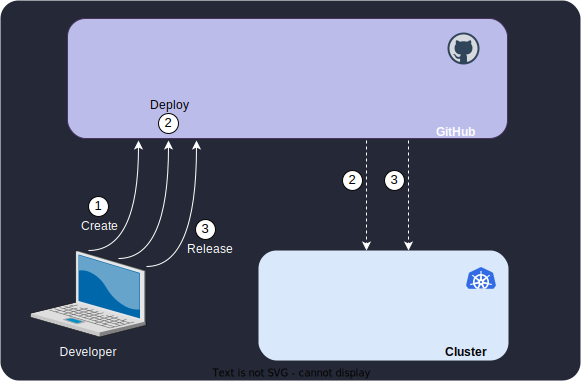

# Home

KubeFox is an SDK, platform and infrastructure to enable rapid construction and
deployment of secure and robust applications for Kubernetes, and which
drastically reduces the burden of DevOps.

Consider the following list:

- Virtual environments
- Zero Trust
- Versioned deployments
- Federated metrics, tracing, logging, auditing, and monitoring – out of the box

Environments transform into lightweight virtual constructs, still possessing the
positive attributes that we expect of them, but shedding undesirable traits that
make them unwieldy. Zero Trust is not something that requires thousands of
dollars and large, high caliber DevOps teams - it’s an intrinsic property of a
KubeFox-developed system. Multiple versions of applications can be run
side-by-side, facilitating Canary and Blue/Green deployments and drastically
simplifying the software lifecycle. Developers are freed to rapidly evolve and
advance applications, without jumping through complex configuration hoops or
waiting in line for resources.

With minimal configuration, KubeFox yields advanced telemetry - including
federated, span-based logs, metrics and traces - on user-developed components,
and on a by-component and component-to-component basis. KubeFox orchestrates
unheard of efficiencies, yielding provisioning efficiencies and driving down
costs. Sound intriguing? Read on…

## Challenges in Kubernetes

It’s one thing but it’s a really big thing: the lifecycle of software in the
Kubernetes world is fraught with complexity and requires continual analysis and
realignment. And as a company and its teams grow, those difficulties increase
disproportionately.

That analysis is performed by the scarcest and one of the most expensive teams
in any company: DevOps. DevOps needs to address a variety of overlapping goals
and deal with sometimes competing objectives:

- Providing a frictionless workflow to engineering, to enable rapid prototyping
  and iterations
- Application security, with the clear objective being zero trust
- Application monitoring, testing and debugging
- What tools will be chosen, how they’ll be implemented, provisioned, monitored
  and supported
- Microservice and Pod proliferation - and resultant and continuous increases in
  costly resources (compute, memory, storage)
- Providing for n - 1, n and n + 1 versions in multiple environments - a
  challenge magnified in dev, where the need to provide isolation results in
  drastic increases in resource demands
- Dealing with multiple vendors on a discrete basis for licenses, support
  contracts, maintenance and upgrades

… and this is just the tip of the iceberg

## Why KubeFox?

KubeFox is involved in the areas of the software lifecycle that inflict the
greatest pain on engineering and DevOps teams. That starts with CI/CD. CI/CD
pipelines are so named because they truly are pipelines, complete with a host of
products and capabilities that spawn the creation of internal cottage industries
with dedicated staff to manage them.

At a high level, they’re all some variation of Figure 1 below:

<figure markdown>
  
  <figcaption>Figure 1 - High Level Deployment Workflow</figcaption>
</figure>

KubeFox automates significant parts of this workflow.

In KubeFox, you build and deploy [Apps](./concepts/index.md#app), just
as you do today.  Applications are collections of
[Components](./concepts/index.md#component).  Components can be microservices or
functions. When an application is deployed, KubeFox determines what components
have changed and distills the deployment to only those components that are
unique - either new versions of existing components or new components.

Building applications with KubeFox yields a host of benefits in the software
lifecycle:

- The application lifecycle is focused on the Application component development and
  interaction – not on associated DevOps tasks and logistics.
- A primary goal of KubeFox is to enable engineering teams to interact with
  Kubernetes in an as frictionless a manner as possible. Developers can rapidly
  prototype new concepts, enhance existing applications, and test their work.
- It is not incumbent on developers or QA / Release teams to manually ascertain
  whether a component has changed and manage component compatibility. KubeFox
  automatically deploys the correct versions of components and distills
  deployments to only those components that are unique.
- Different versions of the same application can coexist on the same cluster –
  without incurring the overhead and resource drain of needlessly duplicated
  unchanged components.
- Sophisticated deployments like Canary and Blue/Green are facilitated with
  KubeFox. You can arrange for a subdomain for canary testing for early
  adopters, and run the advanced version of the application side-by-side with
  the current version.
- KubeFox dynamically shapes traffic at runtime, so shifting from one application
  version to another is lightswitch quick.
- Environments are virtual constructs, enabling you (and your developers) to
  rapidly spool up and tear down isolated environments for teams or even
  individual developers. 
- Configuration is abstracted from environment, yielding great flexibility and
  fostering rapid engineering.
- Span-based federated telemetry (logs, metrics, traces) is immediately
  available, enabling you to view context-relevant application and component
  behavior.
- Your applications are zero trust from the beginning.

In the following sections, we’ll delve more deeply into some of KubeFox’s
concepts and capabilities.
