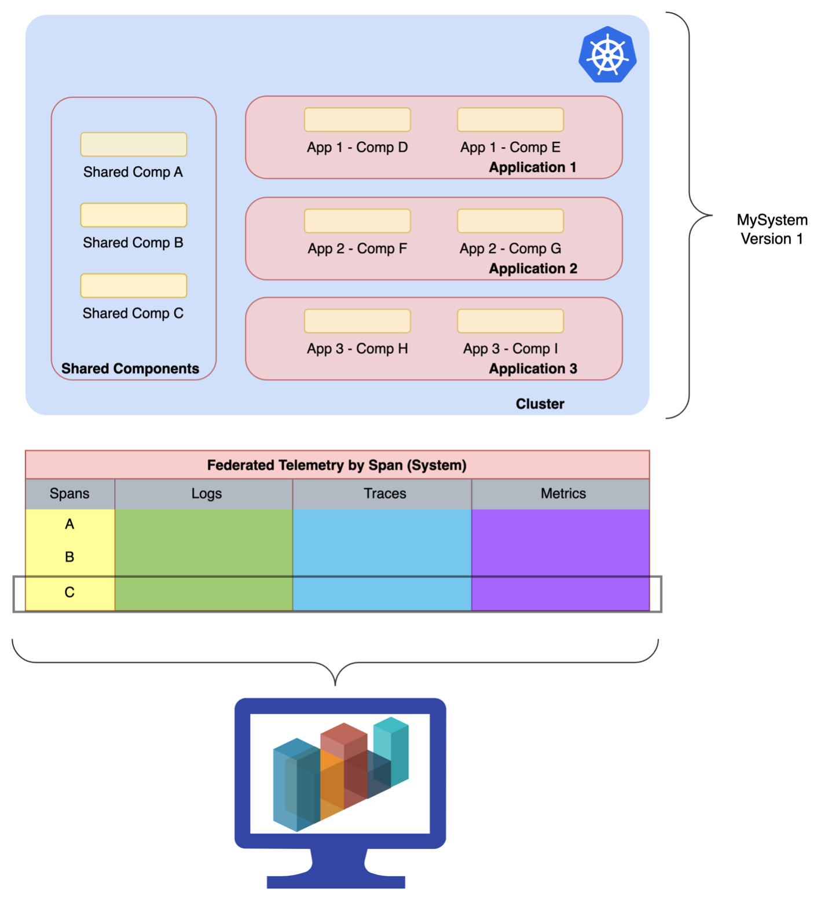
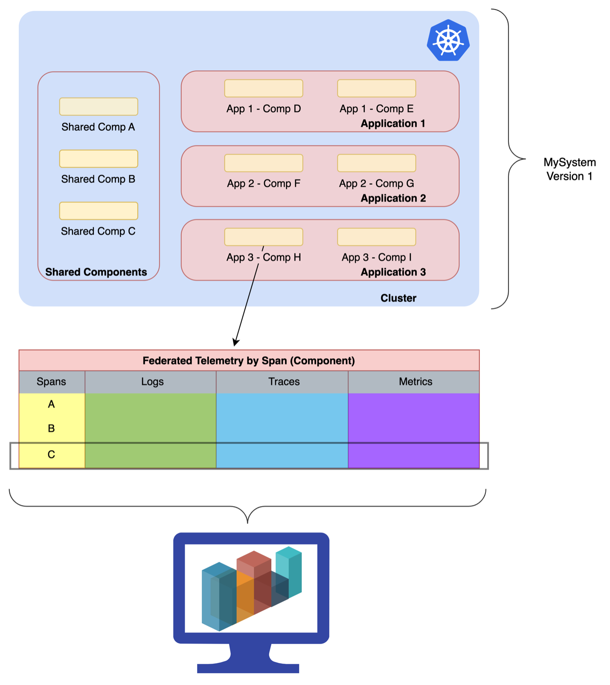

#KubeFox Federated Telemetry

When we first conceived of KubeFox, we thought of the things that should be present in the framework as first class citizens, as opposed to tack on afterthoughts.  Telemetry falls into category.  Wouldn’t it be nice to have context-sensitive logs, metrics, traces and auditing data?  Without going through the travails of configuring them?

With KubeFox, these capabilities are intrinsic to the platform.

You can visualize the behavior of the entire System (all applications that compose the System):

You can visualize behavior by Application:

And you can visualize behavior by individual Component:

